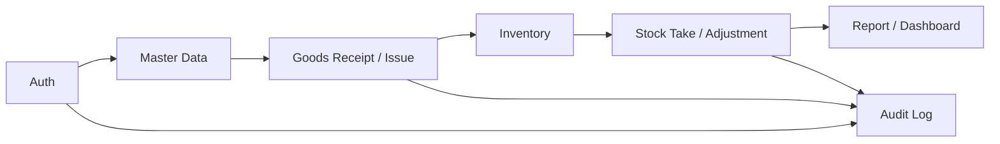

# Tổng quan sản phẩm WMS

## Overview

Warehouse Management System (WMS) cho doanh nghiệp vừa và nhỏ (SME): quản lý master data, nhập/xuất/tồn kho, kiểm kê, điều chỉnh, phân quyền, audit và báo cáo.

## Purpose

Cung cấp bức tranh sản phẩm để:

| Ai | Dùng để |
|----|---------|
| Product / BA | Hiểu mục tiêu và phạm vi MVP |
| Developer mới | Biết hệ thống làm gì trước khi đọc module |
| Stakeholder | Phân biệt trong/ngoài phạm vi |

## Scope

### Trong phạm vi

- Hàng hóa, kho, nhà cung cấp, khách hàng
- Nhập kho, xuất kho, tồn kho
- Kiểm kê, điều chỉnh tồn kho
- Dashboard, báo cáo (Excel/PDF)
- Người dùng, vai trò, phân quyền
- Nhật ký hoạt động (Audit Log)

### Ngoài phạm vi

CRM · ERP · POS · AI · Chat · Notification · Socket Realtime · Workflow Approval · Purchase/Sales Order · Batch/Lot/Serial · Barcode/QR Scanner · Mobile App · Multi Company · Kế toán · Marketing

> Không tự ý bổ sung các hạng mục ngoài phạm vi trừ khi được yêu cầu rõ.

## Workflow

```text
Người dùng đăng nhập
↓
Phân quyền theo Role
↓
Thao tác Master Data / Phiếu kho / Báo cáo
↓
Thay đổi tồn kho (khi confirm phiếu)
↓
Ghi Audit Log (các thao tác quan trọng)
```



## Business Rules

| ID | Rule |
|----|------|
| BR-P01 | Ưu tiên: MVP hoàn chỉnh → dễ dùng → UI hiện đại → hiệu năng → kiến trúc rõ → dễ mở rộng → code sạch |
| BR-P02 | Chỉ triển khai đúng phạm vi Sprint/Module đang làm |
| BR-P03 | Tồn kho chỉ thay đổi khi phiếu ở trạng thái `CONFIRMED` |
| BR-P04 | Không cho phép tồn kho âm khi xuất / giảm tồn |
| BR-P05 | Mọi API nghiệp vụ yêu cầu JWT + permission tương ứng |

## Technical Design

| Tầng | Công nghệ | Kiến trúc |
|------|-----------|-----------|
| Frontend | React + Vite (JS) | Feature-Based |
| Backend | Express + Prisma | Route → Controller → Service → Repository |
| Database | PostgreSQL | Quan hệ chuẩn hóa |
| Auth | JWT Access + Refresh | Middleware `authenticate` / `authorize` |
| File | Cloudflare R2 | DB chỉ lưu URL |

Chi tiết: [01-architecture.md](./01-architecture.md), [04-tech-stack.md](./04-tech-stack.md).

## API / Database

| Hạng mục | Liên kết |
|----------|----------|
| ERD tổng | [wms-database.md](./wms-database.md) |
| Swagger | `http://localhost:3000/api-docs` |
| Base API | `http://localhost:3000/api/v1` |
| Module docs | [README.md](./README.md) |

## Validation

Áp dụng validation ở cả FE (Zod + RHF) và BE (Zod middleware). Rule nghiệp vụ cứng nằm ở Service + DB constraints.

## Security

- Không đăng ký công khai; user do Admin tạo
- Seed mặc định chỉ dùng local/dev
- Secrets trong `.env`, không commit

## Error Handling

Lỗi API theo envelope chuẩn (`success`, `message`, `errors`). Chi tiết mã HTTP: [03-conventions.md](./03-conventions.md).

## Examples

### Tài khoản seed

| Email | Password | Role |
|-------|----------|------|
| `admin@wms.com` | `Admin@123` | Admin |

### Case study ngắn

1. Admin tạo Product + Warehouse + Supplier  
2. Staff tạo Goods Receipt (DRAFT) → Manager confirm  
3. Inventory tăng theo dòng phiếu  
4. Dashboard/Report phản ánh tồn mới  

## Design Decisions

```text
Decision: MVP theo 3 Sprint (Master Data → Operations → Control & Reporting).
Reason: Giao được giá trị sớm, giảm rủi ro phạm vi phình.
Advantages: Tập trung, đo tiến độ rõ.
Trade-offs: Một số UX nâng cao (realtime, barcode) nằm ngoài MVP.
```

## Notes

- Tài liệu module nằm trong `docs/modules/{module}/`.
- Chuẩn viết tài liệu: [03-conventions.md](./03-conventions.md).
- Cài đặt local: [05-getting-started.md](./05-getting-started.md).

## Checklist

- [x] Business Rules đầy đủ
- [x] Phạm vi trong/ngoài rõ
- [x] Workflow + Mermaid
- [x] Security / Error Handling
- [x] Ví dụ seed + case study
- [x] Design Decisions
- [x] Checklist
