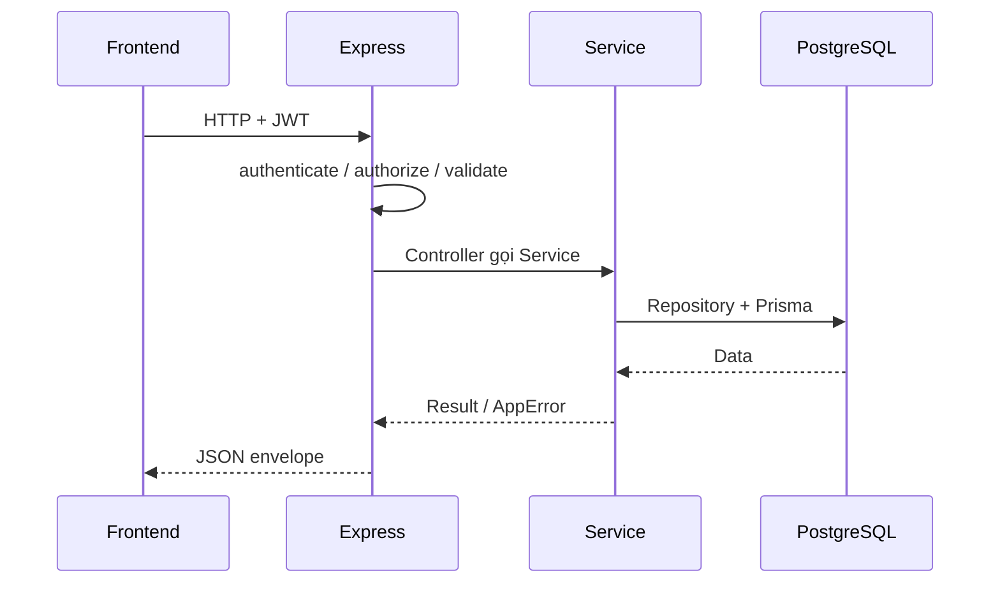

# Kiến trúc hệ thống

## Overview

WMS là hệ thống 3 tầng: React SPA ↔ Express REST API ↔ PostgreSQL, kèm Cloudflare R2 cho file tĩnh.

## Purpose

Mô tả kiến trúc để developer hiểu ranh giới tầng, luồng auth, và quy tắc đặt business logic trước khi code module mới.

## Scope

| Trong phạm vi | Ngoài phạm vi |
|---------------|---------------|
| FE Feature-Based, BE Layered, Auth JWT, R2 | Chi tiết schema từng bảng (xem [wms-database.md](./wms-database.md)) |
| Luồng request chuẩn | Deploy infra chi tiết |

## Workflow

### Request chuẩn

```text
Client (React)
↓ Axios + Bearer Access Token
Route (+ authenticate / authorize / validate)
↓
Controller
↓
Service (business rules)
↓
Repository
↓
Prisma → PostgreSQL
```



### Authentication Flow

1. Login → Access Token (15m) + Refresh Token (7d)
2. Request API kèm `Authorization: Bearer <accessToken>`
3. Access hết hạn → FE gọi `/auth/refresh` → retry request
4. Logout / đổi mật khẩu / deactivate → revoke refresh token trong DB

## Business Rules

| ID | Rule |
|----|------|
| BR-A01 | Business logic **chỉ** viết trong Service |
| BR-A02 | Controller không chứa nghiệp vụ; chỉ map req/res |
| BR-A03 | Repository không chứa business rules |
| BR-A04 | Mọi endpoint nghiệp vụ có `authenticate` + `authorize` (trừ auth public) |
| BR-A05 | Database chỉ lưu URL + metadata file; binary nằm trên R2 |

## Technical Design

### Sơ đồ tổng quan

```text
┌─────────────┐     REST / JSON      ┌─────────────┐      Prisma      ┌────────────┐
│  Frontend   │ ───────────────────► │   Backend   │ ───────────────► │ PostgreSQL │
│ React + Vite│ ◄─────────────────── │ Express API │ ◄─────────────── │            │
└─────────────┘     JWT Bearer       └─────────────┘                  └────────────┘
                                            │
                                            │ Cloudflare R2
                                            ▼
                                     ┌────────────┐
                                     │ File Store │
                                     └────────────┘
```

### Frontend – Feature-Based

```text
frontend/src/
├── features/{feature}/     # pages, components, hooks, api, schemas
├── components/ui/          # Shadcn UI
├── components/layout/      # AppLayout, Sidebar, Header
├── routes/                 # Router + guards
├── lib/                    # axios, queryClient, utils
└── config/                 # env
```

### Backend – Layered

| Layer | Trách nhiệm |
|-------|-------------|
| Route | Endpoint, middleware, Swagger |
| Controller | Request / Response only |
| Service | Business logic |
| Repository | Database access |
| Prisma | ORM |

### File Storage

- Cloudflare R2: ảnh sản phẩm, hóa đơn, PDF, Excel export
- Upload qua Multer + AWS SDK (S3-compatible)

## API / Database

| Thành phần | Giá trị |
|------------|---------|
| API prefix | `/api/v1` |
| Docs | `/api-docs` |
| ORM | Prisma |
| DB | PostgreSQL |

ERD: [wms-database.md](./wms-database.md).

## Validation

- FE: Zod schema theo form
- BE: Zod validation middleware trước Controller
- DB: unique / FK / enum / check qua Prisma schema

## Security

| Cơ chế | Chi tiết |
|--------|----------|
| Access JWT | Short-lived, gửi mỗi request |
| Refresh JWT | Long-lived, lưu **hash** SHA-256 trong `refresh_tokens` |
| RBAC | Permission code `{module}:{action}` gắn Role |
| Lockout | Auth module: sai mật khẩu nhiều lần → LOCKED |

## Error Handling

Service ném lỗi có `statusCode` → error middleware trả JSON chuẩn. Không lộ stack trace ra client ở production.

## Examples

### Gọi API có auth

```http
GET /api/v1/products?page=1&limit=10
Authorization: Bearer <accessToken>
```

### Refresh khi 401

```text
Request → 401
↓
POST /api/v1/auth/refresh { refreshToken }
↓
Lưu accessToken mới → Retry request gốc
↓
Refresh fail → Redirect /login
```

## Design Decisions

```text
Decision: Feature-Based (FE) + Layered (BE).
Reason: FE nhóm theo nghiệp vụ; BE tách rõ trách nhiệm để test và bảo trì.
Advantages: Onboarding nhanh, module độc lập tương đối.
Trade-offs: Nhiều file nhỏ; cần kỷ luật không viết logic sai tầng.
```

```text
Decision: JWT + Refresh Token lưu hash trong DB.
Reason: Revoke được phiên (logout, đổi MK, khóa user).
Advantages: Kiểm soát session tốt hơn JWT stateless thuần.
Trade-offs: Mỗi refresh/logout cần đụng DB.
```

## Notes

- Tech stack bắt buộc: [04-tech-stack.md](./04-tech-stack.md).
- Auth chi tiết: [modules/auth](./modules/auth/README.md).

## Checklist

- [x] Business Rules đầy đủ
- [x] Workflow + Sequence diagram
- [x] Security đầy đủ
- [x] Error Handling đầy đủ
- [x] Ví dụ minh họa
- [x] Design Decisions
- [x] Checklist
