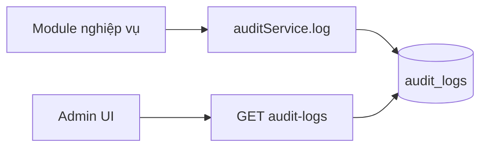

# Module Audit Log (Nhật ký hoạt động)

## Overview

Module **append-only read model** ghi nhận thao tác nhạy cảm (đăng nhập, đổi mật khẩu, confirm GR/GI/ST/SA). API công khai chỉ **đọc**; ghi qua `auditService.log()` nội bộ.

| Thuộc tính | Giá trị |
|------------|---------|
| Sprint | 3 |
| Trạng thái | Đã triển khai |
| Base path | `/api/v1/audit-logs` |
| FE route | `/audit-logs` |

## Purpose

Truy vết ai làm gì, khi nào, trên entity nào — phục vụ kiểm soát và điều tra sự cố.

## Scope

| Trong phạm vi | Ngoài phạm vi |
|---------------|---------------|
| GET list + detail | PUT/PATCH/DELETE log |
| Ghi async từ module khác | Real-time stream |
| Sanitize dữ liệu nhạy cảm | Full request body dump |

## Workflow

## Business Rules

| ID | Quy tắc |
|----|---------|
| BR-AL-01 | Không API ghi/xóa/sửa log |
| BR-AL-02 | Log fail không rollback nghiệp vụ chính |
| BR-AL-03 | Redact password, token fields trong oldData/newData |
| BR-AL-04 | userId nullable (system or failed auth) |

## Technical Design

Single service `audit.service.js`: `log()` write, `list()` / `getById()` read. Controller + route read-only.

## API / Database

[api.md](./api.md) · [database.md](./database.md)

## Validation

List query: pagination, filter module/action/userId/date range, search.

## Security

Permission `audit-log:read` only. JWT required.

## Error Handling

Write errors logged via logger.error; read 404 if id missing.

## Examples

Action `STOCK_TAKE_CONFIRM`, module `stock-take`, description tiếng Việt.

## Design Decisions

| Quyết định | Lý do |
|------------|-------|
| Append-only | Integrity audit trail |
| Best-effort write | Availability > strict audit |
| JSON oldData/newData | Linh hoạt schema |

## Notes

FE filter modules: auth, goods-receipt, goods-issue, stock-take, stock-adjustment.

## Checklist

- [x] Read API
- [x] Internal log helper
- [x] Sanitize
- [x] FE list + detail dialog
- [ ] Log all CRUD master data (future)

## Tài liệu con

[analysis](./analysis.md) · [api](./api.md) · [database](./database.md) · [frontend](./frontend.md) · [backend](./backend.md) · [user-guide](./user-guide.md) · [developer-guide](./developer-guide.md)
