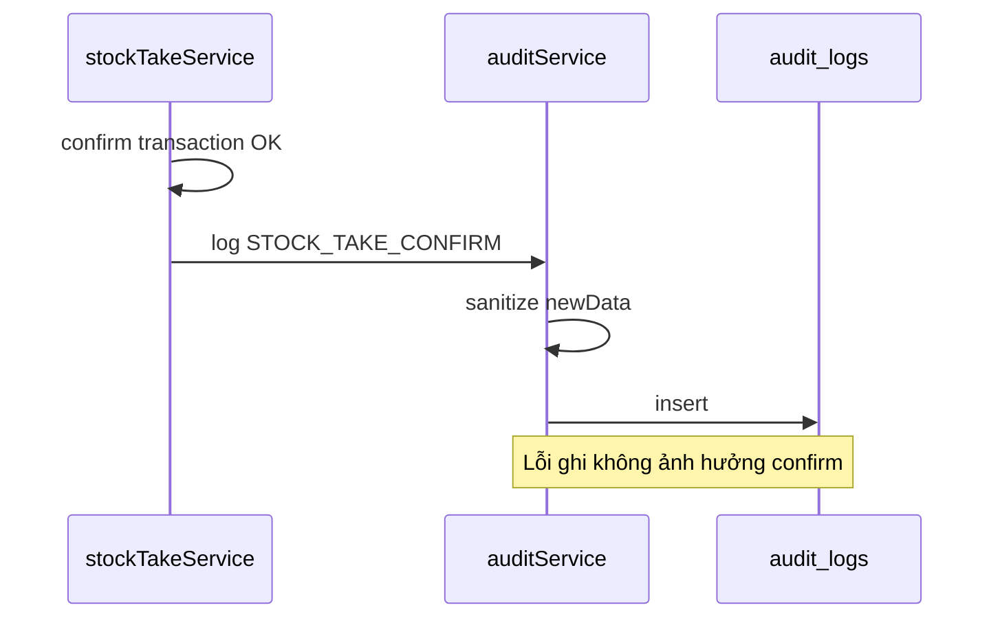

# Audit Log – Phân tích nghiệp vụ

## Overview

Phân tích mô hình nhật ký bất biến, nguồn sự kiện và yêu cầu tra cứu.

## Purpose

Xác định event nào cần log và payload tối thiểu.

## Scope

Sự kiện confirm chứng từ, auth (login, logout, change password). Không log mọi GET.

## Workflow

## Business Rules

| Module | Actions (ví dụ) |
|--------|-----------------|
| auth | LOGIN, LOGOUT, CHANGE_PASSWORD |
| goods-receipt | GOODS_RECEIPT_CONFIRM |
| goods-issue | GOODS_ISSUE_CONFIRM |
| stock-take | STOCK_TAKE_CONFIRM |
| stock-adjustment | STOCK_ADJUSTMENT_CONFIRM |

## Technical Design

Flat table + JSON columns. Index module, action, userId, createdAt, entityId.

## API / Database

Bảng `audit_logs` — xem database.md.

## Validation

Search OR description, entityId, action (case insensitive contains).

## Security

Read restricted. Payload redaction before persist.

## Error Handling

Silent fail on write with error log.

## Examples

newData: `{ code, warehouseId }` — không dump full items.

## Design Decisions

Không partition theo tháng trong MVP — có thể thêm sau khi volume lớn.

## Notes

ipAddress, userAgent optional — pass from controller meta khi có.

## Checklist

- [x] Event inventory per module
- [x] Redaction list
- [ ] Retention policy doc
