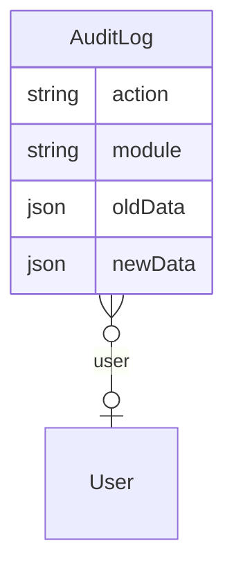

# Audit Log – Database

## Overview

Bảng `audit_logs` lưu sự kiện append-only, map Prisma model `AuditLog`.

## Purpose

Schema reference và index strategy cho tra cứu theo thời gian/module.

## Scope

Single table; no relations requiring cascade delete from business entities.

## Workflow

INSERT only from application. SELECT for UI/reports.

## Business Rules

userId ON DELETE SET NULL — log survives user delete. No updated_at — immutable row.

## Technical Design

## API / Database

### Cột `audit_logs`

| Cột | Kiểu | Mô tả |
|-----|------|-------|
| id | UUID PK | |
| user_id | FK nullable SET NULL | Người thực hiện |
| action | VARCHAR | Mã hành động |
| module | VARCHAR | Slug module |
| entity_type | VARCHAR nullable | Tên entity |
| entity_id | VARCHAR nullable | ID entity |
| description | TEXT nullable | |
| old_data | JSON nullable | Trước thay đổi |
| new_data | JSON nullable | Sau thay đổi |
| ip_address | VARCHAR nullable | |
| user_agent | TEXT nullable | |
| created_at | TIMESTAMP | Thời điểm sự kiện |

### Index

action, module, entity_id, user_id, created_at — hỗ trợ filter list.

## Validation

App-layer sanitize before insert; DB accepts any JSON.

## Security

Sensitive keys redacted to `[REDACTED]` in oldData/newData.

## Error Handling

Insert failure caught in auditService.log — logged, not thrown.

## Examples

Row: action=`LOGIN`, module=`auth`, newData without password fields.

## Design Decisions

entity_id as String — supports non-UUID ids future. JSON vs separate audit_detail table — JSON for MVP speed.

## Notes

No soft delete. Archival = future job moving old rows to cold storage.

## Checklist

- [x] Column + index doc
- [x] Immutability noted
- [ ] Retention/archival plan
