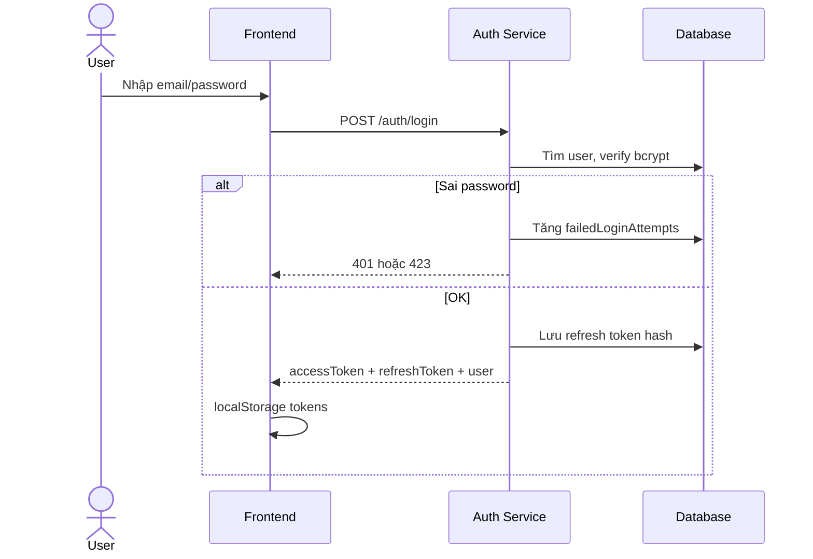

# Auth — Phân tích nghiệp vụ

## Overview

Phân tích nghiệp vụ module xác thực WMS: đăng nhập email/password, duy trì phiên JWT, đăng xuất, xem profile, đổi mật khẩu. Là nền tảng cho middleware `authenticate`/`authorize` toàn hệ thống.

## Purpose

Xác định actor, luồng nghiệp vụ, business rules và tiêu chí chấp nhận trước khi triển khai hoặc mở rộng Auth.

## Scope

| Bao gồm | Loại trừ |
|---------|----------|
| Login, refresh, logout, me, change-password | CRUD user/role |
| Lockout, rate limit | OAuth, MFA, forgot-password |
| User story AUTH-01 → AUTH-07 | Chi tiết API → [api.md](./api.md) |

## Workflow

### Luồng đăng nhập

### Luồng duy trì phiên

1. App load → có `accessToken` → `GET /auth/me`
2. 401 → Axios interceptor gọi `POST /auth/refresh`
3. Refresh OK → retry request; fail → redirect `/login`

### Trạng thái tài khoản

| Status | Ý nghĩa | Hành vi login |
|--------|---------|---------------|
| ACTIVE | Bình thường | Cho phép |
| INACTIVE | Vô hiệu hóa bởi Admin | 403 |
| LOCKED | Khóa tạm (brute-force) | 423 |

## Business Rules

| ID | Rule | Mô tả cụ thể |
|----|------|--------------|
| BR-01 | Không đăng ký công khai | Chỉ Admin tạo user qua [User module](../user/README.md) |
| BR-02 | Email unique, lowercase | Normalize trước khi query |
| BR-03 | Access 15m / Refresh 7d | Config qua env `JWT_*_EXPIRES_IN` |
| BR-04 | Refresh lưu hash SHA-256 | Không lưu plain token trong DB |
| BR-05 | Logout revoke refresh hiện tại | Idempotent nếu token đã revoke |
| BR-06 | Đổi MK revoke tất cả refresh | Bắt đăng nhập lại |
| BR-07 | 5 lần sai → LOCKED 15 phút | `MAX_FAILED_ATTEMPTS=5`, `LOCK_DURATION_MINUTES=15` |
| BR-08 | INACTIVE → từ chối login/refresh | 403 |
| BR-09 | bcrypt cost 12 | `BCRYPT_ROUNDS=12` |
| BR-10 | Không trả passwordHash | Mapper `mapUserResponse` |
| BR-11 | MK mới ≠ MK hiện tại | Change-password reject nếu trùng |

## Technical Design

Tham chiếu triển khai: [backend.md](./backend.md), [frontend.md](./frontend.md). Audit log ghi `LOGIN`, `LOGOUT`, `CHANGE_PASSWORD` qua `auditService`.

## API / Database

Không áp dụng chi tiết tại file này — xem [api.md](./api.md) và [database.md](./database.md).

## Validation

| Form/API | Field | Rule |
|----------|-------|------|
| Login | email | Email hợp lệ, trim |
| Login | password | Required, min 1 |
| Refresh/Logout | refreshToken | Required string |
| Change password | currentPassword | Required |
| Change password | newPassword | `passwordPolicy`: ≥8, 1 hoa, 1 thường, 1 số |
| Change password | confirmPassword | Khớp newPassword |

## Security

- Message login thống nhất: "Email hoặc mật khẩu không đúng" — không tiết lộ email tồn tại
- Rate limit: 10 request/15 phút/IP (bypass trong `NODE_ENV=test`)
- JWT secret ≥ 32 ký tự (env validation)
- Permissions embed trong access token — thay đổi role có hiệu lực sau login/refresh

## Error Handling

| Case | HTTP | Message (ví dụ) |
|------|------|-----------------|
| Sai email/password | 401 | Email hoặc mật khẩu không đúng |
| INACTIVE | 403 | Tài khoản đã bị vô hiệu hóa |
| LOCKED | 423 | Tài khoản tạm khóa, thử lại sau X phút |
| Token invalid/expired | 401 | Refresh token không hợp lệ |
| Rate limit | 429 | Quá nhiều yêu cầu, thử lại sau |
| MK hiện tại sai | 400 | Mật khẩu hiện tại không đúng |

## Examples

### User Stories

| ID | Story | Priority |
|----|-------|----------|
| AUTH-01 | Đăng nhập email/password | Must |
| AUTH-02 | Duy trì phiên tự động (refresh) | Must |
| AUTH-03 | Đăng xuất | Must |
| AUTH-04 | Xem thông tin tài khoản (/me) | Must |
| AUTH-05 | Đổi mật khẩu | Must |
| AUTH-06 | Khóa sau 5 lần sai | Must |
| AUTH-07 | INACTIVE không đăng nhập | Must |

### Acceptance Criteria

- Login OK → tokens + vào app với đúng permissions
- Sai MK → 401, không lộ email tồn tại
- Auto refresh hoạt động khi access hết hạn
- Logout clear session + revoke refresh
- Đổi MK → revoke all → bắt login lại
- Swagger đủ 5 endpoints

## Design Decisions

| Decision | Reason | Advantages | Trade-offs |
|----------|--------|------------|------------|
| Lock trên User row | MVP nhanh | Ít bảng, query đơn giản | Khó báo cáo lịch sử lock |
| Auto unlock khi hết `lockedUntil` | UX tốt hơn | User tự login lại | Cần check mỗi lần login |
| Permissions trong JWT | Giảm DB hit mỗi request | authorize() nhanh | Stale permissions đến khi refresh |

## Notes

- Module User gọi `authRepository.revokeAllUserTokens` khi deactivate/reset password
- Chi tiết permission matrix các module khác: [Role](../role/README.md)

## Checklist

- [x] User stories AUTH-01 → AUTH-07 documented
- [x] Business rules BR-01 → BR-11
- [x] Flow diagrams (login + session)
- [x] Error matrix
- [x] Cross-ref API/DB/FE/BE docs
