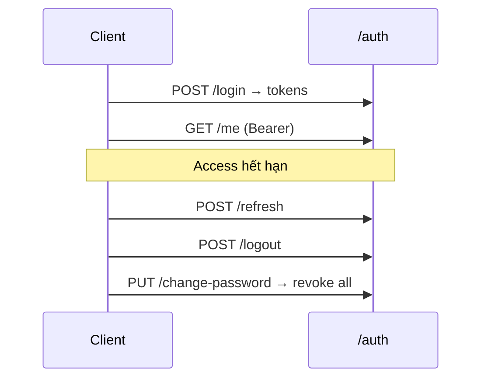

# Auth — API Documentation

## Overview

Tài liệu REST API module xác thực. Base URL: `/api/v1/auth`. Swagger: `http://localhost:3000/api-docs` (tag **Auth**).

## Purpose

Mô tả đầy đủ contract API cho client (FE, integration test, bên thứ ba): URL, method, auth, body, response, mã lỗi.

## Scope

5 endpoints: login, refresh, logout, me, change-password. Không bao gồm User/Role CRUD.

## Workflow



## Business Rules

| Endpoint | Business Rules |
|----------|----------------|
| POST /login | BR-07 lockout; BR-08 INACTIVE; rate limit 10/15 phút |
| POST /refresh | Token phải còn hạn, chưa revoke; user ACTIVE |
| POST /logout | Revoke refresh token (idempotent) |
| GET /me | User phải tồn tại |
| PUT /change-password | BR-06 revoke all; MK mới khác MK cũ |

## Technical Design

Middleware stack: `validate(schema)` → `authenticate` (nếu cần) → controller → service. Rate limit chỉ áp dụng `/login`.

## API / Database

### Tổng hợp endpoints

| Method | URL | Auth | Mô tả |
|--------|-----|------|-------|
| POST | `/auth/login` | Public | Đăng nhập |
| POST | `/auth/refresh` | Public | Cấp access token mới |
| POST | `/auth/logout` | Bearer | Revoke refresh token |
| GET | `/auth/me` | Bearer | Profile user hiện tại |
| PUT | `/auth/change-password` | Bearer | Đổi mật khẩu |

---

### POST `/auth/login`

| Thuộc tính | Giá trị |
|------------|---------|
| **URL** | `POST /api/v1/auth/login` |
| **Method** | POST |
| **Auth** | Không (Public) |
| **Description** | Xác thực email/password, trả JWT + thông tin user |

**Headers**

| Header | Required | Value |
|--------|----------|-------|
| Content-Type | Yes | `application/json` |

**Parameters** — Không có (query/path)

**Body**

| Field | Type | Required | Validation |
|-------|------|----------|------------|
| email | string | Yes | Email hợp lệ |
| password | string | Yes | Min 1 ký tự |

**Response 200**

```json
{
  "success": true,
  "message": "Đăng nhập thành công",
  "data": {
    "accessToken": "eyJ...",
    "refreshToken": "eyJ...",
    "expiresIn": 900,
    "user": {
      "id": "uuid",
      "email": "admin@wms.com",
      "fullName": "System Admin",
      "avatarUrl": null,
      "status": "ACTIVE",
      "role": {
        "id": "uuid",
        "name": "Admin",
        "permissions": ["user:read", "role:read"]
      },
      "lastLoginAt": "2026-08-07T00:00:00.000Z"
    }
  }
}
```

**Status Codes:** 200, 400, 401, 403, 423, 429, 500

**Error Response**

| Status | Message |
|--------|---------|
| 400 | Validation error (email không hợp lệ) |
| 401 | Email hoặc mật khẩu không đúng |
| 403 | Tài khoản đã bị vô hiệu hóa |
| 423 | Tài khoản tạm khóa, thử lại sau X phút |
| 429 | Quá nhiều yêu cầu, thử lại sau |

**Validation:** `loginSchema` — email + password required

**Business Rules:** BR-07, BR-08, BR-09, BR-10; rate limit 10/15 phút/IP

**Example**

```bash
curl -X POST http://localhost:3000/api/v1/auth/login \
  -H "Content-Type: application/json" \
  -d '{"email":"admin@wms.com","password":"Admin@123"}'
```

---

### POST `/auth/refresh`

| Thuộc tính | Giá trị |
|------------|---------|
| **URL** | `POST /api/v1/auth/refresh` |
| **Method** | POST |
| **Auth** | Public |
| **Description** | Cấp access token mới từ refresh token hợp lệ |

**Body**

| Field | Type | Required |
|-------|------|----------|
| refreshToken | string | Yes |

**Response 200**

```json
{
  "success": true,
  "message": "Token refreshed",
  "data": {
    "accessToken": "eyJ...",
    "expiresIn": 900
  }
}
```

**Status Codes:** 200, 400, 401, 403, 500

**Error Response:** 401 — Refresh token không hợp lệ / đã hết hạn; 403 — INACTIVE

**Validation:** `refreshSchema`

**Business Rules:** BR-04, BR-08

**Example**

```bash
curl -X POST http://localhost:3000/api/v1/auth/refresh \
  -H "Content-Type: application/json" \
  -d '{"refreshToken":"<refresh_token>"}'
```

---

### POST `/auth/logout`

| Thuộc tính | Giá trị |
|------------|---------|
| **URL** | `POST /api/v1/auth/logout` |
| **Method** | POST |
| **Auth** | Bearer access token |
| **Description** | Revoke refresh token hiện tại |

**Headers:** `Authorization: Bearer <accessToken>`, `Content-Type: application/json`

**Body:** `{ "refreshToken": "..." }`

**Response 200:** `{ "success": true, "message": "Đăng xuất thành công", "data": null }`

**Status Codes:** 200, 400, 401, 500

**Validation:** `logoutSchema`

**Business Rules:** BR-05

---

### GET `/auth/me`

| Thuộc tính | Giá trị |
|------------|---------|
| **URL** | `GET /api/v1/auth/me` |
| **Method** | GET |
| **Auth** | Bearer |
| **Description** | Lấy profile user đang đăng nhập kèm role + permissions |

**Response 200:** Cùng cấu trúc `user` như login (không có tokens)

**Status Codes:** 200, 401, 404, 500

**Business Rules:** BR-10

---

### PUT `/auth/change-password`

| Thuộc tính | Giá trị |
|------------|---------|
| **URL** | `PUT /api/v1/auth/change-password` |
| **Method** | PUT |
| **Auth** | Bearer |
| **Description** | Đổi mật khẩu; revoke tất cả refresh tokens |

**Body**

| Field | Type | Required | Validation |
|-------|------|----------|------------|
| currentPassword | string | Yes | Required |
| newPassword | string | Yes | passwordPolicy |
| confirmPassword | string | Yes | Khớp newPassword |

**Response 200:** `{ "success": true, "message": "Đổi mật khẩu thành công. Vui lòng đăng nhập lại.", "data": null }`

**Status Codes:** 200, 400, 401, 500

**Error Response:** 400 — Mật khẩu hiện tại không đúng / MK mới trùng MK cũ / confirm không khớp

**Business Rules:** BR-06, BR-09, BR-11

**Example**

```bash
curl -X PUT http://localhost:3000/api/v1/auth/change-password \
  -H "Authorization: Bearer <token>" \
  -H "Content-Type: application/json" \
  -d '{"currentPassword":"Admin@123","newPassword":"NewPass@456","confirmPassword":"NewPass@456"}'
```

## Validation

Schemas trong `backend/src/modules/auth/auth.validation.js`. Password policy dùng chung `backend/src/utils/passwordPolicy.js`.

## Security

- Login: rate limit + generic error message
- Bearer token cho protected endpoints
- Refresh token verified JWT + DB record (hash, expiry, revoked)

## Error Handling

Format chuẩn: `{ "success": false, "message": "..." }`. Validation errors có thể kèm `errors[]`.

## Examples

Xem từng endpoint ở trên. Seed account: `admin@wms.com` / `Admin@123`.

## Design Decisions

| Decision | Reason | Advantages | Trade-offs |
|----------|--------|------------|------------|
| Refresh không rotate | MVP đơn giản | Ít phức tạp client | Không detect token reuse |
| Logout idempotent | UX ổn định | Không lỗi khi token đã revoke | Khó phát hiện replay |

## Notes

Access token payload: `sub`, `email`, `roleId`, `roleName`, `permissions[]`. Env: `JWT_ACCESS_SECRET`, `JWT_REFRESH_SECRET`, `JWT_ACCESS_EXPIRES_IN` (default `15m`), `JWT_REFRESH_EXPIRES_IN` (default `7d`).

## Checklist

- [x] 5 endpoints documented đủ fields
- [x] Status codes + error messages
- [x] Validation + business rules per endpoint
- [x] curl examples
- [x] Cross-ref database schema
