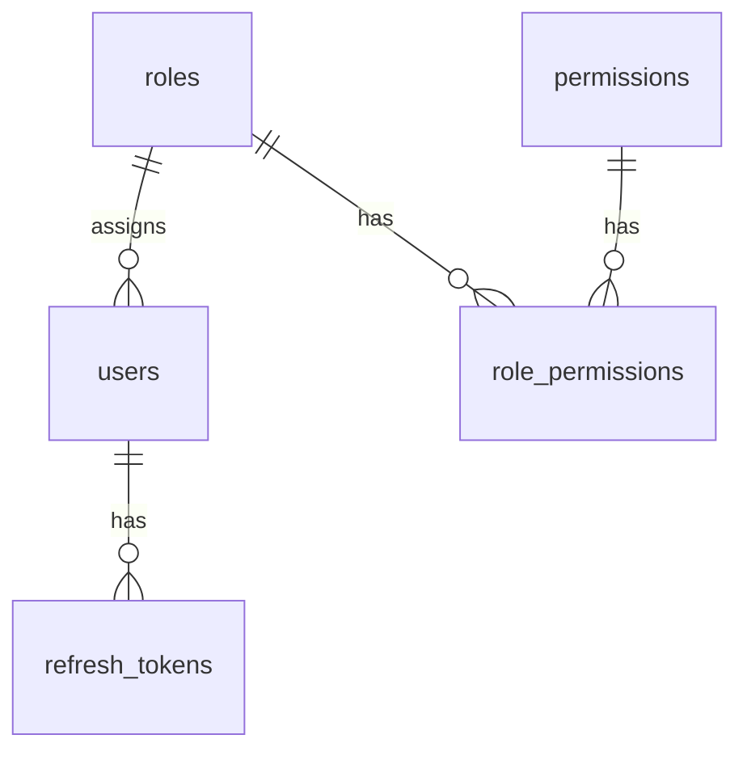

# Auth – Database Documentation

## Bảng liên quan

| Bảng | Mục đích |
|------|----------|
| `users` | Credential + profile |
| `refresh_tokens` | Quản lý phiên refresh |
| `roles` | Vai trò (seed) |
| `permissions` | Quyền (seed) |
| `role_permissions` | N–N Role ↔ Permission |

## ERD



## `users` (chính)

| Field | Type | Notes |
|-------|------|-------|
| id | UUID PK | |
| email | VARCHAR UNIQUE | Login identity |
| password_hash | VARCHAR | bcrypt |
| full_name | VARCHAR | |
| avatar_url | VARCHAR? | |
| status | ENUM | ACTIVE / INACTIVE / LOCKED |
| role_id | UUID FK | → roles |
| failed_login_attempts | INT | Brute-force |
| locked_until | TIMESTAMPTZ? | |
| last_login_at | TIMESTAMPTZ? | |
| created_at / updated_at | TIMESTAMPTZ | |

**Index:** email UNIQUE, status, role_id

## `refresh_tokens`

| Field | Type | Notes |
|-------|------|-------|
| id | UUID PK | |
| user_id | UUID FK CASCADE | |
| token_hash | VARCHAR UNIQUE | SHA-256 của token |
| expires_at | TIMESTAMPTZ | |
| revoked_at | TIMESTAMPTZ? | |
| ip_address / user_agent | VARCHAR? | Metadata |
| created_at | TIMESTAMPTZ | |

## Lý do thiết kế

- Hash refresh token → an toàn nếu DB lộ  
- `revoked_at` thay vì xóa → audit  
- Lock fields trên user → đơn giản cho MVP  

## Seed

```bash
cd backend && npm run db:seed
```

Roles: Admin (all), Manager (không user/role), Staff (chỉ `:read`)  
Admin: `admin@wms.com` / `Admin@123`
