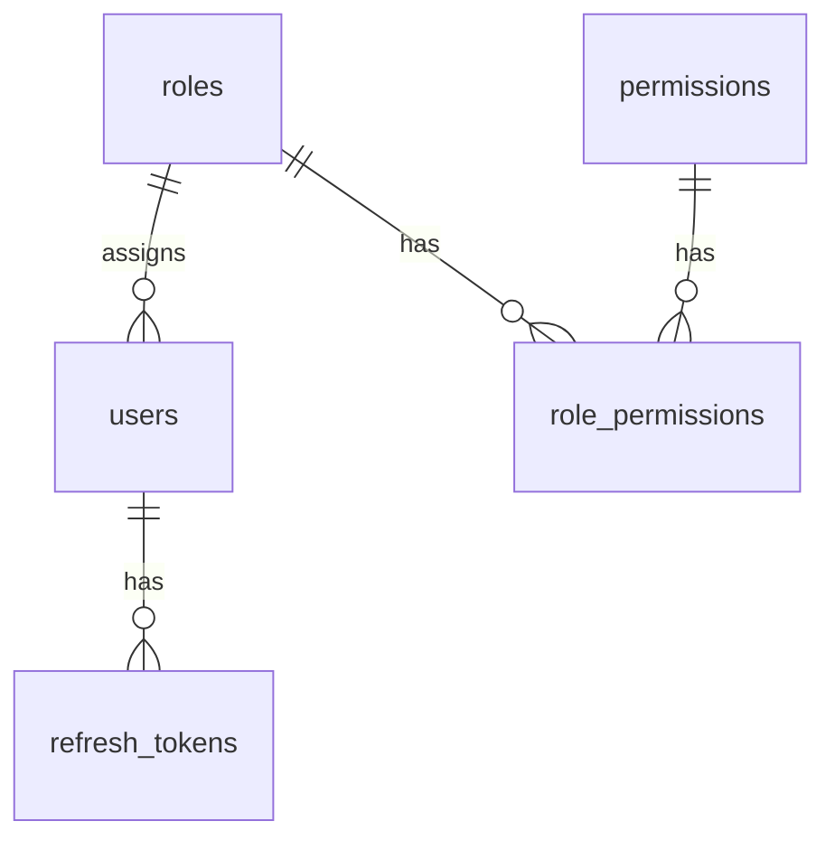

# Auth — Database Documentation

## Overview

Schema cơ sở dữ liệu phục vụ module Auth: credential, phiên refresh token, và quan hệ role/permission (đọc khi login).

## Purpose

Mô tả bảng, cột, ràng buộc, index và quan hệ để dev/DBA hiểu dữ liệu Auth lưu trữ và truy vấn thế nào.

## Scope

Bảng: `users`, `refresh_tokens`, `roles`, `permissions`, `role_permissions`. User module tái sử dụng `users` — xem [User database](../user/database.md).

## Workflow



## Business Rules

| Rule | DB enforcement |
|------|----------------|
| Email unique | UNIQUE index trên `users.email` |
| Refresh token unique | UNIQUE trên `refresh_tokens.token_hash` |
| Role name unique | UNIQUE trên `roles.name` |
| Permission code unique | UNIQUE trên `permissions.code` |
| Xóa user → xóa refresh | FK `refresh_tokens.user_id` ON DELETE CASCADE |

## Technical Design

ORM: Prisma (`backend/prisma/schema.prisma`). Enum `UserStatus`: ACTIVE, INACTIVE, LOCKED.

## API / Database

Không áp dụng — xem [api.md](./api.md).

### Bảng `users`

| Column | Type | Description |
|--------|------|-------------|
| id | UUID | **PK** — định danh user |
| email | VARCHAR | **UNIQUE** — identity đăng nhập, lowercase |
| password_hash | VARCHAR | bcrypt hash (cost 12) |
| full_name | VARCHAR | Họ tên hiển thị |
| avatar_url | VARCHAR? | URL ảnh đại diện |
| status | UserStatus | ACTIVE / INACTIVE / LOCKED |
| role_id | UUID | **FK → roles.id** |
| failed_login_attempts | INT | Đếm lần sai (default 0) |
| locked_until | TIMESTAMPTZ? | Hết hạn khóa tạm |
| last_login_at | TIMESTAMPTZ? | Lần đăng nhập cuối |
| created_at | TIMESTAMPTZ | Audit |
| updated_at | TIMESTAMPTZ | Audit |

**Index:** UNIQUE(email); INDEX(status); INDEX(role_id)

**Relationships:** N users → 1 role; 1 user → N refresh_tokens; user liên kết audit/transactions khác (ngoài Auth)

**Business Notes:** Không SELECT/RETURN `password_hash` qua API. Lock fields reset khi login OK hoặc Admin unlock.

---

### Bảng `refresh_tokens`

| Column | Type | Description |
|--------|------|-------------|
| id | UUID | **PK** |
| user_id | UUID | **FK → users.id** ON DELETE CASCADE |
| token_hash | VARCHAR | **UNIQUE** — SHA-256 của refresh JWT |
| expires_at | TIMESTAMPTZ | Thời điểm hết hạn |
| revoked_at | TIMESTAMPTZ? | Thời điểm revoke (logout/change-pw/deactivate) |
| ip_address | VARCHAR? | Metadata login |
| user_agent | VARCHAR? | Metadata client |
| created_at | TIMESTAMPTZ | Audit |

**Index:** UNIQUE(token_hash); INDEX(user_id); INDEX(expires_at)

**Business Notes:** Revoke = set `revoked_at`, không xóa row (phục vụ audit). `revokeAllUserTokens` set revoked cho mọi token active của user.

---

### Bảng `roles`

| Column | Type | Description |
|--------|------|-------------|
| id | UUID | **PK** |
| name | VARCHAR | **UNIQUE** — Admin, Manager, Staff, custom |
| description | VARCHAR? | Mô tả vai trò |
| created_at / updated_at | TIMESTAMPTZ | Audit |

**Relationships:** 1 role → N users; N-M permissions qua `role_permissions`

---

### Bảng `permissions`

| Column | Type | Description |
|--------|------|-------------|
| id | UUID | **PK** |
| code | VARCHAR | **UNIQUE** — `{module}:{action}` |
| name | VARCHAR | Nhãn hiển thị |
| module | String | Nhóm module |
| created_at / updated_at | TIMESTAMPTZ | Audit |

**Index:** INDEX(module)

**Business Notes:** Seed từ `backend/src/constants/permissions.js`. Không CRUD qua Auth API.

---

### Bảng `role_permissions`

| Column | Type | Description |
|--------|------|-------------|
| role_id | UUID | **PK composite**, **FK → roles** CASCADE |
| permission_id | UUID | **PK composite**, **FK → permissions** CASCADE |

**Business Notes:** Junction N-N. Permissions load khi login để embed vào JWT.

## Validation

Ràng buộc DB bổ sung cho validation API: NOT NULL trên email, password_hash, role_id; enum status.

## Security

- `password_hash`: bcrypt, never exposed
- `token_hash`: SHA-256 — không recover plain refresh token
- Cascade delete refresh khi xóa user (hard delete — hiện MVP dùng soft INACTIVE)

## Error Handling

Vi phạm UNIQUE → Prisma P2002 → API 409 (ở module User/Role). Auth login không expose constraint details.

## Examples

```bash
cd backend && npm run db:push && npm run db:seed
```

Seed roles: Admin (full), Manager (no user/role/audit-log), Staff (`:read` only). Admin user: `admin@wms.com`.

## Design Decisions

| Decision | Reason | Advantages | Trade-offs |
|----------|--------|------------|------------|
| Hash refresh token | DB leak mitigation | Không lộ session | Không lookup by plain token |
| revoked_at vs DELETE | Audit trail | Lịch sử phiên | Bảng tăng dần — cần cleanup job sau |
| Lock on users row | Simplicity | Một query login | Không multi-device lock riêng |

## Notes

Chi tiết CRUD role/permission: [Role database](../role/database.md). ERD tổng: `docs/wms-database.md`.

## Checklist

- [x] All Auth-related tables documented
- [x] PK/FK/Index/Constraints noted
- [x] Business notes per table
- [x] ERD diagram
- [x] Seed instructions
