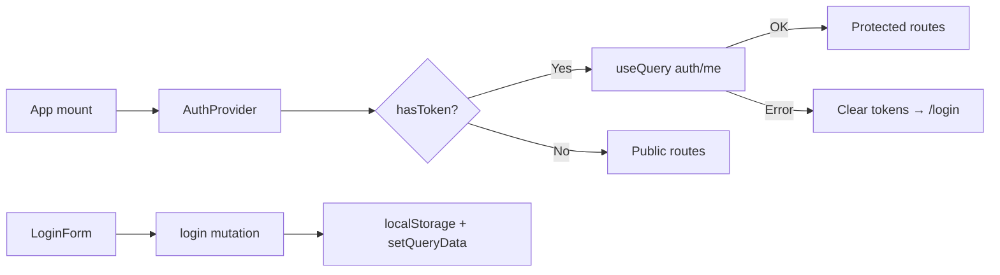

# Auth — Frontend Documentation

## Overview

Thiết kế giao diện và cấu trúc feature Auth trên React: đăng nhập, đổi mật khẩu, quản lý phiên qua `AuthProvider`.

## Purpose

Mô tả routes, state, API client, token storage và luồng UI để dev FE triển khai hoặc bảo trì Auth.

## Scope

| Trong phạm vi | Ngoài phạm vi |
|---------------|---------------|
| `/login`, `/change-password` | User/Role admin pages |
| AuthProvider, interceptors | Backend middleware |
| LoginForm, ChangePasswordForm | PermissionRoute logic chi tiết các module khác |

## Workflow



## Business Rules

| UI Rule | Implementation |
|---------|----------------|
| Chưa login → không vào app | `ProtectedRoute` redirect `/login` |
| Đã login → không vào `/login` | `PublicRoute` redirect `/` |
| Đổi MK xong → logout | `changePasswordMutation.onSuccess` gọi logout |
| Hiển thị lỗi login | `loginError` từ mutation |

## Technical Design

### Routes

| Path | Component | Guard |
|------|-----------|-------|
| `/login` | `LoginPage` | PublicRoute |
| `/change-password` | `ChangePasswordPage` | ProtectedRoute |
| `/*` (app) | AppLayout | ProtectedRoute |

### Feature structure

```
frontend/src/features/auth/
├── api/authApi.js
├── hooks/useAuth.jsx          # AuthProvider + useAuth
├── schemas/authSchema.js
├── components/
│   ├── LoginForm.jsx
│   └── ChangePasswordForm.jsx
└── pages/
    ├── LoginPage.jsx
    └── ChangePasswordPage.jsx
```

### Auth state (`useAuth`)

| Property | Type | Mô tả |
|----------|------|-------|
| user | object \| null | Profile từ `/auth/me` |
| isAuthenticated | boolean | Có token + me loaded |
| isLoading | boolean | Đang fetch me |
| isLoggingIn / isLoggingOut | boolean | Mutation pending |
| login / logout / changePassword | functions | Async actions |
| loginError | Error | Lỗi đăng nhập |

### Token storage

| Key | Location |
|-----|----------|
| accessToken | `localStorage.accessToken` |
| refreshToken | `localStorage.refreshToken` |

Axios interceptor (`@/lib/axios`): gắn `Authorization: Bearer`; 401 → `POST /auth/refresh` → retry hoặc clear + redirect login.

### UI components

| Component | Mô tả |
|-----------|-------|
| LoginForm | Card centered, email/password, show/hide password, loading, error alert |
| ChangePasswordForm | current + new + confirm password |
| Header | fullName, role, nút Đổi MK, Đăng xuất |

Responsive: card max-width ~400px desktop.

## API / Database

API client: [api.md](./api.md). Không truy cập DB trực tiếp từ FE.

## Validation

`frontend/src/features/auth/schemas/authSchema.js` — mirror BE rules (email, password policy, confirm match). Tests: `schemas/__tests__/authSchema.test.js`.

## Security

- Tokens trong localStorage (MVP) — cân nhắc httpOnly cookie cho production
- Không log tokens ra console
- Clear tokens khi me query fail hoặc logout

## Error Handling

Hiển thị `error.response.data.message` hoặc fallback "Có lỗi xảy ra". Login errors qua `loginError` prop.

## Examples

```javascript
const { login, user, logout } = useAuth();
await login({ email: 'admin@wms.com', password: 'Admin@123' });
```

Env:

```env
VITE_API_BASE_URL=http://localhost:3000/api/v1
VITE_APP_NAME=WMS
```

## Design Decisions

| Decision | Reason | Advantages | Trade-offs |
|----------|--------|------------|------------|
| React Query cho me | Cache + refetch | Đồng bộ state app | Thêm dependency |
| localStorage tokens | MVP nhanh | Dễ debug | XSS risk |
| Auto logout sau change-pw | BR-06 | Session sạch | User phải login lại |

## Notes

Permissions đọc từ `user.role.permissions` — dùng `usePermissions()` hook ở module khác. Chi tiết BE: [backend.md](./backend.md).

## Checklist

- [x] Routes + guards documented
- [x] Feature folder structure
- [x] AuthProvider API surface
- [x] Token + interceptor behavior
- [x] Validation + env vars
