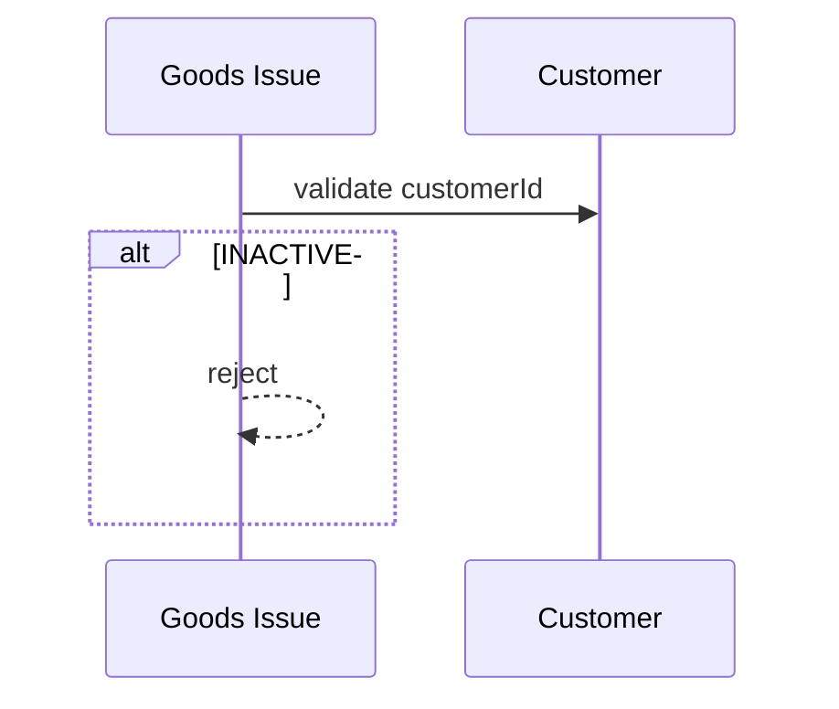

# Customer – Phân tích nghiệp vụ

## Overview

Phân tích module **khách hàng** — đối tượng nhận hàng xuất kho, liên kết phiếu xuất (goods issue).

## Purpose

Làm rõ actor, use case và ràng buộc với outbound logistics.

## Scope

Master data KH. Không quản lý đơn bán hàng đầy đủ.

## Workflow

### UC-CU-01: Tạo KH

Mã CUS-xxx, tên, liên hệ → status ACTIVE.

### UC-CU-02: Phiếu xuất

Goods issue chọn customer → validate ACTIVE.

### UC-CU-03: Ngừng giao dịch

Soft delete INACTIVE.

## Business Rules

| ID | Rule |
|----|------|
| CU-BR-01 | code unique UPPERCASE |
| CU-BR-02 | name min 2 |
| CU-BR-03 | soft delete INACTIVE |
| CU-BR-04 | INACTIVE on new goods issue |
| CU-BR-05 | notes max 1000 |

## Technical Design

Mirror supplier module. [backend.md](./backend.md)

## API / Database

[api.md](./api.md) · [database.md](./database.md)

## Validation

Zod BE/FE on contact fields

## Security

customer:* permissions

## Error Handling

409 Mã khách hàng đã tồn tại · 404 Không tìm thấy khách hàng

## Examples

CUS-001 Công ty Alpha — phiếu xuất tháng 3.

## Design Decisions

| Decision | Reason |
|----------|--------|
| Separate from supplier | Different WMS flows (issue vs receipt) |
| Same field set | Party contact pattern |

## Notes

goodsIssue.service validates customer when customerId provided.

## Checklist

- [x] BR + goods-issue workflow
- [ ] Sales order link (future)
