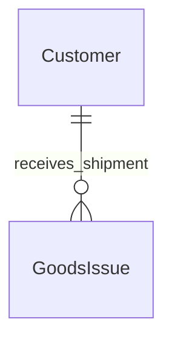

# Customer – Database Schema

## Overview

Bảng `customers` — master data khách hàng, Prisma model `Customer`.

## Purpose

Schema và quan hệ với goods_issues.

## Scope

customers table + incoming FKs

## Workflow



## Business Rules

code UNIQUE · EntityStatus · no hard delete

## Technical Design

customer.repository.js — Prisma CRUD

## API / Database

HTTP: [api.md](./api.md)

### Bảng `customers`

| Column | Type | Description |
|--------|------|-------------|
| id | UUID | PK |
| code | VARCHAR unique | Mã KH |
| name | VARCHAR | Tên |
| contact_person | VARCHAR nullable | |
| phone | VARCHAR nullable | |
| email | VARCHAR nullable | |
| address | TEXT nullable | |
| notes | TEXT nullable | |
| status | EntityStatus | |
| created_at | TIMESTAMPTZ | |
| updated_at | TIMESTAMPTZ | |

### PK / Unique / Index

PK id · UNIQUE code · INDEX status

### FK incoming

`goods_issues.customer_id` → customers.id

### Relationships

1 customer : N goods issues. INACTIVE customer retained on historical issues.

### Business Notes

Structure mirrors suppliers — intentional symmetry.

## Validation

Application Zod; DB constraints on code/name

## Security

Prisma only

## Error Handling

Unique violation → 409 API

## Examples

```sql
SELECT * FROM customers WHERE status = 'ACTIVE' ORDER BY code;
```

## Design Decisions

Separate table vs single `parties` — clearer WMS domain language.

## Notes

`backend/prisma/schema.prisma` model Customer

## Checklist

- [x] Columns + FK goods_issues
- [x] Symmetry note with suppliers
