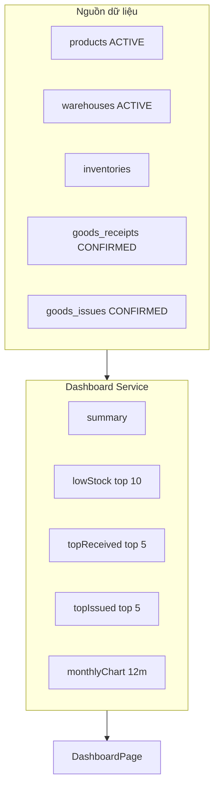

# Dashboard – Phân tích nghiệp vụ

## Overview

Phân tích màn **Tổng quan** — read model tổng hợp, không ghi dữ liệu.

## Purpose

Định nghĩa KPI, nguồn dữ liệu và quy tắc aggregate.

## Scope

1 API overview; không CRUD.

## Workflow

## Business Rules

| KPI | Công thức |
|-----|-----------|
| totalProducts | COUNT products WHERE status=ACTIVE |
| totalWarehouses | COUNT warehouses WHERE status=ACTIVE |
| totalStockQty | SUM inventories.quantity |
| totalStockValue | SUM qty × product.costPrice |
| receiptsToday | COUNT goods_receipts CONFIRMED, receipt_date in today |
| issuesToday | COUNT goods_issues CONFIRMED, issue_date in today |

## Technical Design

Parallel `Promise.all` trong `getOverview()`.

## API / Database (nếu có)

Tables read: products, warehouses, inventories, goods_receipts, goods_issues, goods_*_items (raw SQL).

## Validation

N/A input.

## Security

Role cần `dashboard:read` — thường Manager/Admin.

## Error Handling

Partial failure: entire overview fails (single Promise.all).

## Examples

| Story | P |
|-------|---|
| DASH-01 | Xem KPI khi có quyền | Must |
| DASH-02 | Message khi không quyền | Must |
| DASH-03 | Low stock table | Must |
| DASH-04 | Chart 12 tháng | Must |

## Design Decisions

monthlyChart counts documents not quantities — document clearly for BA/users.

## Notes

Timezone "today" = server local (startOfDay/endOfDay in service).

## Checklist

- [x] KPI formulas
- [x] Data sources
- [x] Assumptions documented
