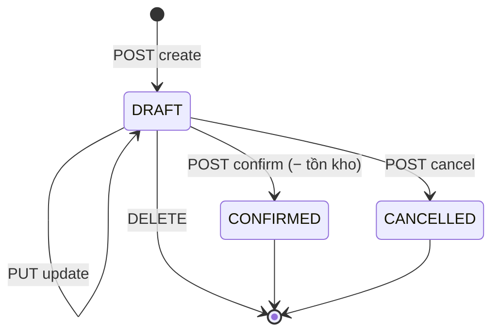

# Module Goods Issue (Xuất kho)

## Overview

Module quản lý **phiếu xuất kho** — chứng từ ghi nhận hàng ra khỏi kho. Pattern giống Nhập kho: `DRAFT → CONFIRMED / CANCELLED`. Tồn kho chỉ **giảm** khi Confirm; thất bại nếu không đủ tồn.

| Thuộc tính | Giá trị |
|------------|---------|
| Sprint | 2 – Module 2 |
| Trạng thái | ✅ Đã triển khai |
| Base path | `/api/v1/goods-issues` |
| FE route | `/goods-issues` |

## Purpose

- Tạo phiếu xuất hàng cho khách hàng (hoặc không gắn KH).
- Ghi nhận số lượng, đơn giá xuất theo dòng.
- Trừ `inventories` khi xác nhận, đảm bảo không âm kho.

## Scope

| Trong phạm vi | Ngoài phạm vi |
|---------------|---------------|
| CRUD phiếu DRAFT | Hủy phiếu CONFIRMED |
| Confirm → trừ tồn | Xuất chuyển kho |
| Cancel / Delete DRAFT | Pick/pack/shipment workflow |

## Workflow

| Bước | Hành động | Tồn kho |
|------|-----------|---------|
| 1 | Tạo DRAFT | Không đổi |
| 2 | Sửa DRAFT | Không đổi |
| 3 | Confirm | **Trừ** từng dòng; fail nếu thiếu |
| 4 | Cancel DRAFT | Không đổi |

## Business Rules

| ID | Quy tắc |
|----|---------|
| BR-GI01 | Phiếu mới = `DRAFT` |
| BR-GI02 | Mã: `GI-YYYYMMDD-XXXX` |
| BR-GI03 | Chỉ sửa/xóa/hủy khi `DRAFT` |
| BR-GI04 | Confirm trừ tồn trong transaction |
| BR-GI05 | **Không cho âm kho** — conflict nếu thiếu |
| BR-GI06 | `customerId` optional; kho/SP `ACTIVE` |
| BR-GI07 | Không trùng `productId` trong phiếu |
| BR-GI08 | `quantity > 0`; `unitPrice >= 0` |
| BR-GI09 | Audit `GOODS_ISSUE_CONFIRM` khi confirm |

## Technical Design

| Layer | Path |
|-------|------|
| BE | `backend/src/modules/goods-issue/` |
| FE | `frontend/src/features/goods-issues/` |

Confirm: `inventoryRepository.decreaseStock` — trả `{ ok: false, available }` nếu thiếu.

## API / Database (nếu có)

- [api.md](./api.md) · [database.md](./database.md)

## Validation

Zod BE/FE; service kiểm tra tồn khi confirm (không chỉ lúc tạo DRAFT).

## Security

| Permission | Mô tả |
|------------|-------|
| goods-issue:read | GET |
| goods-issue:create | POST |
| goods-issue:update | PUT, confirm, cancel |
| goods-issue:delete | DELETE |

## Error Handling

| HTTP | Tình huống |
|------|------------|
| 409 | Không đủ tồn: `Không đủ tồn kho cho sản phẩm X. Hiện có: N` |
| 409 | Phiếu không DRAFT |

## Examples

Confirm phiếu xuất 20 SP khi tồn 15 → **409**, không đổi status, không trừ tồn (transaction rollback).

## Design Decisions

| Quyết định | Lý do |
|------------|-------|
| Check tồn lúc confirm | DRAFT có thể tạo trước khi hàng về |
| Mirror goods-receipt | Một pattern chứng từ cho team |
| Không reverse CONFIRMED | MVP — nhập lại bằng goods-receipt |

## Notes

- `unitPrice` trên dòng; không sync `products.price`.
- Chi tiết: [developer-guide.md](./developer-guide.md).

## Checklist

- [x] CRUD DRAFT
- [x] Confirm trừ tồn + anti negative
- [x] FE + permissions
- [x] Audit confirm
- [ ] Hiển thị tồn khả dụng trên form (future)

## Tài liệu con

[analysis](./analysis.md) · [api](./api.md) · [database](./database.md) · [frontend](./frontend.md) · [backend](./backend.md) · [user-guide](./user-guide.md) · [developer-guide](./developer-guide.md)
