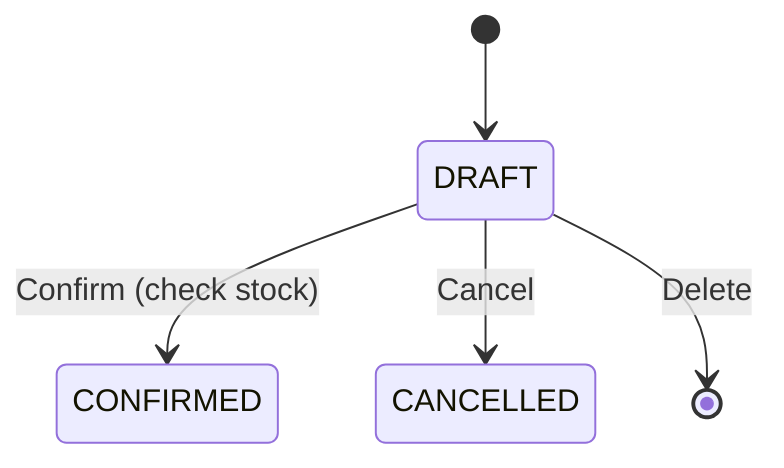

# Goods Issue – Phân tích nghiệp vụ

## Overview

Phân tích module **Xuất kho** — chứng từ giảm tồn, đối xứng với Nhập kho. Khác biệt chính: validate **đủ tồn** khi confirm.

## Purpose

Định nghĩa lifecycle, BR và integration với inventory.

## Scope

Phiếu xuất bán / xuất nội bộ. Không bao gồm reservation / allocated stock.

## Workflow



```text
Tạo DRAFT (chưa trừ tồn)
→ User có thể chỉnh sửa
→ Confirm: kiểm tra từng dòng quantity <= inventory.quantity
→ Nếu OK: CONFIRMED + decrement
→ Nếu fail: 409, rollback toàn transaction
```

## Business Rules

| ID | Quy tắc |
|----|---------|
| BR-GI01 | Không âm kho (BR-INV01) |
| BR-GI02 | Confirm all-or-nothing |
| BR-GI03 | customerId optional |
| BR-GI04 | Chỉ CONFIRMED mới ảnh hưởng tồn |
| BR-GI05 | SP inactive → 400 khi confirm |

## Technical Design

- Tables: `goods_issues`, `goods_issue_items`
- Stock: `decreaseStock(warehouseId, productId, qty, tx)`

## API / Database (nếu có)

Xem [api.md](./api.md), [database.md](./database.md).

## Validation

Giống goods-receipt nhưng `unitPrice` thay `unitCost`, `issueDate` thay `receiptDate`.

## Security

Permission prefix `goods-issue:*`.

## Error Handling

Insufficient stock → 409 với số tồn hiện có trong message.

## Examples

| ID | User Story | P |
|----|------------|---|
| GI-01 | List + filter | Must |
| GI-02 | Tạo DRAFT | Must |
| GI-03 | Confirm trừ tồn | Must |
| GI-04 | Block khi thiếu tồn | Must |
| GI-05 | Cancel DRAFT | Must |

## Design Decisions

| # | Quyết định |
|---|------------|
| DD-GI01 | Không soft-lock tồn ở DRAFT — đơn giản MVP |
| DD-GI02 | Fail fast từng dòng trong loop confirm |
| DD-GI03 | Message tiếng Việt kèm `available` |

## Notes

Top products xuất dùng trong Dashboard (`topIssued`).

## Checklist

- [x] State machine
- [x] Anti negative stock BR
- [x] User stories
- [ ] BA sign-off
