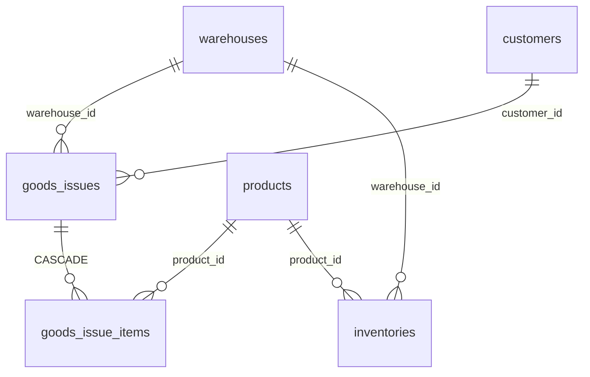

# Goods Issue – Database Schema

## Overview

Schema phiếu xuất: `goods_issues` + `goods_issue_items`. Enum `DocumentStatus`.

## Purpose

Mô tả cấu trúc DB và FK.

## Scope

2 bảng document + tham chiếu `inventories`.

## Workflow

Confirm → `UPDATE inventories SET quantity = quantity - ?` (app layer via Prisma decrement).

## Business Rules

- Không CHECK constraint âm tồn DB — enforced trong `decreaseStock`.
- Không row inventory → available = 0.

## Technical Design

Prisma: `backend/prisma/schema.prisma`.

## API / Database (nếu có)

### `goods_issues`

| Cột | Type | Mô tả |
|-----|------|-------|
| id | uuid PK | |
| code | varchar UK | GI-YYYYMMDD-XXXX |
| warehouse_id | uuid FK | → warehouses |
| customer_id | uuid FK nullable | → customers |
| status | DocumentStatus | default DRAFT |
| issue_date | date | |
| note | text nullable | |
| created_by_id | uuid FK | → users |
| confirmed_by_id | uuid FK nullable | |
| confirmed_at | timestamptz nullable | |
| created_at, updated_at | timestamptz | |

**Indexes:** status, warehouse_id, customer_id, issue_date, created_by_id.

### `goods_issue_items`

| Cột | Type | Mô tả |
|-----|------|-------|
| id | uuid PK | |
| goods_issue_id | uuid FK | Cascade delete |
| product_id | uuid FK | → products |
| quantity | decimal(15,3) | |
| unit_price | decimal(15,2) | default 0 |
| note | text nullable | |
| created_at, updated_at | timestamptz | |

### ERD

## Validation

Application-only quantity > 0.

## Security

API authorization; no RLS.

## Error Handling

FK restrict on delete master entities with documents.

## Examples

Tồn SP A = 10, confirm xuất 12 → transaction abort, status vẫn DRAFT.

## Design Decisions

Symmetric schema với goods_receipts (customer thay supplier, unit_price thay unit_cost).

## Notes

Dashboard raw SQL aggregate `goods_issue_items` WHERE parent CONFIRMED.

## Checklist

- [x] Tables documented
- [x] FK/cascade
- [x] Inventory link
