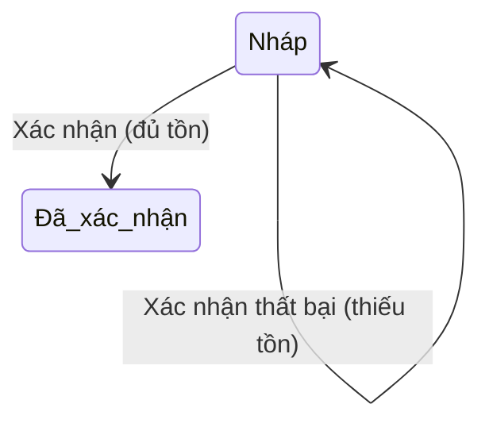

# Goods Issue – Hướng dẫn sử dụng

## Overview

Hướng dẫn thao tác **Phiếu xuất kho** trên WMS.

## Purpose

Giúp user xuất hàng đúng quy trình, tránh lỗi thiếu tồn.

## Scope

Thủ kho, quản lý có quyền `goods-issue:*`.

## Workflow

### Tạo phiếu xuất

1. Menu **Xuất kho** (`/goods-issues`).
2. **Tạo phiếu** → chọn Kho, (tuỳ chọn) Khách hàng, Ngày xuất.
3. Thêm dòng SP + số lượng + đơn giá xuất.
4. **Lưu** → trạng thái **Nháp**.

### Xác nhận xuất

1. Kiểm tra tồn trên màn **Tồn kho** (khuyến nghị).
2. Bấm **Xác nhận** trên phiếu Nháp.
3. Hệ thống trừ tồn — **từ chối** nếu bất kỳ dòng nào thiếu hàng.

### Hủy / Xóa

Chỉ áp dụng phiếu **Nháp**. Phiếu đã xác nhận không sửa/hủy trên MVP.

## Business Rules

| Quy tắc | Ý nghĩa |
|---------|---------|
| Không âm kho | Không xuất quá tồn hiện có |
| Confirm mới trừ | Nháp không ảnh hưởng tồn |
| Không trùng SP | Gộp số lượng 1 dòng |

## Technical Design

UI badge trạng thái; confirm qua hộp thoại xác nhận.

## API / Database (nếu có)

N/A cho end user.

## Validation

Thiếu tồn → thông báo kèm số lượng hiện có.

## Security

| Thao tác | Permission |
|----------|------------|
| Xem | goods-issue:read |
| Tạo | goods-issue:create |
| Sửa/Xác nhận/Hủy | goods-issue:update |
| Xóa | goods-issue:delete |

## Error Handling

Đọc message lỗi: ví dụ *"Không đủ tồn kho cho sản phẩm SP001. Hiện có: 5"* → giảm số lượng hoặc nhập thêm hàng.

## Examples

Xuất 30 cho KH B từ Kho HN: DRAFT → kiểm tra tồn ≥ 30 → Confirm.

## Design Decisions

Tách bước Nháp và Xác nhận để review trước khi trừ tồn.

## Notes

Đơn giá xuất trên phiếu không đổi giá bán master.

## Checklist (user)

- [ ] Đã kiểm tra tồn
- [ ] Số lượng đúng
- [ ] Confirm chỉ khi chắc chắn
