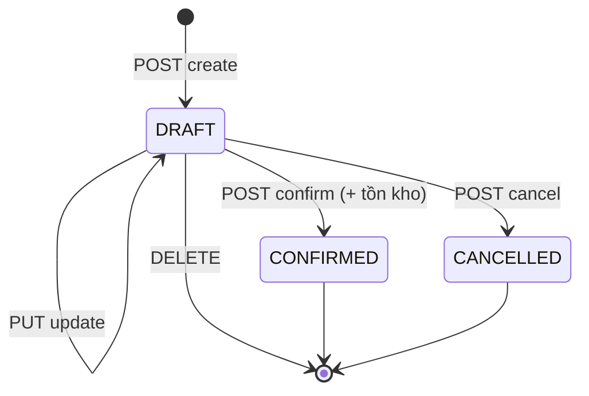

# Module Goods Receipt (Nhập kho)

## Overview

Module quản lý **phiếu nhập kho** — chứng từ ghi nhận hàng vào kho. Phiếu tuân theo mô hình chứng từ: `DRAFT → CONFIRMED / CANCELLED`. Tồn kho chỉ tăng khi **Confirm**.

| Thuộc tính | Giá trị |
|------------|---------|
| Sprint | 2 – Module 1 |
| Trạng thái | ✅ Đã triển khai |
| Base path | `/api/v1/goods-receipts` |
| FE route | `/goods-receipts` |

## Purpose

- Tạo và quản lý phiếu nhập hàng từ NCC (hoặc không gắn NCC).
- Ghi nhận số lượng, đơn giá nhập theo từng dòng sản phẩm.
- Cập nhật bảng `inventories` khi xác nhận phiếu.

## Scope

| Trong phạm vi | Ngoài phạm vi |
|---------------|---------------|
| CRUD phiếu nhập (DRAFT) | Hủy / đảo phiếu CONFIRMED |
| Confirm → cộng tồn | Nhập kho chuyển kho (transfer) |
| Cancel / Delete (DRAFT) | Quản lý NCC, SP, kho (module khác) |
| List, filter, search | Báo cáo chi tiết (module Report) |

## Workflow



| Bước | Hành động | Tồn kho |
|------|-----------|---------|
| 1 | Tạo phiếu DRAFT | Không đổi |
| 2 | Sửa / thêm dòng (DRAFT) | Không đổi |
| 3 | Confirm | **Cộng** theo từng dòng |
| 4 | Cancel (DRAFT) | Không đổi |

## Business Rules

| ID | Quy tắc |
|----|---------|
| BR-GR01 | Phiếu mới luôn ở trạng thái `DRAFT` |
| BR-GR02 | Mã phiếu tự sinh: `GR-YYYYMMDD-XXXX` |
| BR-GR03 | Chỉ sửa / xóa / hủy khi `DRAFT` |
| BR-GR04 | **Confirm** mới cộng tồn (`inventories`) trong transaction |
| BR-GR05 | Không hỗ trợ hủy phiếu `CONFIRMED` (MVP) |
| BR-GR06 | `supplierId` optional; kho và SP phải `ACTIVE` |
| BR-GR07 | Không trùng `productId` trong cùng phiếu |
| BR-GR08 | `quantity > 0`; `unitCost >= 0` |
| BR-GR09 | Confirm ghi audit log `GOODS_RECEIPT_CONFIRM` |

## Technical Design

| Layer | Path |
|-------|------|
| Route | `backend/src/modules/goods-receipt/goodsReceipt.route.js` |
| Controller | `goodsReceipt.controller.js` |
| Service | `goodsReceipt.service.js` |
| Repository | `goodsReceipt.repository.js` |
| Validation | `goodsReceipt.validation.js` |
| FE Page | `frontend/src/features/goods-receipts/pages/GoodsReceiptsPage.jsx` |
| FE API | `frontend/src/features/goods-receipts/api/goodsReceiptApi.js` |
| FE Schema | `frontend/src/features/goods-receipts/schemas/goodsReceiptSchema.js` |

Luồng Confirm: service mở transaction → kiểm tra DRAFT → `inventoryRepository.increaseStock` từng dòng → cập nhật status `CONFIRMED` + `confirmedBy` / `confirmedAt`.

## API / Database (nếu có)

- **API:** xem [api.md](./api.md)
- **DB:** `goods_receipts`, `goods_receipt_items` — xem [database.md](./database.md)

## Validation

| Tầng | Công cụ | Ghi chú |
|------|---------|---------|
| API | Zod (`goodsReceipt.validation.js`) | UUID, items min 1, quantity positive |
| Service | Business rules | Kho/NCC/SP active, không trùng SP |
| FE | Zod (`goodsReceiptSchema.js`) | Mirror API, chọn kho/SP bắt buộc |

## Security

| Permission | Endpoint |
|------------|----------|
| `goods-receipt:read` | GET list, GET by id |
| `goods-receipt:create` | POST create |
| `goods-receipt:update` | PUT, POST confirm, POST cancel |
| `goods-receipt:delete` | DELETE |

Tất cả route yêu cầu JWT (`authenticate` middleware).

## Error Handling

| HTTP | Tình huống |
|------|------------|
| 400 | Validation, kho/NCC/SP không hợp lệ, ngày sai |
| 401 | Chưa đăng nhập |
| 403 | Thiếu permission |
| 404 | Không tìm thấy phiếu |
| 409 | Thao tác trên phiếu không phải DRAFT |

## Examples

**Tạo phiếu nhập:**

```json
POST /api/v1/goods-receipts
{
  "warehouseId": "uuid-kho",
  "supplierId": "uuid-ncc",
  "receiptDate": "2026-08-07",
  "note": "Nhập hàng tháng 8",
  "items": [
    { "productId": "uuid-sp", "quantity": 100, "unitCost": 50000, "note": null }
  ]
}
```

**Confirm:** `POST /api/v1/goods-receipts/{id}/confirm` — không body.

## Design Decisions

| Quyết định | Lý do |
|------------|-------|
| Confirm mới cập nhật tồn | Tránh sai số khi phiếu còn nháp |
| Không hủy CONFIRMED | Tránh logic âm kho / đảo chứng từ phức tạp MVP |
| Replace-all items khi update DRAFT | Đơn giản, tránh diff dòng |
| Mã theo ngày + sequence | Dễ tra cứu, unique trong DB |
| NCC optional | Hỗ trợ nhập nội bộ / điều chỉnh tồn qua module khác |

## Notes

- `unitCost` lưu trên dòng phiếu; **không** tự cập nhật `products.cost_price`.
- Giá trị tồn trên màn Inventory dùng `product.costPrice`, không phải `unitCost` từng phiếu.
- Chi tiết triển khai: [developer-guide.md](./developer-guide.md).

## Checklist

- [x] CRUD phiếu DRAFT
- [x] Confirm cộng tồn (transaction)
- [x] Cancel / Delete chỉ DRAFT
- [x] Phân quyền đầy đủ
- [x] Audit log khi confirm
- [x] FE list + form + confirm/cancel
- [ ] Hủy / đảo phiếu CONFIRMED (future)
- [ ] Export / in phiếu (future)

## Tài liệu con

[analysis](./analysis.md) · [api](./api.md) · [database](./database.md) · [frontend](./frontend.md) · [backend](./backend.md) · [user-guide](./user-guide.md) · [developer-guide](./developer-guide.md)
