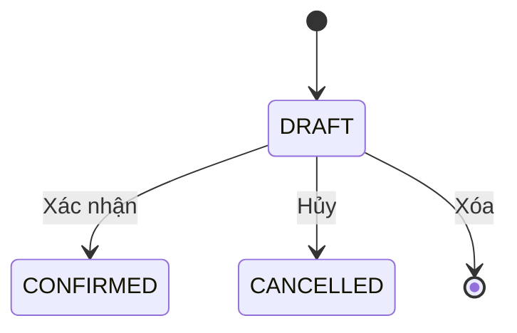

# Goods Receipt – Phân tích nghiệp vụ

## Overview

Phân tích module **Nhập kho** — chứng từ tăng tồn kho theo kho × sản phẩm. Là module mẫu cho pattern chứng từ WMS (dùng chung với Xuất kho, Kiểm kê, Điều chỉnh).

## Purpose

- Xác định actor, user story, luồng trạng thái và quy tắc nghiệp vụ.
- Làm cơ sở cho API, DB, FE và test.

## Scope

| Bao gồm | Loại trừ |
|---------|----------|
| Phiếu nhập từ NCC | Nhập chuyển kho |
| Confirm → inventory | FIFO / batch / serial |
| MVP lifecycle DRAFT/CONFIRMED/CANCELLED | Reverse confirm |

## Workflow

### Luồng người dùng

```text
Danh sách phiếu → Tạo DRAFT → Nhập kho, NCC, ngày, dòng SP
→ (Tuỳ chọn) Sửa DRAFT → Confirm → Tồn kho tăng
→ Hoặc Cancel/Delete nếu không nhập
```

### State machine



### Actor

| Actor | Quyền |
|-------|-------|
| Thủ kho / Nhân viên kho | create, update (confirm/cancel) |
| Quản lý | read + toàn bộ thao tác |
| Admin | Full permissions |

## Business Rules

| ID | Quy tắc | Mức |
|----|---------|-----|
| BR-GR01 | Status mặc định DRAFT | Must |
| BR-GR02 | Confirm trong transaction, all-or-nothing | Must |
| BR-GR03 | Chỉ DRAFT được sửa/xóa/hủy | Must |
| BR-GR04 | Không trùng product trong 1 phiếu | Must |
| BR-GR05 | quantity > 0 | Must |
| BR-GR06 | Kho, SP phải ACTIVE khi tạo/sửa/confirm | Must |
| BR-GR07 | NCC optional, nếu có phải ACTIVE | Must |
| BR-GR08 | Không hủy CONFIRMED | Must (MVP) |
| BR-GR09 | Mã GR-YYYYMMDD-XXXX unique | Must |

## Technical Design

| Thành phần | Mô tả |
|------------|-------|
| Document header | `goods_receipts` |
| Document lines | `goods_receipt_items` |
| Stock mutation | `inventoryRepository.increaseStock` |
| Audit | `GOODS_RECEIPT_CONFIRM` |

## API / Database (nếu có)

- Bảng: `goods_receipts`, `goods_receipt_items`
- Enum: `DocumentStatus` (DRAFT, CONFIRMED, CANCELLED)
- Chi tiết: [api.md](./api.md), [database.md](./database.md)

## Validation

| Trường | Rule |
|--------|------|
| warehouseId | UUID, kho ACTIVE |
| supplierId | UUID optional, NCC ACTIVE |
| receiptDate | Bắt buộc, parse được |
| items | Min 1 dòng |
| items[].quantity | > 0 |
| items[].unitCost | >= 0, default 0 |
| items[].note | Max 500 ký tự |
| note (header) | Max 1000 ký tự |

## Security

| Permission | Use case |
|------------|----------|
| goods-receipt:read | Xem danh sách, chi tiết |
| goods-receipt:create | Tạo phiếu |
| goods-receipt:update | Sửa, confirm, cancel |
| goods-receipt:delete | Xóa DRAFT |

## Error Handling

| Tình huống | Xử lý |
|------------|-------|
| Confirm phiếu không DRAFT | 409 Conflict |
| SP inactive khi confirm | 400 Bad Request |
| Phiếu không tồn tại | 404 |

## Examples

### User stories

| ID | Story | Priority |
|----|-------|----------|
| GR-01 | Xem danh sách phiếu nhập, lọc status | Must |
| GR-02 | Tạo phiếu nhập DRAFT | Must |
| GR-03 | Sửa phiếu DRAFT | Must |
| GR-04 | Confirm → tồn tăng | Must |
| GR-05 | Hủy / xóa DRAFT | Must |
| GR-06 | Xem chi tiết phiếu CONFIRMED (read-only) | Must |

### Acceptance criteria (Confirm)

- Given phiếu DRAFT có 2 dòng SP A (10), SP B (5)
- When confirm
- Then status = CONFIRMED, tồn A +10, tồn B +5, `confirmedBy` / `confirmedAt` được set

## Design Decisions

| # | Quyết định | Trade-off |
|---|------------|-----------|
| DD-GR01 | Pattern chứng từ chuẩn WMS | Đồng bộ với goods-issue, stock-take |
| DD-GR02 | Không reverse CONFIRMED | Đơn giản MVP; cần phiếu xuất/điều chỉnh để giảm |
| DD-GR03 | unitCost trên dòng, không động cost_price master | Tránh ghi đè giá vốn tự động |
| DD-GR04 | Replace-all items khi update | Dễ implement hơn partial line update |

## Notes

- Search: `code`, `note` (case-insensitive).
- Filter list: `status`, `warehouseId`, `supplierId`.
- Sort: `createdAt`, `receiptDate`, `code`.

## Checklist

- [x] User stories Must
- [x] State machine documented
- [x] BR table complete
- [x] Link API/DB/FE docs
- [ ] UAT sign-off BA
