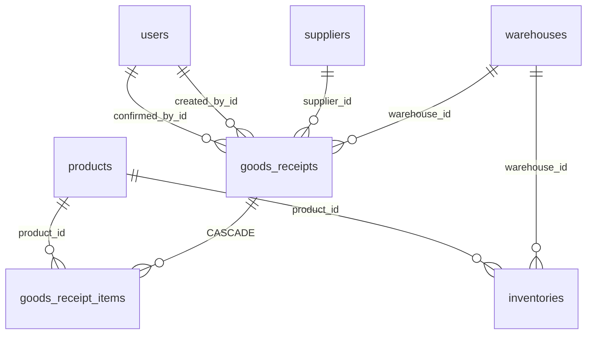

# Goods Receipt – Database Schema

## Overview

Schema PostgreSQL (Prisma) cho phiếu nhập kho: header `goods_receipts` và lines `goods_receipt_items`. Status dùng enum `DocumentStatus`.

## Purpose

Mô tả bảng, cột, ràng buộc và quan hệ để implement repository và migration.

## Scope

| Bảng | Vai trò |
|------|---------|
| goods_receipts | Header phiếu |
| goods_receipt_items | Dòng sản phẩm |
| inventories | Cập nhật khi confirm (module Inventory) |

## Workflow

```text
INSERT goods_receipts (DRAFT) + goods_receipt_items
→ UPDATE status CONFIRMED
→ UPSERT inventories (warehouse_id + product_id)
```

## Business Rules

| ID | DB-level |
|----|----------|
| BR-DB-GR01 | `code` UNIQUE |
| BR-DB-GR02 | FK warehouse, supplier, users Restrict |
| BR-DB-GR03 | Xóa header → cascade xóa items |
| BR-DB-GR04 | inventories unique (warehouse_id, product_id) |

## Technical Design

Source of truth: `backend/prisma/schema.prisma`.

## API / Database (nếu có)

### Enum `DocumentStatus`

| Value | Mô tả |
|-------|-------|
| DRAFT | Nháp |
| CONFIRMED | Đã xác nhận, đã cộng tồn |
| CANCELLED | Đã hủy (không cộng tồn) |

### Bảng `goods_receipts`

| Cột | Type | Null | Mô tả |
|-----|------|------|-------|
| id | uuid | PK | |
| code | varchar | UK | GR-YYYYMMDD-XXXX |
| warehouse_id | uuid | FK → warehouses | Restrict |
| supplier_id | uuid | FK → suppliers, nullable | Restrict |
| status | DocumentStatus | default DRAFT | |
| receipt_date | date | | Ngày nhập |
| note | text | nullable | |
| created_by_id | uuid | FK → users | Restrict |
| confirmed_by_id | uuid | FK → users, nullable | Restrict |
| confirmed_at | timestamptz | nullable | |
| created_at | timestamptz | | |
| updated_at | timestamptz | | |

**Indexes:** `status`, `warehouse_id`, `supplier_id`, `receipt_date`, `created_by_id`.

### Bảng `goods_receipt_items`

| Cột | Type | Null | Mô tả |
|-----|------|------|-------|
| id | uuid | PK | |
| goods_receipt_id | uuid | FK → goods_receipts | **Cascade** delete |
| product_id | uuid | FK → products | Restrict |
| quantity | decimal(15,3) | | Số lượng nhập |
| unit_cost | decimal(15,2) | default 0 | Đơn giá nhập |
| note | text | nullable | |
| created_at | timestamptz | | |
| updated_at | timestamptz | | |

**Indexes:** `goods_receipt_id`, `product_id`.

### Quan hệ ERD



### Bảng `inventories` (ảnh hưởng khi confirm)

| Cột | Type | Mô tả |
|-----|------|-------|
| id | uuid | PK |
| warehouse_id | uuid | FK |
| product_id | uuid | FK |
| quantity | decimal(15,3) | default 0 |
| created_at | timestamptz | |
| updated_at | timestamptz | |

**Unique:** `(warehouse_id, product_id)`.

## Validation

- quantity > 0 enforced ở application layer (Zod + service).
- Không có CHECK constraint âm tồn ở DB — logic ở service.

## Security

- Không có RLS; authorization ở API layer.
- Audit log lưu ở bảng `audit_logs` (module audit-log).

## Error Handling

| DB error | App mapping |
|----------|-------------|
| Unique code violation | Hiếm (generate server-side) |
| FK violation | 400 reference invalid |

## Examples

**Sau confirm** — inventory row tồn tại thì `quantity += item.quantity`; chưa có thì INSERT mới.

```sql
-- Conceptual (Prisma dùng increment)
UPDATE inventories SET quantity = quantity + 100
WHERE warehouse_id = ? AND product_id = ?;
```

## Design Decisions

| Quyết định | Lý do |
|------------|-------|
| Không bảng stock_movements | MVP; lịch sử suy từ chứng từ + audit |
| unit_cost trên line | Lưu giá nhập tại thời điểm phiếu |
| Cascade delete items | Xóa DRAFT gọn |
| Restrict FK master data | Không xóa kho/SP đang có chứng từ |

## Notes

- Update DRAFT: `deleteMany` items rồi `create` lại (repository pattern).
- `receipt_date` kiểu `@db.Date` — không lưu giờ.

## Checklist

- [x] Header + lines columns
- [x] FK / cascade documented
- [x] Link inventories impact
- [x] Indexes listed
- [ ] Migration history per env
