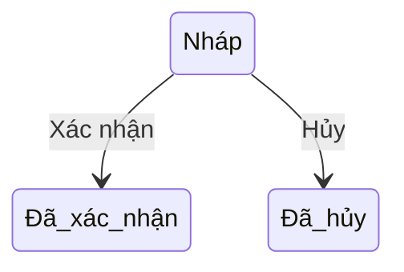

# Goods Receipt – Hướng dẫn sử dụng

## Overview

Hướng dẫn thao tác **Phiếu nhập kho** trên giao diện WMS cho thủ kho và quản lý.

## Purpose

Giúp người dùng nghiệp vụ tạo và xác nhận nhập hàng đúng quy trình, tránh sai tồn.

## Scope

| Đối tượng | Nội dung |
|-----------|----------|
| Thủ kho, NV kho | Tạo và confirm phiếu |
| Quản lý | Xem, duyệt qua confirm |
| Admin | Full quyền |

## Workflow

### Tạo phiếu nhập

1. Vào menu **Nhập kho** (`/goods-receipts`).
2. Bấm **Tạo phiếu**.
3. Chọn **Kho** (bắt buộc).
4. (Tuỳ chọn) Chọn **Nhà cung cấp**.
5. Chọn **Ngày nhập** (mặc định hôm nay).
6. Thêm ít nhất **một dòng sản phẩm**: chọn SP, số lượng, đơn giá nhập.
7. Bấm **Lưu** — phiếu ở trạng thái **Nháp (DRAFT)**.

### Xác nhận nhập (cộng tồn)

1. Tìm phiếu **Nháp** trên danh sách.
2. Kiểm tra kho, SP, số lượng.
3. Bấm **Xác nhận** → xác nhận trong hộp thoại.
4. Phiếu chuyển **Đã xác nhận (CONFIRMED)** — tồn kho **tăng** ngay.

### Hủy hoặc xóa

- **Hủy:** Giữ bản ghi, status **Đã hủy** — chỉ với phiếu Nháp.
- **Xóa:** Xóa hẳn phiếu Nháp khỏi hệ thống.

> **Lưu ý:** Phiếu đã xác nhận **không thể** hủy hoặc sửa trên MVP.

## Business Rules

| Quy tắc | Ý nghĩa với user |
|---------|------------------|
| Chỉ Nháp mới sửa | Tránh thay đổi sau khi đã cộng tồn |
| Xác nhận = cộng tồn | Kiểm tra kỹ trước khi confirm |
| Không trùng SP trên 1 phiếu | Gộp số lượng vào 1 dòng |
| SP/Kho phải đang hoạt động | Không chọn master đã vô hiệu |

## Technical Design

Giao diện: bảng danh sách + hộp thoại form. Trạng thái hiển thị bằng badge màu.

## API / Database (nếu có)

Người dùng không cần biết API; mọi thao tác qua UI gọi backend tự động.

## Validation

| Lỗi thường gặp | Cách xử lý |
|----------------|------------|
| Chưa chọn kho/SP | Điền đủ trường bắt buộc |
| Số lượng ≤ 0 | Nhập số dương |
| Trùng sản phẩm | Gộp dòng |

## Security

Cần quyền tương ứng. Không thấy nút Tạo/Xác nhận → liên hệ Admin gán role.

| Thao tác | Permission |
|----------|------------|
| Xem | goods-receipt:read |
| Tạo | goods-receipt:create |
| Sửa / Xác nhận / Hủy | goods-receipt:update |
| Xóa | goods-receipt:delete |

## Error Handling

- Thông báo đỏ trên form hoặc toast khi API lỗi.
- "Chỉ thao tác được trên phiếu ở trạng thái Nháp" — phiếu đã confirm bởi người khác.

## Examples

**Nhập 100 thùng từ NCC A vào Kho HN:** Tạo DRAFT → 1 dòng SP, qty 100 → Confirm → kiểm tra **Tồn kho** filter kho HN.

## Design Decisions

Confirm là bước tách biệt (không auto confirm khi Lưu) để user review trước khi ảnh hưởng tồn.

## Notes

- Tìm kiếm theo mã phiếu hoặc ghi chú.
- Lọc theo trạng thái: Nháp / Đã xác nhận / Đã hủy.
- Đơn giá nhập trên phiếu không tự đổi giá vốn master sản phẩm.

## Checklist (user)

- [ ] Đã chọn đúng kho
- [ ] Số lượng và SP đúng
- [ ] Phiếu Nháp đã review trước Confirm
- [ ] Sau Confirm đã đối chiếu Tồn kho
