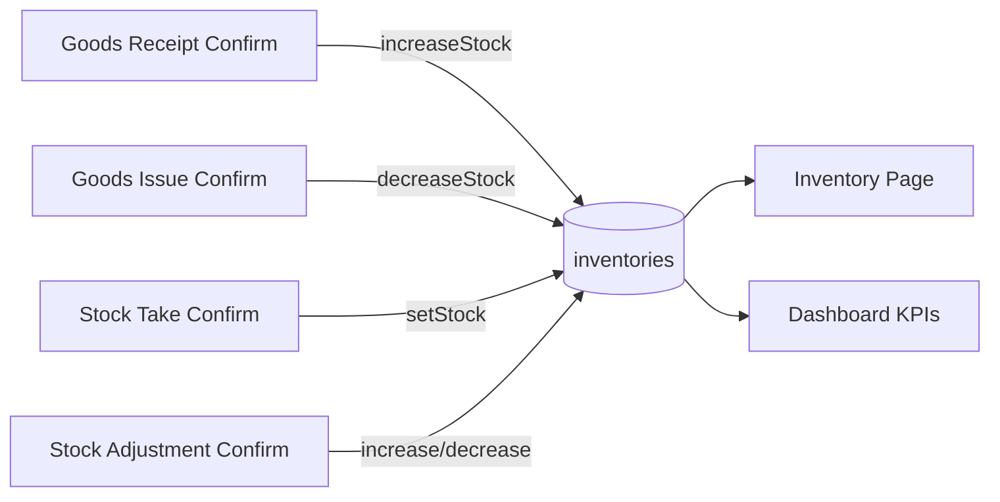

# Module Inventory (Tồn kho)

## Overview

Module **Tồn kho** cung cấp **chỉ đọc** (read-only) snapshot số lượng tồn theo cặp **Kho × Sản phẩm**. Module **không** có API tạo/sửa tồn trực tiếp — tồn được cập nhật bởi các module chứng từ khác khi **Confirm**.

| Thuộc tính | Giá trị |
|------------|---------|
| Sprint | 2 – Module 3 |
| Trạng thái | ✅ Read-only API + UI |
| Base path | `/api/v1/inventories` |
| FE route | `/inventories` |

## Purpose

- Tra cứu tồn hiện tại theo kho/sản phẩm.
- Cảnh báo hàng sắp hết (`quantity <= minStock`).
- Tính giá trị tồn (`quantity × costPrice`).

## Scope

| Trong phạm vi | Ngoài phạm vi |
|---------------|---------------|
| GET list + filter | POST/PUT tồn thủ công |
| Search SP/kho | Lịch sử biến động tồn |
| lowStock filter | Batch/serial tracking |

## Workflow

**Quan trọng:** User **không** chỉnh tồn trên màn Inventory. Mọi thay đổi đi qua confirm chứng từ.

## Business Rules

| ID | Quy tắc |
|----|---------|
| BR-INV01 | **Không âm kho** — `decreaseStock` reject nếu thiếu |
| BR-INV02 | Unique `(warehouse_id, product_id)` |
| BR-INV03 | Row tồn tạo lazy khi nhập/điều chỉnh tăng lần đầu |
| BR-INV04 | `isLowStock` khi `quantity <= product.minStock` |
| BR-INV05 | `stockValue = quantity × product.costPrice` (computed) |
| BR-INV06 | Không có row = tồn 0 (xuất sẽ fail) |

## Technical Design

| Layer | Path |
|-------|------|
| API | `inventory.route.js` — **GET only** |
| Service | `inventory.service.js` — list + map |
| Repository | `inventory.repository.js` — **mutations dùng nội bộ** |
| FE | `InventoryPage.jsx` |

## API / Database (nếu có)

- [api.md](./api.md) · [database.md](./database.md)

## Validation

Query params Zod; không body mutation.

## Security

Chỉ `inventory:read`.

## Error Handling

List API: 400 validation; 401/403 auth.

## Examples

Sau GR confirm +100 và GI confirm -30 → tồn = 70 (nếu ban đầu 0).

## Design Decisions

| Quyết định | Lý do |
|------------|-------|
| Read-only public API | Single source of truth qua chứng từ |
| Repository mutations internal | Tránh bypass nghiệp vụ |
| lowStock filter in-memory | Prisma không so sánh cross-field dễ; MVP chấp nhận load all khi filter |

## Notes

Stock Take dùng `setStock`; Adjustment dùng increase/decrease.

## Checklist

- [x] GET list
- [x] FE filters
- [x] lowStock + stockValue
- [x] Document upstream writers
- [ ] Stock movement history table (future)

## Tài liệu con

[analysis](./analysis.md) · [api.md](./api.md) · [database.md](./database.md) · [frontend](./frontend.md) · [backend](./backend.md) · [user-guide](./user-guide.md) · [developer-guide](./developer-guide.md)
