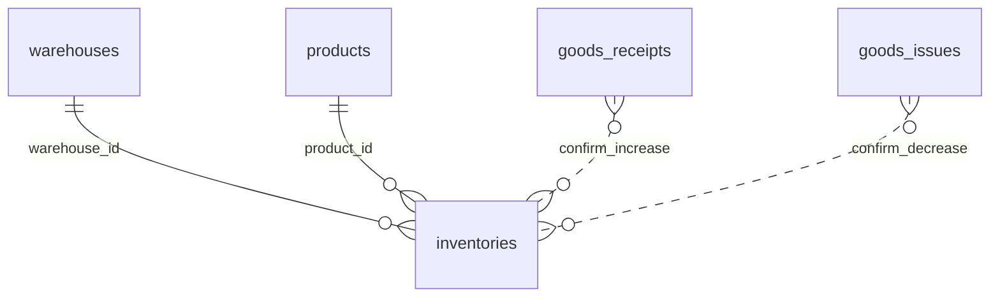

# Inventory – Database Schema

## Overview

Bảng **`inventories`** — snapshot tồn theo cặp kho × sản phẩm.

## Purpose

Schema reference và ràng buộc unique.

## Scope

Một bảng; không bảng movement.

## Workflow

```text
INSERT/UPDATE triggered by:
  increaseStock | decreaseStock | setStock (application)
Never direct user SQL in production
```

## Business Rules

| Rule | Implementation |
|------|----------------|
| Unique pair | @@unique([warehouseId, productId]) |
| quantity default 0 | @default(0) |
| No negative at DB | Application decreaseStock |

## Technical Design

```prisma
model Inventory {
  id          String   @id @default(uuid())
  warehouseId String
  productId   String
  quantity    Decimal  @default(0) @db.Decimal(15, 3)
  createdAt   DateTime
  updatedAt   DateTime
  @@unique([warehouseId, productId])
  @@map("inventories")
}
```

## API / Database (nếu có)

### Cột `inventories`

| Cột | Type | Null | Mô tả |
|-----|------|------|-------|
| id | uuid | PK | |
| warehouse_id | uuid | FK → warehouses | Restrict |
| product_id | uuid | FK → products | Restrict |
| quantity | decimal(15,3) | default 0 | |
| created_at | timestamptz | | |
| updated_at | timestamptz | | |

### Indexes

- Unique: `(warehouse_id, product_id)`
- Index: `warehouse_id`, `product_id`

### Repository methods (internal)

| Method | Hành vi |
|--------|---------|
| increaseStock | upsert increment |
| decreaseStock | check >= qty then decrement |
| setStock | upsert absolute qty (stock take) |
| findByWarehouseAndProduct | lookup |

### ERD



(Dashed: logical update via app, không FK trực tiếp)

## Validation

quantity precision 3 decimals; cost from products join.

## Security

No public write path to table.

## Error Handling

FK restrict: không xóa warehouse/product còn inventory row (và thường còn documents).

## Examples

| Trước | Event | Sau |
|-------|-------|-----|
| no row | GR +10 | row qty=10 |
| qty=10 | GI -3 | qty=7 |
| qty=7 | ST set 5 | qty=5 |

## Design Decisions

Denormalized snapshot vs event sourcing — chọn snapshot cho MVP performance.

## Notes

Row chỉ xuất hiện sau lần nhập/điều chỉnh/set đầu tiên; SP chưa từng nhập không có row (list có thể không hiện).

## Checklist

- [x] Column list
- [x] Unique constraint
- [x] Internal mutation methods
- [x] Upstream modules listed
