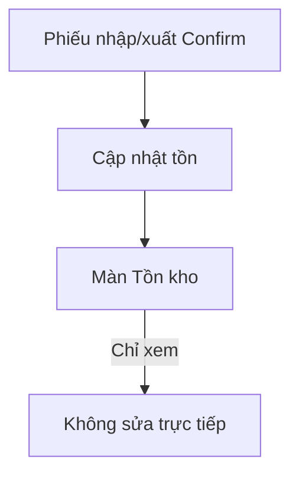

# Inventory – Hướng dẫn sử dụng

## Overview

Hướng dẫn xem **Tồn kho** trên WMS. Đây là màn **tra cứu**, không chỉnh sửa trực tiếp.

## Purpose

Giúp user biết tồn hiện tại và cách tồn thay đổi qua phiếu nhập/xuất.

## Scope

Mọi user có quyền `inventory:read`.

## Workflow

### Xem tồn

1. Menu **Tồn kho** (`/inventories`).
2. (Tuỳ chọn) Gõ tìm theo mã/tên SP hoặc kho.
3. Chọn **Kho** hoặc **Tất cả kho**.
4. Chọn **Sắp hết** để chỉ xem hàng dưới mức tối thiểu.

### Tồn thay đổi như thế nào?

| Muốn | Làm gì |
|------|--------|
| Tăng tồn | **Nhập kho** → Xác nhận phiếu nhập |
| Giảm tồn | **Xuất kho** → Xác nhận phiếu xuất (đủ tồn) |
| Điều chỉnh | Module **Kiểm kê** / **Điều chỉnh tồn** (Sprint khác) |

## Business Rules

| Hiển thị | Ý nghĩa |
|----------|---------|
| Số tồn | Số lượng thực tế trong kho |
| Min | Ngưỡng cảnh báo trên master SP |
| Giá trị tồn | Tồn × giá vốn (costPrice) |
| Sắp hết | Tồn ≤ Min |

## Technical Design

Bảng read-only; badge màu cho low stock.

## API / Database (nếu có)

N/A end user.

## Validation

N/A — không nhập liệu.

## Security

Cần quyền `inventory:read`.

## Error Handling

Không tải được → refresh trang hoặc liên hệ IT.

## Examples

Trước khi xuất 50 thùng: lọc kho + SP → kiểm tra tồn ≥ 50.

## Design Decisions

Không cho sửa tồn tay — tránh lệch sổ và thiếu audit.

## Notes

SP chưa từng nhập có thể không có dòng tồn (coi như 0).

## Checklist (user)

- [ ] Hiểu tồn chỉ đổi qua phiếu
- [ ] Dùng filter sắp hết định kỳ
- [ ] Đối chiếu trước khi xuất lớn
