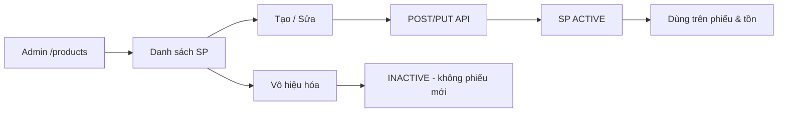

# Module Product – Hub tài liệu

## Overview

Module **Product** quản lý danh mục sản phẩm/hàng hóa: mã, tên, danh mục, đơn vị, giá, tồn tối thiểu và trạng thái. Sản phẩm là master data bắt buộc cho tồn kho và mọi dòng phiếu.

| Thuộc tính | Giá trị |
|------------|---------|
| Sprint | 1 – Module 5 |
| Trạng thái | Đã triển khai |
| Base path API | `/api/v1/products` |
| Route FE | `/products` |
| Permissions | `product:read` · `product:create` · `product:update` · `product:delete` |

## Purpose

Duy trì catalog sản phẩm thống nhất, hỗ trợ định giá, cảnh báo tồn tối thiểu và validation trên phiếu nhập/xuất.

## Scope

| Trong phạm vi | Ngoài phạm vi |
|--------------|---------------|
| CRUD sản phẩm (soft delete) | Quản lý ảnh upload (chỉ URL) |
| Lọc category, search, sort giá | BOM, variant, barcode |
| Giá bán / giá vốn / minStock | Tính tồn thực tế (inventory) |

## Workflow

Chi tiết: [analysis.md](./analysis.md) · API: [api.md](./api.md)

## Business Rules

| ID | Quy tắc |
|----|---------|
| PR-BR-01 | Mã SP unique, UPPERCASE |
| PR-BR-02 | Tạo mới ACTIVE; unit mặc định `pcs` |
| PR-BR-03 | price, costPrice ≥ 0; map Decimal → Number ở API |
| PR-BR-04 | minStock ≥ 0 — ngưỡng cảnh báo (dashboard/report) |
| PR-BR-05 | SP INACTIVE không dùng trên phiếu mới |
| PR-BR-06 | DELETE = soft delete → INACTIVE |

## Technical Design

Backend layered + Frontend `MasterDataListPage`. Service `mapProduct` chuyển Decimal sang number. Chi tiết: [backend.md](./backend.md), [frontend.md](./frontend.md)

## API / Database

- [api.md](./api.md)
- [database.md](./database.md)

## Validation

BE: `product.validation.js` · FE: `productSchema`. Tóm tắt tại [api.md](./api.md#validation)

## Security

JWT + RBAC `product:*`. Chi tiết: [api.md](./api.md#security)

## Error Handling

404, 409 (trùng mã), 400 validation. [api.md](./api.md#error-handling)

## Examples

[user-guide.md](./user-guide.md) · [api.md](./api.md#examples)

## Design Decisions

| Quyết định | Lý do |
|------------|-------|
| Decimal(15,2) DB | Chính xác tiền tệ |
| imageUrl BE only | FE chưa form upload |
| Category free-text | Chưa có bảng category riêng |

## Notes

- FE hiển thị giá format `vi-VN`
- Filter `category` exact match case-insensitive (API)

## Checklist

- [x] Hub + cross-links
- [x] Khớp product.service / ProductsPage
- [ ] Doc OpenAPI

## Tài liệu con

| File | Vai trò |
|------|---------|
| [analysis.md](./analysis.md) | Nghiệp vụ |
| [api.md](./api.md) | API |
| [database.md](./database.md) | DB |
| [frontend.md](./frontend.md) | UI |
| [backend.md](./backend.md) | BE |
| [user-guide.md](./user-guide.md) | User |
| [developer-guide.md](./developer-guide.md) | Dev |
