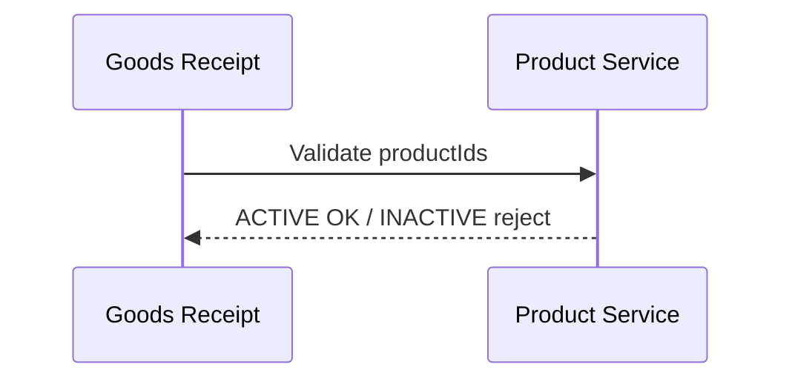

# Product – Phân tích nghiệp vụ

## Overview

Phân tích module **danh mục sản phẩm** — định nghĩa hàng hóa tham gia chu trình nhập, xuất, kiểm kê và báo cáo tồn.

## Purpose

Làm rõ actor, luồng dữ liệu và ràng buộc giá/tồn tối thiểu trước khi mở rộng catalog.

## Scope

Quản lý thông tin master sản phẩm. Không quản lý tồn thực tế (module Inventory) hay giá theo thời gian.

## Workflow

### UC-PR-01: Tạo sản phẩm

Admin nhập mã, tên, danh mục, ĐVT, giá → API normalize code → unique check → lưu ACTIVE, unit default `pcs`, price/costPrice default 0.

### UC-PR-02: Cập nhật giá

PUT partial body — chỉ field gửi lên được cập nhật. Giá trả về dạng number trong JSON.

### UC-PR-03: Vô hiệu hóa

DELETE → INACTIVE. Phiếu nhập/xuất/kiểm kê/điều chỉnh từ chối sản phẩm INACTIVE.

## Business Rules

| ID | Quy tắc | Input | Ràng buộc |
|----|---------|-------|-----------|
| PR-BR-01 | Mã unique UPPERCASE | code | max 50 |
| PR-BR-02 | Tên min 2 ký tự | name | trim |
| PR-BR-03 | Giá không âm | price, costPrice | ≥ 0 |
| PR-BR-04 | minStock integer ≥ 0 | minStock | cảnh báo low stock |
| PR-BR-05 | unit default pcs | unit | max 20 |
| PR-BR-06 | imageUrl URL hợp lệ | imageUrl | nullable, BE only |
| PR-BR-07 | category filter | list query | equals insensitive |
| PR-BR-08 | Soft delete only | DELETE | INACTIVE |

## Technical Design

Pattern master data giống warehouse. Khác biệt: Decimal mapping, filter category, sortBy price. Xem [backend.md](./backend.md).

## API / Database

[api.md](./api.md) · [database.md](./database.md)

## Validation

| Layer | File |
|-------|------|
| API | product.validation.js |
| FE form | productSchema (không imageUrl) |

## Security

RBAC `product:read|create|update|delete`.

## Error Handling

| Case | Response |
|------|----------|
| Không tìm thấy | 404 |
| Trùng mã | 409 Mã sản phẩm đã tồn tại |
| Giá âm | 400 validation |

## Examples

| Story | Kịch bản |
|-------|----------|
| PR-US-01 | Tạo PRD-001 Laptop, category Electronics, minStock 5 |
| PR-US-02 | Lọc category=Electronics trên API |
| PR-US-03 | Vô hiệu hóa SP cũ — phiếu mới không chọn được |

## Design Decisions

| Quyết định | Lý do | Trade-off |
|------------|-------|-----------|
| Category string | Đơn giản sprint 1 | Trùng tên khác hoa |
| mapProduct Number() | JSON không có Decimal | Mất precision cực lớn (chấp nhận) |
| minStock on product | Một ngưỡng global | Chưa theo từng kho |

## Notes

- Dashboard có thể query low stock JOIN products (xem dashboard module)
- FE chưa expose imageUrl — thêm qua API trực tiếp nếu cần

## Checklist

- [x] Use cases + BR IDs
- [x] Liên kết phiếu validate ACTIVE
- [ ] Category master table (future)
