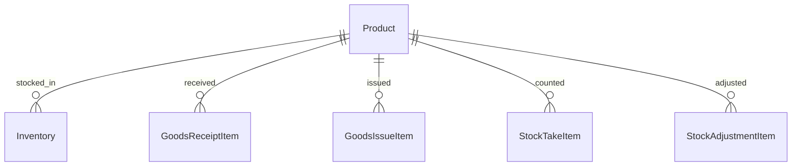

# Product – Database Schema

## Overview

Bảng `products` lưu master data sản phẩm. Prisma model `Product`, map `products`.

## Purpose

Mô tả cột, ràng buộc và quan hệ với tồn kho và chi tiết phiếu.

## Scope

Bảng `products` và FK incoming. Category là cột text, không normalize bảng riêng.

## Workflow



## Business Rules

PR-BR-01: code UNIQUE · PR-BR-03: price/costPrice Decimal ≥ 0 · status EntityStatus

## Technical Design

Repository Prisma CRUD. Service convert Decimal khi trả API.

## API / Database

HTTP: [api.md](./api.md)

### Bảng `products`

| Column | Type | Description |
|--------|------|-------------|
| id | UUID | PK |
| code | VARCHAR unique | Mã SP |
| name | VARCHAR | Tên |
| description | TEXT nullable | Mô tả |
| category | VARCHAR nullable | Danh mục (free text) |
| unit | VARCHAR | ĐVT, default `pcs` |
| cost_price | DECIMAL(15,2) | Giá vốn |
| price | DECIMAL(15,2) | Giá bán |
| min_stock | INT | Tồn tối thiểu, default 0 |
| image_url | VARCHAR nullable | URL ảnh |
| status | EntityStatus | ACTIVE/INACTIVE |
| created_at | TIMESTAMPTZ | |
| updated_at | TIMESTAMPTZ | |

### Primary Key

`id` (UUID)

### Unique / Indexes

| Constraint | Columns |
|------------|---------|
| UNIQUE | code |
| INDEX | status |
| INDEX | category |

### Foreign Keys (incoming)

| Table | FK |
|-------|-----|
| inventories | product_id |
| goods_receipt_items | product_id |
| goods_issue_items | product_id |
| stock_take_items | product_id |
| stock_adjustment_items | product_id |

### Relationships

1 product : N inventory rows (per warehouse). Unique (warehouse_id, product_id) on inventories.

### Business Notes

- Soft delete giữ FK lịch sử phiếu
- min_stock dùng cho alert — logic ở dashboard/report, không trigger DB
- Giá lưu DECIMAL; API expose number

## Validation

Application Zod; DB NOT NULL on code, name, unit; defaults on price fields.

## Security

DB access via Prisma only.

## Error Handling

Unique code violation → 409 at API layer.

## Examples

```sql
SELECT code, name, price, min_stock FROM products WHERE status = 'ACTIVE' AND category ILIKE 'Electronics';
```

## Design Decisions

| Decision | Trade-off |
|----------|-----------|
| DECIMAL(15,2) | Đủ tiền VND; 3 decimal ở inventory qty |
| category index | Filter list; không FK category table |
| image_url nullable | No blob storage |

## Notes

Schema: `backend/prisma/schema.prisma` model Product

## Checklist

- [x] Columns + types
- [x] PK/FK/index
- [x] Business notes min_stock
- [ ] Category normalization migration (future)
