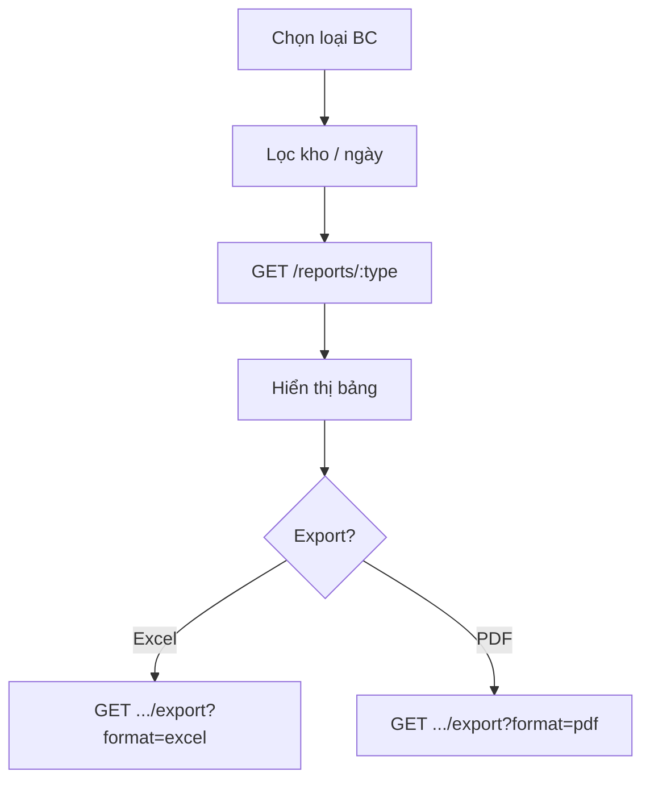

# Module Report (Báo cáo)

## Overview

Module báo cáo đọc dữ liệu từ inventory và chứng từ đã **CONFIRMED**, hỗ trợ xem trên UI và **export Excel/PDF**.

| Thuộc tính | Giá trị |
|------------|---------|
| Sprint | 3 |
| Trạng thái | Đã triển khai |
| Base path | `/api/v1/reports` |
| FE route | `/reports` |

## Purpose

Cung cấp báo cáo tồn kho, giá trị tồn, nhập/xuất, kiểm kê, điều chỉnh với bộ lọc kho và khoảng ngày.

## Scope

| Trong phạm vi | Ngoài phạm vi |
|---------------|---------------|
| 6 loại báo cáo | BI dashboard động |
| JSON preview + export | Scheduled email reports |
| Excel (full rows) | PDF >200 rows full detail |
| Max 10.000 dòng/query | Unlimited export |

## Workflow

## Business Rules

| ID | Quy tắc |
|----|---------|
| BR-RP-01 | GR/GI/ST/SA reports chỉ lấy status CONFIRMED |
| BR-RP-02 | inventory/stock-value: snapshot tồn hiện tại |
| BR-RP-03 | MAX_ROWS = 10000 mỗi query |
| BR-RP-04 | PDF hiển thị tối đa 200 dòng (+ ghi chú phần còn lại) |
| BR-RP-05 | stock-value = inventory × costPrice |

## Technical Design

report.route.js → report.controller.js → report.service.js. ExcelJS + PDFKit generation.

## API / Database

[api.md](./api.md) · [database.md](./database.md)

## Validation

type path param regex whitelist. format query: excel \| pdf.

## Security

`report:read` — xem JSON. `report:export` — download file.

## Error Handling

404 unsupported type. 400 invalid format.

## Examples

Export kiểm kê tháng 8: type=`stock-takes`, dateFrom/dateTo, format=excel.

## Design Decisions

| Quyết định | Lý do |
|------------|-------|
| Shared handler inventory/stock-value | Cùng nguồn, khác cột stockValue |
| Blob download FE | Standard file export UX |
| PDF row cap | Tránh file quá lớn / timeout |

## Notes

Không có bảng report riêng — query trực tiếp operational tables.

## Checklist

- [x] 6 report types
- [x] Excel + PDF export
- [x] FE ReportsPage
- [ ] Integration tests export
- [ ] Validation schema for query params

## Tài liệu con

[analysis](./analysis.md) · [api](./api.md) · [database](./database.md) · [frontend](./frontend.md) · [backend](./backend.md) · [user-guide](./user-guide.md) · [developer-guide](./developer-guide.md)
