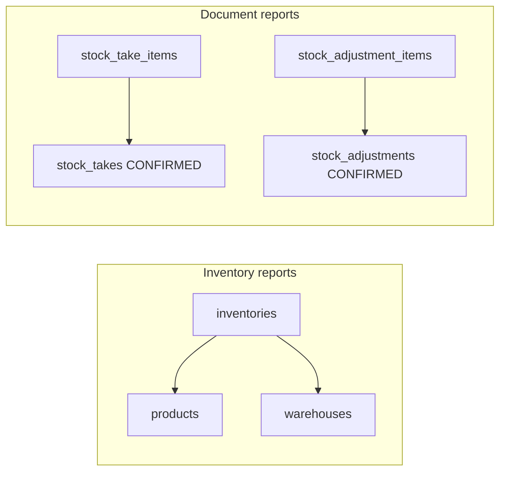

# Report – Database

## Overview

Module Report **không có bảng riêng** — đọc từ bảng vận hành qua Prisma queries.

## Purpose

Document nguồn dữ liệu, join và filter cho từng handler.

## Scope

Tables: inventories, products, warehouses, goods_receipts/items, goods_issues/items, stock_takes/items, stock_adjustments/items.

## Workflow

Handler builds `where` → findMany with include → map flat row DTO.

## Business Rules

Transactional reports filter parent.status = CONFIRMED. Inventory reports use live quantity.

## Technical Design

## API / Database

### inventory / stock-value

| Bảng | Join | Ghi chú |
|------|------|---------|
| inventories | product, warehouse | orderBy warehouse.code, product.code |
| products.costPrice | | stockValue = qty × costPrice |

Filter: optional warehouseId. take: MAX_ROWS 10000.

### goods-receipts

`goodsReceiptItem` where goodsReceipt.status=CONFIRMED, optional warehouseId, receiptDate range.

### goods-issues

`goodsIssueItem` where goodsIssue.status=CONFIRMED, optional warehouseId, issueDate range.

### stock-takes

`stockTakeItem` where stockTake.status=CONFIRMED, optional warehouseId, takeDate range.

Columns system_qty, counted_qty from item table; variance computed in service.

### stock-adjustments

`stockAdjustmentItem` where stockAdjustment.status=CONFIRMED, optional warehouseId, adjustDate range.

Includes reason from header.

## Validation

Date filter via parseDateRange — gte dateFrom, lte dateTo end of day.

## Security

Read-only DB user recommended for prod reporting replica (future); app uses same Prisma client.

## Error Handling

Large result capped at MAX_ROWS — no pagination in MVP.

## Examples

SQL concept: `SELECT * FROM stock_take_items sti JOIN stock_takes st ON ... WHERE st.status='CONFIRMED'`.

## Design Decisions

Item-level grain for document reports — aligns with Excel export usefulness.

## Notes

Indexes on take_date, adjust_date, receipt_date benefit report filters — see respective module schemas.

## Checklist

- [x] Source per report type
- [x] CONFIRMED filters
- [x] MAX_ROWS documented
- [ ] Read replica strategy (prod)
