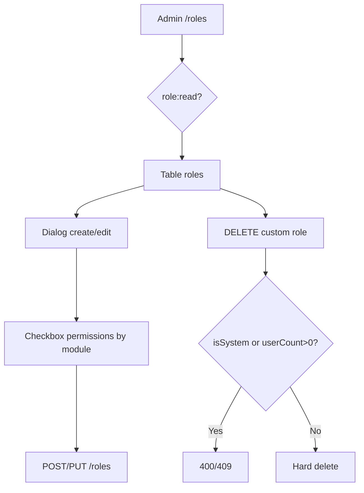

# Module Role & Permission — Hub

## Overview

Module quản lý vai trò (Role) và gán quyền (Permission) cho người dùng WMS. Permission seed sẵn; Admin tạo role tùy chỉnh và chọn quyền theo module.

| Thuộc tính | Giá trị |
|------------|---------|
| Sprint | 1 – Module 3 |
| Trạng thái | ✅ Đã triển khai |
| Base path BE | `/api/v1/roles` |
| FE route | `/roles` |

## Purpose

| Câu hỏi | Trả lời |
|---------|---------|
| **Module này làm gì?** | CRUD role tùy chỉnh, gán permission, meta permissions grouped |
| **Ai dùng?** | Admin (hoặc role có `role:*`) |
| **Input chính?** | name, description, permissionIds[] |
| **Output chính?** | Role + permissions + userCount + isSystem flag |
| **Ràng buộc?** | Bảo vệ 3 system roles; không xóa role có user |

## Scope

| Trong phạm vi | Ngoài phạm vi |
|---------------|---------------|
| CRUD role, meta permissions | CRUD permission (seed only) |
| System roles: Admin, Manager, Staff | Gán role cho user → [User](../user/README.md) |
| Hard delete role tùy chỉnh (userCount=0) | Login/JWT → [Auth](../auth/README.md) |

## Workflow

## Business Rules

| ID | Rule |
|----|------|
| BR-R01 | Chỉ `role:*` mới thao tác |
| BR-R02 | Tên role unique |
| BR-R03 | Admin/Manager/Staff = system — không xóa |
| BR-R04 | System role không đổi tên |
| BR-R05 | ≥ 1 permission khi create/update permissionIds |
| BR-R06 | Không xóa role userCount > 0 |
| BR-R07 | Update permissionIds = replace toàn bộ RolePermission |

## Technical Design

Layered BE + `RolesPage.jsx`. Chi tiết: [backend.md](./backend.md), [frontend.md](./frontend.md).

## API / Database

- API: [api.md](./api.md)
- Schema: [database.md](./database.md) — `roles`, `permissions`, `role_permissions`

## Validation

name 2–100; description max 500; permissionIds min 1 UUID. Chi tiết: [analysis.md](./analysis.md).

## Security

Bearer + `role:*`. Permissions catalog immutable qua API (chỉ seed). JWT permissions cập nhật sau login/refresh.

## Error Handling

400 (system role rename/delete), 401, 403, 404, 409 (name trùng / role có user), 500.

## Examples

Tạo "Warehouse Clerk" → gán quyền warehouse → assign user tại [User module](../user/README.md).

## Design Decisions

| Decision | Reason | Advantages | Trade-offs |
|----------|--------|------------|------------|
| isSystem derived from name | No DB column | Simple seed sync | Rename breaks protection |
| Replace all permissions on update | Clear state | Predictable | Large payload |
| Hard delete custom roles | Cleanup | No orphan roles | Irreversible |

## Notes

`SYSTEM_ROLE_NAMES` trong `backend/src/constants/roles.js` phải khớp seed.

## Checklist

- [x] 6 endpoints triển khai
- [x] System role protection
- [x] Permission meta grouped by module
- [x] FE RolesPage + checkbox UI

## Tài liệu con

| File | Nội dung |
|------|----------|
| [analysis.md](./analysis.md) | Nghiệp vụ, user story, BR |
| [api.md](./api.md) | API đầy đủ |
| [database.md](./database.md) | Schema Role/Permission |
| [frontend.md](./frontend.md) | UI design |
| [backend.md](./backend.md) | Layer BE |
| [user-guide.md](./user-guide.md) | Hướng dẫn Admin |
| [developer-guide.md](./developer-guide.md) | Mở rộng / bảo trì |

## Permissions

| Code | Mô tả |
|------|-------|
| `role:read` | Xem role, chi tiết, meta permissions |
| `role:create` | Tạo role |
| `role:update` | Sửa role |
| `role:delete` | Xóa role tùy chỉnh |
