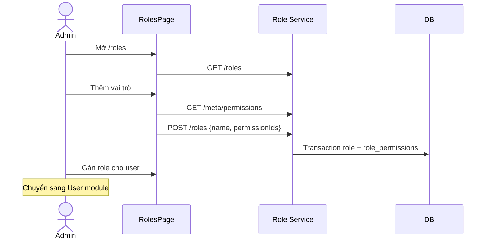

# Role & Permission — Phân tích nghiệp vụ

## Overview

Phân tích nghiệp vụ quản lý vai trò và gán quyền: role tùy chỉnh, bảo vệ role hệ thống, meta API permissions nhóm theo module.

## Purpose

Định nghĩa actor, use case, business rules và acceptance criteria cho module Role & Permission.

## Scope

| Bao gồm | Loại trừ |
|---------|----------|
| CRUD role, list permissions meta | CRUD permission records |
| User stories ROL-01 → ROL-06 | User assign roleId → [User](../user/analysis.md) |
| System role protection | JWT implementation → [Auth](../auth/analysis.md) |

## Workflow

### Luồng Admin

### Xóa role

1. Kiểm tra không phải system role
2. Kiểm tra `userCount === 0`
3. Hard delete role (+ cascade role_permissions)

## Business Rules

| ID | Rule | Chi tiết |
|----|------|----------|
| BR-R01 | Permission `role:*` | authorize trên mọi route |
| BR-R02 | Tên role unique | Case-sensitive DB unique on name |
| BR-R03 | System roles không xóa | Admin, Manager, Staff |
| BR-R04 | System role không đổi tên | Cho phép sửa description + permissions |
| BR-R05 | ≥ 1 permission | create + update (nếu gửi permissionIds) |
| BR-R06 | userCount > 0 → không xóa | 409 conflict |
| BR-R07 | permissionIds update = replace | Delete all RolePermission + insert mới |

## Technical Design

`roleService.mapRole` thêm `isSystem` từ `SYSTEM_ROLE_NAMES.includes(name)` — không có cột DB. Chi tiết: [backend.md](./backend.md).

## API / Database

[api.md](./api.md), [database.md](./database.md).

## Validation

| Field | Rule |
|-------|------|
| name | 2–100 ký tự, trim |
| description | max 500, nullable |
| permissionIds | array UUID, min 1 (create); min 1 if provided (update) |
| List query | page, limit (max 100), search, sortBy (name\|createdAt), sortOrder |

## Security

Permission catalog chỉ thay đổi qua seed + deploy — không API public edit. Admin role có full permissions qua seed.

## Error Handling

| Case | HTTP |
|------|------|
| Tên trùng | 409 |
| System role delete/rename | 400 |
| Role có user | 409 |
| Permission id invalid | 400 |
| Not found | 404 |

## Examples

### User Stories

| ID | Story | Priority |
|----|-------|----------|
| ROL-01 | Xem danh sách role + search | Must |
| ROL-02 | Tạo role + chọn quyền | Must |
| ROL-03 | Sửa mô tả / quyền role tùy chỉnh | Must |
| ROL-04 | Không đổi tên / xóa role hệ thống | Must |
| ROL-05 | Không xóa role đang có user | Must |
| ROL-06 | Meta permissions nhóm theo module | Must |

### Seed role permissions (tham khảo)

| Role | Permissions |
|------|-------------|
| Admin | Tất cả (`PERMISSIONS`) |
| Manager | Tất cả trừ `user:*`, `role:*`, `audit-log:*` |
| Staff | Chỉ `*:read` (trừ audit-log) |

## Design Decisions

| Decision | Reason | Advantages | Trade-offs |
|----------|--------|------------|------------|
| Permission seed-only | Stability | Controlled catalog | Need deploy to add permission |
| isSystem by name | No migration | Fast MVP | Must keep names in sync |
| Full permission replace | Simplicity | No diff logic | Must send full array |

## Notes

User module dùng `GET /users/meta/roles` — lightweight id/name only. Role module owns full permission assignment.

## Checklist

- [x] User stories ROL-01 → ROL-06
- [x] Business rules BR-R01 → BR-R07
- [x] Flow + sequence diagram
- [x] Seed permission summary
- [x] Cross-ref User/Auth
