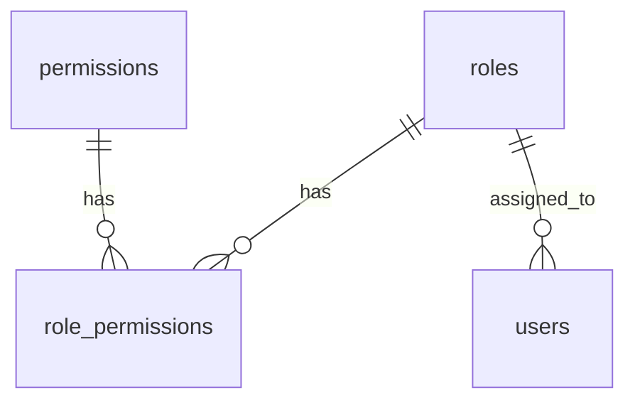

# Role & Permission — Database Documentation

## Overview

Schema lưu trữ vai trò, quyền hạn và quan hệ N-N Role ↔ Permission phục vụ phân quyền WMS.

## Purpose

Mô tả bảng, cột, ràng buộc, index và quan hệ cho module Role và seed permissions.

## Scope

Bảng: `roles`, `permissions`, `role_permissions`. User FK trên `users.role_id` — xem [User database](../user/database.md).

## Workflow



## Business Rules

| Rule | Enforcement |
|------|-------------|
| Role name unique | UNIQUE(roles.name) |
| Permission code unique | UNIQUE(permissions.code) |
| Composite PK role_permissions | (role_id, permission_id) |
| Cascade delete junction | ON DELETE CASCADE both FKs |
| System roles | Convention — names Admin, Manager, Staff (not DB constraint) |

## Technical Design

Prisma models in `backend/prisma/schema.prisma`. Seed: `backend/prisma/seed.js` + `constants/permissions.js`.

## API / Database

Không áp dụng — [api.md](./api.md).

### Bảng `roles`

| Column | Type | Description |
|--------|------|-------------|
| id | UUID | **PK** |
| name | VARCHAR | **UNIQUE** — tên vai trò |
| description | VARCHAR? | Mô tả hiển thị |
| created_at | TIMESTAMPTZ | Audit |
| updated_at | TIMESTAMPTZ | Audit |

**Index:** UNIQUE(name)

**Relationships:** 1 role → N users; N-M permissions via `role_permissions`

**Business Notes:** `isSystem` computed in service — không lưu DB. Hard delete chỉ role custom không user.

---

### Bảng `permissions`

| Column | Type | Description |
|--------|------|-------------|
| id | UUID | **PK** |
| code | VARCHAR | **UNIQUE** — `{module}:{action}` e.g. `user:read` |
| name | VARCHAR | Nhãn tiếng Việt |
| module | VARCHAR | Nhóm module cho UI |
| created_at | TIMESTAMPTZ | Audit |
| updated_at | TIMESTAMPTZ | Audit |

**Index:** INDEX(module)

**Business Notes:** Immutable qua API — thêm qua seed + deploy. ~47 permissions Sprint 1 catalog in `PERMISSIONS` constant.

---

### Bảng `role_permissions`

| Column | Type | Description |
|--------|------|-------------|
| role_id | UUID | **PK composite**, **FK → roles.id** CASCADE |
| permission_id | UUID | **PK composite**, **FK → permissions.id** CASCADE |

**Constraints:** Composite PK prevents duplicate assignment

**Business Notes:** Update role permissions = DELETE all rows for role_id + INSERT new set (transaction).

## Validation

FK ensures permissionIds exist. Service asserts count match before write.

## Security

Permission table is sensitive config — no public write API. Admin role gets all permissions on seed.

## Error Handling

Delete role with users → FK not the issue (check userCount in service before delete). Cascade removes junction rows on role delete.

## Examples

```bash
cd backend && npm run db:push && npm run db:seed
```

Seed creates 3 system roles with permission sets per `ROLE_DEFINITIONS`.

## Design Decisions

| Decision | Reason | Advantages | Trade-offs |
|----------|--------|------------|------------|
| Junction table vs array | Normalized | Query/filter by permission | Join overhead |
| module column on permission | UI grouping | Meta API simple | Duplicate module in code |
| No is_system column | MVP | Less schema | Name-based logic |

## Notes

ERD tổng: `docs/wms-database.md`. Khi thêm module mới: append `PERMISSIONS`, re-seed, Admin auto-gets new codes.

## Checklist

- [x] 3 tables documented
- [x] PK/FK/index/constraints
- [x] Relationships + business notes
- [x] Seed reference
- [x] ERD diagram
