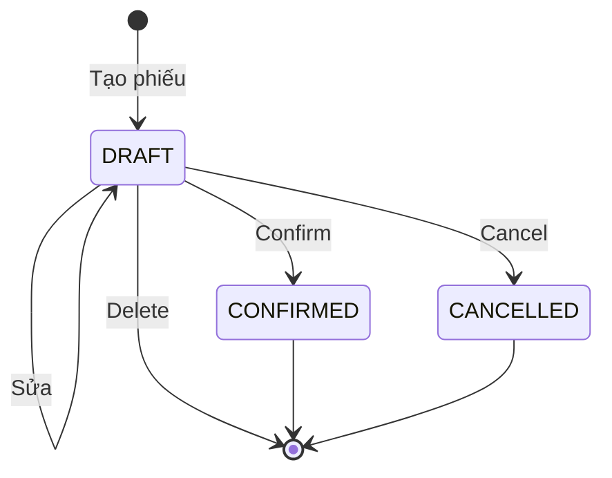

# Module Stock Adjustment (Điều chỉnh tồn)

## Overview

Module quản lý phiếu điều chỉnh tồn kho thủ công theo loại **INCREASE** (tăng) hoặc **DECREASE** (giảm). Confirm áp dụng thay đổi lên `inventories`; giảm không được làm tồn âm.

| Thuộc tính | Giá trị |
|------------|---------|
| Sprint | 3 |
| Trạng thái | Đã triển khai |
| Base path | `/api/v1/stock-adjustments` |
| FE route | `/stock-adjustments` |

## Purpose

Xử lý hư hỏng, mất mát, phát hiện thừa, hoặc điều chỉnh lệch không qua GR/GI/Stock Take.

## Scope

| Trong phạm vi | Ngoài phạm vi |
|---------------|---------------|
| Phiếu DRAFT → CONFIRMED/CANCELLED | Reverse CONFIRMED |
| INCREASE / DECREASE từng dòng | Điều chỉnh âm tồn (DECREASE vượt tồn) |
| Lý do bắt buộc (reason) | Multi-step approval |

## Workflow

## Business Rules

| ID | Quy tắc |
|----|---------|
| BR-SA-01 | Chỉ DRAFT được sửa/xóa/hủy/confirm |
| BR-SA-02 | `type`: INCREASE hoặc DECREASE |
| BR-SA-03 | `quantity > 0` mọi dòng |
| BR-SA-04 | DECREASE: tồn sau ≥ 0; không đủ → 409 Conflict |
| BR-SA-05 | INCREASE: `increaseStock`; DECREASE: `decreaseStock` |
| BR-SA-06 | `reason` bắt buộc, min 3 ký tự |
| BR-SA-07 | Không trùng productId trong cùng phiếu |
| BR-SA-08 | Mã: `SA-YYYYMMDD-####` |

## Technical Design

Cấu trúc mirror Stock Take: route → service → repository. Confirm trong transaction + audit `STOCK_ADJUSTMENT_CONFIRM`.

## API / Database

[api.md](./api.md) · [database.md](./database.md)

## Validation

Zod: warehouseId, adjustDate, reason, items (type enum, quantity positive). Service: kho/SP ACTIVE.

## Security

Permissions: `stock-adjustment:read|create|update|delete`. JWT required.

## Error Handling

409 khi DECREASE vượt tồn: message kèm `available`. 409 khi phiếu không DRAFT.

## Examples

Tồn SP X = 20, DECREASE 25 → confirm fail. DECREASE 5 → tồn còn 15.

## Design Decisions

| Quyết định | Lý do |
|------------|-------|
| Tách INCREASE/DECREASE explicit | Rõ nghiệp vụ, dễ báo cáo |
| reason bắt buộc | Truy vết audit/compliance |
| Block âm kho tại confirm | Bảo toàn integrity inventory |

## Notes

Khác Stock Take: adjustment **cộng/trừ** quantity, không set absolute.

## Checklist

- [x] Backend + FE
- [x] DECREASE guard
- [x] Validation tests
- [x] Audit on confirm
- [ ] Integration test DECREASE insufficient stock

## Tài liệu con

[analysis](./analysis.md) · [api](./api.md) · [database](./database.md) · [frontend](./frontend.md) · [backend](./backend.md) · [user-guide](./user-guide.md) · [developer-guide](./developer-guide.md)
