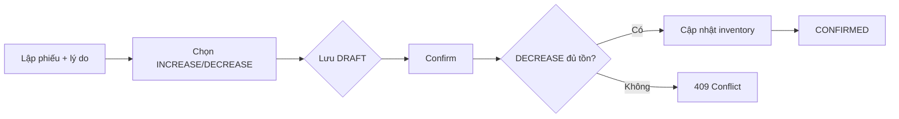

# Stock Adjustment – Phân tích nghiệp vụ

## Overview

Phân tích nhu cầu điều chỉnh tồn độc lập với nhập/xuất/kiểm kê, tập trung vào loại điều chỉnh và ràng buộc không âm kho.

## Purpose

Làm rõ khi nào dùng Adjustment thay vì Stock Take hoặc GR/GI.

## Scope

Điều chỉnh có chủ đích (hư, mất, thừa phát hiện ngoài kiểm kê). Một phiếu một kho, nhiều dòng SP.

## Workflow

## Business Rules

| Use case | Type | Ghi chú |
|----------|------|---------|
| Hàng hư hỏng | DECREASE | reason mô tả |
| Tìm thấy thêm | INCREASE | |
| Kiểm kê chuẩn hóa | Stock Take | Không dùng SA |
| Nhập từ NCC | GR | Không dùng SA |

## Technical Design

`validateItems` không đọc tồn lúc draft — chỉ validate master data. Check tồn khi **confirm** cho DECREASE.

Enum Prisma `AdjustmentType`: INCREASE, DECREASE.

## API / Database

Tables `stock_adjustments`, `stock_adjustment_items`. Xem [database.md](./database.md).

## Validation

reason 3–500 chars; quantity positive; unique product per document.

## Security

Confirm là thao tác nhạy cảm — ghi audit; nên giới hạn role Manager+.

## Error Handling

Rollback transaction nếu bất kỳ dòng DECREASE fail.

## Examples

Phiếu 2 dòng: SP A INCREASE 10, SP B DECREASE 5 — confirm atomic, cả hai thành công hoặc none.

## Design Decisions

Không cho DECREASE âm — thay vì cho phép và flag warning.

## Notes

Một SP một type/phiếu (unique productId) — muốn tăng và giảm cùng SP cần hai phiếu hoặc mở rộng schema sau.

## Checklist

- [x] Phân biệt SA vs ST
- [x] BR không âm kho
- [x] reason mandatory
- [ ] Policy nội bộ ai được confirm
