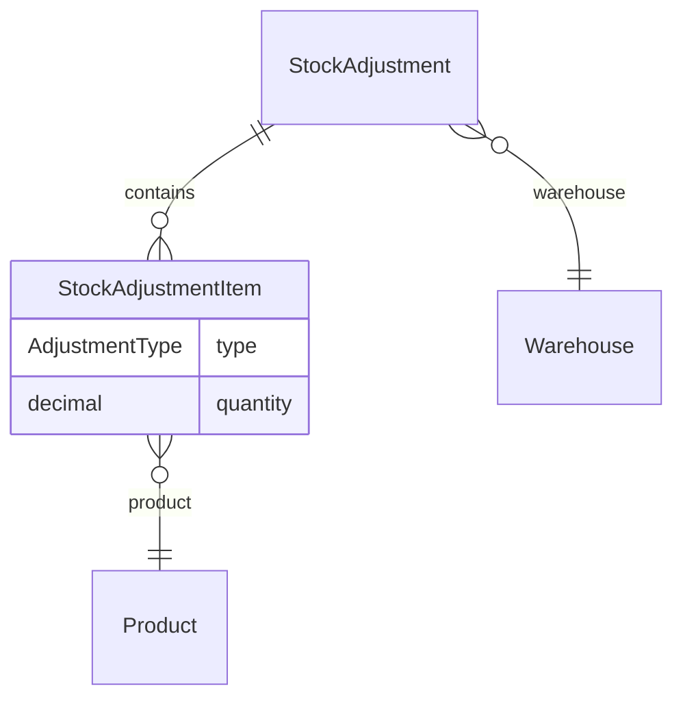

# Stock Adjustment – Database

## Overview

Schema lưu phiếu điều chỉnh và chi tiết dòng với loại INCREASE/DECREASE.

## Purpose

Tài liệu hóa bảng, FK, index cho dev và báo cáo.

## Scope

`stock_adjustments`, `stock_adjustment_items`, enum `AdjustmentType`.

## Workflow

Insert header DRAFT + items → confirm updates status + inventory (ngoài bảng này).

## Business Rules

Unique (stock_adjustment_id, product_id). reason NOT NULL on header.

## Technical Design

## API / Database

### `stock_adjustments`

| Cột | Kiểu | Mô tả |
|-----|------|-------|
| id | UUID PK | |
| code | VARCHAR UNIQUE | SA-YYYYMMDD-#### |
| warehouse_id | FK | |
| status | DocumentStatus | |
| adjust_date | DATE | |
| reason | VARCHAR | Bắt buộc |
| note | TEXT nullable | |
| created_by_id | FK | |
| confirmed_by_id | FK nullable | |
| confirmed_at | TIMESTAMP nullable | |

**Index:** status, warehouse_id, adjust_date, created_by_id.

### `stock_adjustment_items`

| Cột | Kiểu | Mô tả |
|-----|------|-------|
| id | UUID PK | |
| stock_adjustment_id | FK CASCADE | |
| product_id | FK | |
| type | AdjustmentType | INCREASE, DECREASE |
| quantity | DECIMAL(15,3) | Luôn dương |
| note | TEXT nullable | |

### Enum AdjustmentType

| Value | Inventory op |
|-------|--------------|
| INCREASE | increment |
| DECREASE | decrement (if sufficient) |

## Validation

quantity > 0 enforced app-layer; DB Decimal precision 15,3.

## Security

No PII in items; user FK on header.

## Error Handling

FK violation if warehouse/product deleted — prevent via ACTIVE checks.

## Examples

Report joins items where parent status CONFIRMED, outputs type + quantity.

## Design Decisions

Quantity always positive; direction in `type` — tránh lưu số âm gây nhầm.

## Notes

Cascade delete items when delete draft document.

## Checklist

- [x] Column docs
- [x] Enum mapping
- [x] ER diagram
- [ ] Sample SQL report query
