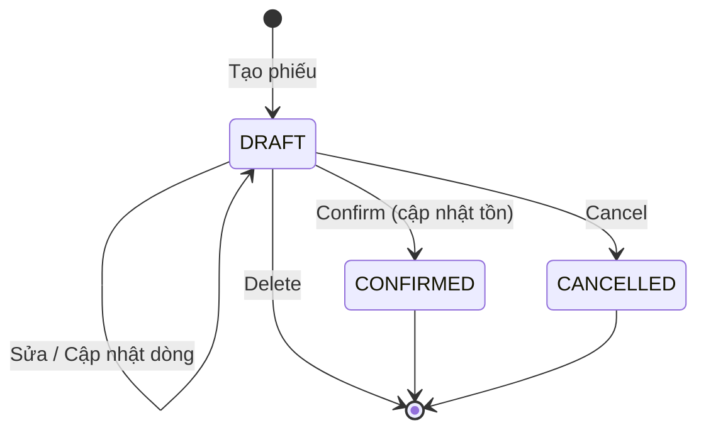

# Module Stock Take (Kiểm kê)

## Overview

Module quản lý phiếu kiểm kê tồn kho theo kho. Mỗi dòng ghi nhận `system_qty` (tồn hệ thống tại thời điểm lập phiếu) và `counted_qty` (số lượng đếm thực tế). Xác nhận phiếu đặt tồn kho bằng `counted_qty`.

| Thuộc tính | Giá trị |
|------------|---------|
| Sprint | 3 |
| Trạng thái | Đã triển khai |
| Base path | `/api/v1/stock-takes` |
| FE route | `/stock-takes` |

## Purpose

Chuẩn hóa quy trình kiểm kê định kỳ hoặc đột xuất, lưu vết chênh lệch và cập nhật tồn kho một cách có kiểm soát.

## Scope

| Trong phạm vi | Ngoài phạm vi |
|---------------|---------------|
| CRUD phiếu DRAFT | Hủy/sửa phiếu CONFIRMED |
| Snapshot `system_qty` khi tạo/sửa | Batch/Lot/Serial |
| Confirm → `setStock(counted_qty)` | Workflow phê duyệt nhiều cấp |
| Cancel / Delete chỉ DRAFT | Reverse tồn sau confirm |

## Workflow

## Business Rules

| ID | Quy tắc |
|----|---------|
| BR-ST-01 | Chỉ phiếu `DRAFT` được sửa, xóa, hủy, xác nhận |
| BR-ST-02 | `system_qty` chụp từ `inventories` khi create/update; không gửi từ client |
| BR-ST-03 | `variance = counted_qty - system_qty` (tính khi trả API) |
| BR-ST-04 | Confirm gọi `inventoryRepository.setStock(warehouseId, productId, counted_qty)` cho từng dòng |
| BR-ST-05 | Không trùng `productId` trong cùng phiếu |
| BR-ST-06 | Kho và sản phẩm phải `ACTIVE` |
| BR-ST-07 | `counted_qty ≥ 0` |
| BR-ST-08 | Mã phiếu: `ST-YYYYMMDD-####` (tự sinh) |

## Technical Design

| Lớp | Vị trí |
|-----|--------|
| Route | `backend/src/modules/stock-take/stockTake.route.js` |
| Service | `backend/src/modules/stock-take/stockTake.service.js` |
| Repository | `backend/src/modules/stock-take/stockTake.repository.js` |
| Validation | `backend/src/modules/stock-take/stockTake.validation.js` |
| Frontend | `frontend/src/features/stock-takes/` |

Luồng confirm chạy trong `prisma.$transaction`: kiểm tra DRAFT → setStock từng item → cập nhật status + `confirmedBy`/`confirmedAt` → ghi audit log.

## API / Database

Xem chi tiết: [api.md](./api.md) · [database.md](./database.md)

## Validation

| Tầng | Nội dung |
|------|----------|
| API (Zod) | `warehouseId`, `takeDate`, `items[]` với `productId`, `countedQty ≥ 0` |
| Service | Kho ACTIVE, SP ACTIVE, không trùng SP, ngày hợp lệ |
| FE (Zod) | `stockTakeSchema` — tương tự; `systemQty` chỉ hiển thị |

## Security

| Permission | Mô tả |
|------------|-------|
| `stock-take:read` | Danh sách, chi tiết, meta warehouse-products |
| `stock-take:create` | Tạo phiếu |
| `stock-take:update` | Sửa, confirm, cancel |
| `stock-take:delete` | Xóa DRAFT |

Tất cả route yêu cầu JWT (`authenticate`).

## Error Handling

| HTTP | Tình huống |
|------|------------|
| 400 | Kho/SP không hợp lệ, trùng SP, ngày sai |
| 404 | Không tìm thấy phiếu |
| 409 | Thao tác trên phiếu không phải DRAFT |

## Examples

**Confirm:** Phiếu ST-20260807-0001 có SP A: system=100, counted=95 → sau confirm tồn A = 95.

**Variance:** system=50, counted=60 → variance=+10 (thừa 10).

## Design Decisions

| Quyết định | Lý do |
|------------|-------|
| `setStock` thay vì adjust theo variance | Đơn giản, tồn sau kiểm kê = số đếm thực tế |
| Snapshot `system_qty` tại create/update | Lưu lịch sử chênh lệch đúng thời điểm kiểm kê |
| Không reverse CONFIRMED | Tránh logic hoàn tác phức tạp trong MVP |
| Endpoint `meta/warehouse-products` | Prefill danh sách SP + tồn hiện tại cho UX |

## Notes

- Confirm ghi audit `STOCK_TAKE_CONFIRM` qua `auditService.log`.
- Báo cáo kiểm kê (`report: stock-takes`) chỉ lấy phiếu `CONFIRMED`.

## Checklist

- [x] Backend CRUD + confirm/cancel
- [x] Snapshot system_qty
- [x] Frontend form + variance hiển thị
- [x] Validation unit test
- [x] Audit log khi confirm
- [ ] Integration test E2E đầy đủ
- [ ] Swagger mô tả đủ endpoint

## Tài liệu con

[analysis](./analysis.md) · [api](./api.md) · [database](./database.md) · [frontend](./frontend.md) · [backend](./backend.md) · [user-guide](./user-guide.md) · [developer-guide](./developer-guide.md)
