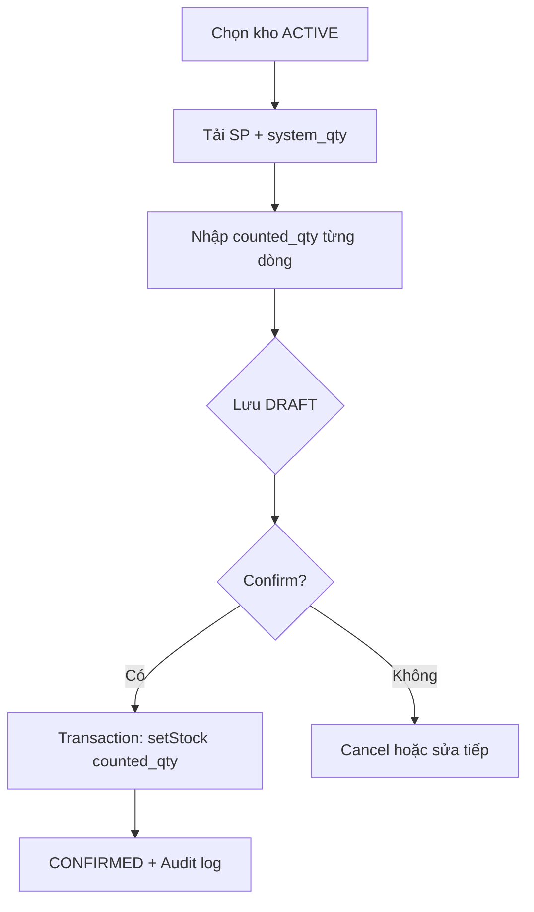

# Stock Take – Phân tích nghiệp vụ

## Overview

Phân tích yêu cầu và mô hình dữ liệu cho module Kiểm kê (Stock Take), bổ sung cho GR/GI bằng cách đối chiếu tồn sổ sách với tồn thực tế.

## Purpose

Xác định actor, luồng nghiệp vụ, quy tắc chênh lệch và điểm tích hợp với `inventories` trước khi triển khai.

## Scope

| Actor | Hành động |
|-------|-----------|
| Staff | Xem danh sách, chi tiết (nếu có quyền read) |
| Manager/Admin | Tạo, sửa, xác nhận, hủy, xóa phiếu nháp |
| Hệ thống | Sinh mã, snapshot tồn, cập nhật inventory khi confirm |

## Workflow

## Business Rules

| ID | Mô tả | Nguồn kiểm tra |
|----|-------|----------------|
| BR-ST-01 | Phiếu CONFIRMED/CANCELLED không sửa được | `assertDraft()` |
| BR-ST-02 | Mỗi SP một dòng duy nhất | Service + DB unique |
| BR-ST-03 | SP ngừng hoạt động không confirm | Loop items trước setStock |
| BR-ST-04 | Tồn mới = counted_qty (không cộng variance) | `setStock()` |
| BR-ST-05 | SP chưa có tồn → system_qty = 0 | `buildItemsWithSnapshot` |

## Technical Design

| Thành phần | Trách nhiệm |
|------------|-------------|
| `buildItemsWithSnapshot` | Đọc inventory, gán system_qty |
| `mapItem` | Tính variance cho response |
| `generateCode` | ST-YYYYMMDD-#### |
| `inventoryRepository.setStock` | Upsert/update quantity |

Quan hệ: `StockTake` 1—N `StockTakeItem`; FK `warehouse`, `product`, `createdBy`, `confirmedBy`.

## API / Database

Bảng `stock_takes`, `stock_take_items`. Enum `DocumentStatus`: DRAFT, CONFIRMED, CANCELLED. Chi tiết: [database.md](./database.md), [api.md](./api.md).

## Validation

| Input | Ràng buộc |
|-------|-----------|
| countedQty | ≥ 0, bắt buộc |
| takeDate | Chuỗi ngày parse được |
| items | Min 1 phần tử |
| note | Max 1000 (header), 500 (dòng) |

## Security

Phân quyền theo CRUD + confirm thuộc `update`. Không expose endpoint ghi trực tiếp inventory.

## Error Handling

Conflict khi confirm phiếu đã xử lý; bad request khi dữ liệu master không ACTIVE.

## Examples

| system_qty | counted_qty | variance | Tồn sau confirm |
|------------|-------------|----------|-----------------|
| 100 | 100 | 0 | 100 |
| 100 | 88 | -12 | 88 |
| 0 | 5 | +5 | 5 |

## Design Decisions

| # | Quyết định | Thay thế đã bỏ |
|---|------------|----------------|
| 1 | Document pattern giống GR/GI | Phiếu kiểm kê không trạng thái riêng |
| 2 | Variance chỉ read-only | Cho phép client gửi variance |
| 3 | Confirm toàn bộ phiếu | Confirm từng dòng riêng lẻ |

## Notes

- `getWarehouseProducts` trả SP có tồn > 0 hoặc tất cả inventory tại kho (filter ACTIVE).
- Cập nhật phiếu DRAFT xóa và tạo lại toàn bộ items (replace strategy).

## Checklist

- [x] Xác định BR system vs counted
- [x] Map state machine
- [x] Xác định điểm chạm inventory
- [x] Liên kết audit + report
- [ ] UAT kịch bản kiểm kê cuối tháng
