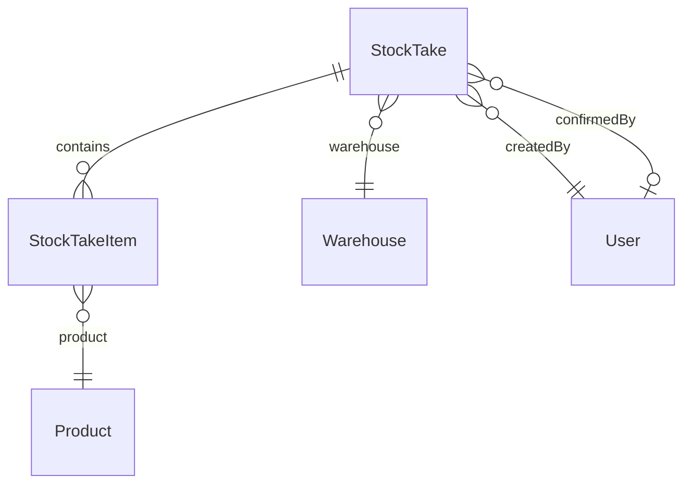

# Stock Take – Database

## Overview

Schema Prisma cho phiếu kiểm kê và chi tiết dòng, map bảng `stock_takes` / `stock_take_items`.

## Purpose

Mô tả cấu trúc lưu trữ, ràng buộc và index phục vụ truy vấn danh sách/báo cáo.

## Scope

Hai bảng chính + tham chiếu `warehouses`, `products`, `users`, `inventories` (đọc khi snapshot).

## Workflow

1. Insert `stock_takes` (DRAFT) + bulk insert `stock_take_items` (system_qty, counted_qty).
2. Confirm: update `status`, `confirmed_by_id`, `confirmed_at`; inventory cập nhật ở bảng `inventories`.

## Business Rules

| Ràng buộc DB | Ý nghĩa |
|-------------|---------|
| `code` UNIQUE | Mã phiếu duy nhất |
| `@@unique([stockTakeId, productId])` | Một SP một dòng/phiếu |
| `system_qty`, `counted_qty` Decimal(15,3) | Hỗ trợ số lẻ |
| ON DELETE CASCADE items | Xóa phiếu → xóa dòng |

## Technical Design

## API / Database

### Bảng `stock_takes`

| Cột | Kiểu | Mô tả |
|-----|------|-------|
| id | UUID PK | |
| code | VARCHAR UNIQUE | ST-YYYYMMDD-#### |
| warehouse_id | FK → warehouses | |
| status | DocumentStatus | DRAFT, CONFIRMED, CANCELLED |
| take_date | DATE | Ngày kiểm kê |
| note | TEXT nullable | |
| created_by_id | FK → users | |
| confirmed_by_id | FK nullable | |
| confirmed_at | TIMESTAMP nullable | |
| created_at, updated_at | TIMESTAMP | |

**Index:** status, warehouse_id, take_date, created_by_id.

### Bảng `stock_take_items`

| Cột | Kiểu | Mô tả |
|-----|------|-------|
| id | UUID PK | |
| stock_take_id | FK CASCADE | |
| product_id | FK | |
| system_qty | DECIMAL(15,3) | Snapshot tồn |
| counted_qty | DECIMAL(15,3) | Số đếm |
| note | TEXT nullable | |

**Unique:** (stock_take_id, product_id).

### Enum DocumentStatus

`DRAFT` | `CONFIRMED` | `CANCELLED` — dùng chung GR/GI/ST/SA.

## Validation

Service validate trước insert; DB enforce FK và unique product per take.

## Security

Không có cột nhạy cảm. Quyền truy cập qua API layer.

## Error Handling

Vi phạm unique → Prisma P2002 (handled upstream nếu có).

## Examples

Phiếu confirm: `status='CONFIRMED'`, items giữ nguyên system_qty/counted_qty làm lịch sử audit nội bộ.

## Design Decisions

| Quyết định | Lý do |
|------------|-------|
| Lưu cả system và counted | Báo cáo variance không cần join inventory lịch sử |
| Không bảng variance riêng | Tính derived |
| Replace items on update draft | Đơn giản hơn patch từng dòng |

## Notes

Report module query `stock_take_items` join `stock_takes` where status CONFIRMED.

## Checklist

- [x] Document columns + FK
- [x] Index list
- [x] ER diagram
- [ ] Migration history link
