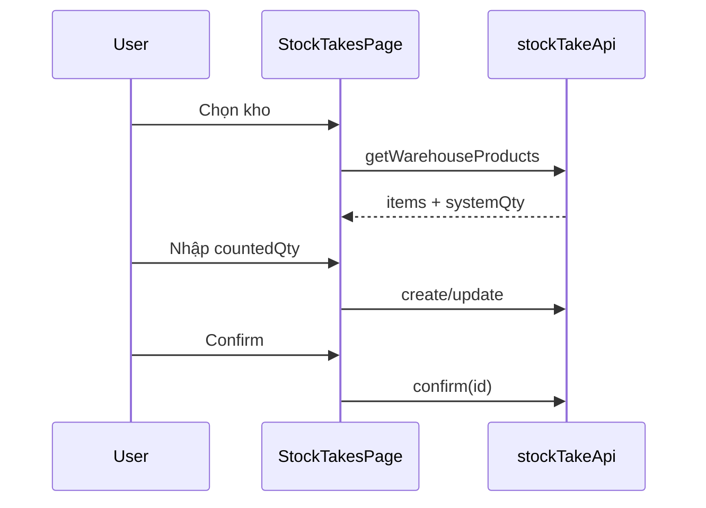

# Stock Take – Frontend

## Overview

Giao diện quản lý phiếu kiểm kê tại route `/stock-takes`, feature folder `frontend/src/features/stock-takes/`.

## Purpose

Cho phép người dùng lập phiếu, nhập số đếm, xem chênh lệch và thực hiện confirm/cancel theo quyền.

## Scope

| Thành phần | File |
|------------|------|
| Page | `pages/StockTakesPage.jsx` |
| API client | `api/stockTakeApi.js` |
| Form schema | `schemas/stockTakeSchema.js` |
| Tests | `schemas/__tests__/stockTakeSchema.test.js` |

## Workflow

## Business Rules

UI hiển thị `systemQty` read-only; chỉ gửi `countedQty` lên server. Nút Sửa/Xóa/Confirm/Cancel ẩn khi không phải DRAFT hoặc thiếu permission.

## Technical Design

| Công nghệ | Dùng cho |
|-----------|----------|
| React Query | list, options, mutations |
| react-hook-form + zodResolver | Form dialog |
| useFieldArray | Nhiều dòng SP |
| usePermissions | Ẩn/hiện action |
| shadcn/ui | Dialog, Table, Select |

Khi đổi kho: gọi `getWarehouseProducts` → map vào `items` với `systemQty` và default `countedQty = systemQty`.

## API / Database

Client map qua `stockTakeApi`: list, getById, getWarehouseProducts, create, update, confirm, cancel, remove.

## Validation

`stockTakeSchema`: warehouseId, takeDate, items min 1; `countedQty ≥ 0`. Lỗi hiển thị field-level + `formError` từ API message.

## Security

Route guard ở app router (permission). Buttons gated: `stock-take:create`, `update`, `delete`.

## Error Handling

`getErrorMessage`: `error.response.data.message` hoặc fallback "Có lỗi xảy ra". ConfirmDialog trước confirm/cancel/delete.

## Examples

Bảng list: cột code, kho, ngày, trạng thái (StatusBadge), số dòng. Dialog view: bảng SP với system, counted, variance (màu +/-).

## Design Decisions

| Quyết định | Lý do |
|------------|-------|
| Prefill counted = system | Giảm nhập liệu khi khớp tồn |
| Variance tính ở UI khi edit | Phản hồi tức thì |
| Pagination 10/page | Đồng bộ module khác |

## Notes

Filter: search text, status select. View mode read-only không submit.

## Checklist

- [x] List + CRUD dialog
- [x] Warehouse products load
- [x] Permission gates
- [x] Schema unit test
- [ ] E2E Playwright flow
