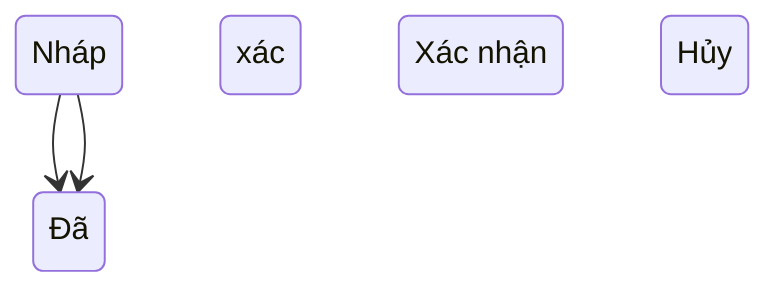

# Stock Take – Hướng dẫn người dùng

## Overview

Hướng dẫn thao tác Kiểm kê trên giao diện WMS cho nhân viên kho và quản lý.

## Purpose

Giúp người dùng hoàn thành kiểm kê đúng quy trình, hiểu ý nghĩa số liệu và hậu quả khi xác nhận.

## Scope

Menu **Kiểm kê** (`/stock-takes`). Yêu cầu đăng nhập và quyền tương ứng.

## Workflow

1. Vào **Kiểm kê** → **Tạo phiếu** (cần quyền create).
2. Chọn **Kho** và **Ngày kiểm kê**.
3. Hệ thống tải danh sách sản phẩm; cột **Tồn HT** (`system_qty`) là tồn sổ sách lúc lưu.
4. Nhập **Số đếm** (`counted_qty`) cho từng sản phẩm.
5. Xem **Chênh lệch** = Số đếm − Tồn HT.
6. **Lưu** → phiếu ở trạng thái **Nháp**.
7. Kiểm tra lại → **Xác nhận** → tồn kho cập nhật theo số đếm.

## Business Rules

| Tình huống | Hành vi |
|------------|---------|
| Số đếm = Tồn HT | Chênh lệch 0; confirm không đổi tồn (set cùng giá trị) |
| Số đếm < Tồn HT | Thiếu hàng; confirm giảm tồn về số đếm |
| Số đếm > Tồn HT | Thừa hàng; confirm tăng tồn về số đếm |
| Phiếu đã xác nhận | Chỉ xem; không sửa/xóa |
| Phiếu nháp sai | Sửa hoặc Hủy/Xóa |

## Technical Design

Không áp dụng trực tiếp cho end-user; tham khảo IT nếu lỗi kỹ thuật.

## API / Database

Người dùng không tương tác DB trực tiếp. Mọi thay đổi qua nút trên UI.

## Validation

- Phải chọn kho và ít nhất một sản phẩm.
- Số đếm không được âm.
- Không thêm trùng một sản phẩm hai lần.

## Security

Chỉ tài khoản có quyền mới thấy nút Tạo / Sửa / Xác nhận. Staff thường chỉ xem danh sách.

## Error Handling

Thông báo đỏ trên form hoặc toast khi kho ngừng hoạt động, phiếu không còn nháp, v.v.

## Examples

**Kiểm kê cuối tháng kho A:** Tạo phiếu ngày 31/08, load SP, điền số đếm thực tế, confirm → báo cáo Kiểm kê phản ánh variance.

## Design Decisions

Confirm một lần cho cả phiếu — người dùng cần rà soát hết dòng trước khi xác nhận.

## Notes

- Ghi chú dòng (note) để giải thích thiếu/thừa khi audit sau này.
- Sau confirm, xem **Nhật ký hoạt động** nếu có quyền audit-log.

## Checklist

- [ ] Đào tạo: ý nghĩa system vs counted
- [ ] Quy trình in phiếu kiểm kê (nếu cần — dùng Report export)
- [ ] Escalation khi chênh lệch lớn (quy trình nội bộ)
