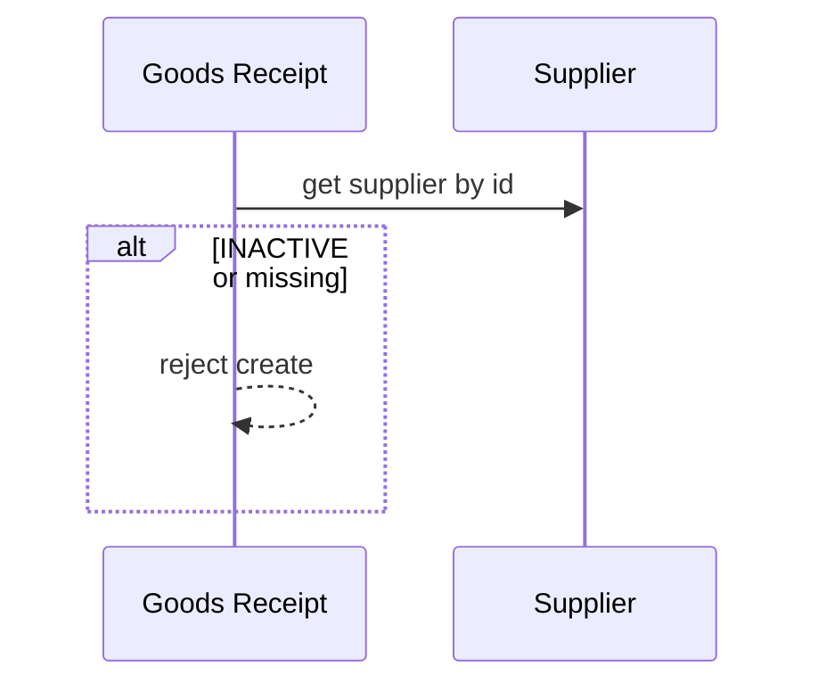

# Supplier – Phân tích nghiệp vụ

## Overview

Phân tích module **nhà cung cấp** — đối tác cung cấp hàng, tham chiếu trên phiếu nhập kho (goods receipt).

## Purpose

Xác định actor, luồng và ràng buộc liên kết procurement.

## Scope

Master data NCC. Không quản lý PO, invoice.

## Workflow

### UC-SU-01: Đăng ký NCC

Nhập mã SUP-xxx, tên công ty, người liên hệ → ACTIVE.

### UC-SU-02: Dùng trên phiếu nhập

Goods receipt chọn supplier_id → service validate supplier ACTIVE (nếu có).

### UC-SU-03: Ngừng hợp tác

Soft delete INACTIVE — phiếu mới không chọn.

## Business Rules

| ID | Rule |
|----|------|
| SU-BR-01 | code unique UPPERCASE |
| SU-BR-02 | name min 2 chars |
| SU-BR-03 | email valid if set |
| SU-BR-04 | soft delete only |
| SU-BR-05 | INACTIVE blocked on new goods receipt |
| SU-BR-06 | notes max 1000 |

## Technical Design

Identical stack to customer module. [backend.md](./backend.md)

## API / Database

[api.md](./api.md) · [database.md](./database.md)

## Validation

Zod BE/FE aligned on contact fields.

## Security

supplier:* RBAC

## Error Handling

409 Mã nhà cung cấp đã tồn tại · 404 Không tìm thấy nhà cung cấp

## Examples

SUP-001 Công ty ABC — dùng trên phiếu nhập tháng 1.

## Design Decisions

| Decision | Reason |
|----------|--------|
| Mirror customer model | Same party structure |
| Optional on receipt | Some internal receipts without supplier |

## Notes

goodsReceipt.service validates supplier when supplierId provided.

## Checklist

- [x] BR + workflow
- [x] goods-receipt link
- [ ] PO integration (future)
