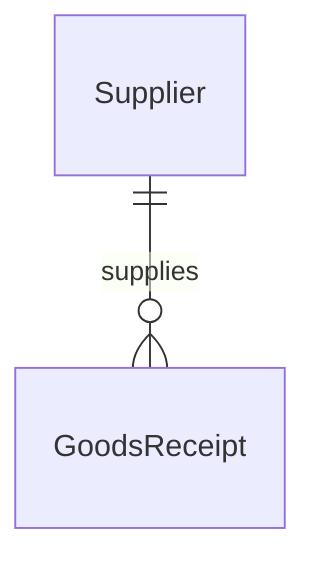

# Supplier – Database Schema

## Overview

Bảng `suppliers` — master data nhà cung cấp, Prisma model `Supplier`.

## Purpose

Schema reference cho query và FK từ goods_receipts.

## Scope

Table suppliers + relation to goods_receipts.

## Workflow



## Business Rules

code UNIQUE · status EntityStatus · soft delete only

## Technical Design

supplier.repository.js — Prisma CRUD

## API / Database

HTTP: [api.md](./api.md)

### Bảng `suppliers`

| Column | Type | Description |
|--------|------|-------------|
| id | UUID | PK |
| code | VARCHAR unique | Mã NCC |
| name | VARCHAR | Tên |
| contact_person | VARCHAR nullable | Người liên hệ |
| phone | VARCHAR nullable | |
| email | VARCHAR nullable | |
| address | TEXT nullable | |
| notes | TEXT nullable | Ghi chú |
| status | EntityStatus | |
| created_at | TIMESTAMPTZ | |
| updated_at | TIMESTAMPTZ | |

### PK / Unique / Index

PK: id · UNIQUE: code · INDEX: status

### FK incoming

`goods_receipts.supplier_id` → suppliers.id (optional on receipt per business)

### Relationships

1 supplier : N goods receipts. Historical receipts keep FK when supplier INACTIVE.

### Business Notes

Không cascade delete. INACTIVE supplier still visible on old receipts.

## Validation

App-layer Zod; DB NOT NULL code, name.

## Security

Prisma access only.

## Error Handling

Unique code → 409.

## Examples

```sql
SELECT code, name, contact_person FROM suppliers WHERE status = 'ACTIVE' ORDER BY name;
```

## Design Decisions

Symmetric with customers table — easier maintenance.

## Notes

Prisma: `backend/prisma/schema.prisma` model Supplier

## Checklist

- [x] Full column list
- [x] FK to goods_receipts
- [ ] supplier_id nullable doc on receipts (see goods-receipt)
