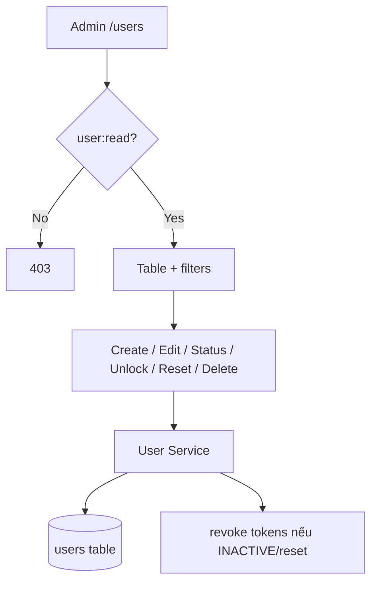

# Module User — Hub

## Overview

Module quản lý vòng đời tài khoản nội bộ WMS: tạo, xem, cập nhật, vô hiệu hóa, mở khóa, reset mật khẩu và gán vai trò.

| Thuộc tính | Giá trị |
|------------|---------|
| Sprint | 1 – Module 2 |
| Trạng thái | ✅ Đã triển khai |
| Base path BE | `/api/v1/users` |
| FE route | `/users` |

## Purpose

| Câu hỏi | Trả lời |
|---------|---------|
| **Module này làm gì?** | CRUD user nội bộ + status/unlock/reset password |
| **Ai dùng?** | Admin (hoặc role có `user:*`) |
| **Input chính?** | Email, họ tên, password, roleId, status |
| **Output chính?** | Danh sách/chi tiết user (không có passwordHash) |
| **Ràng buộc?** | Không self-deactivate; bảo vệ Admin cuối cùng; email unique |

## Scope

| Trong phạm vi | Ngoài phạm vi |
|---------------|---------------|
| List, create, update, status, unlock, reset, soft delete | Login/refresh → [Auth](../auth/README.md) |
| Gán `roleId` từ role có sẵn | CRUD role → [Role](../role/README.md) |
| Meta API `/users/meta/roles` | Đổi email (MVP không hỗ trợ) |

## Workflow

## Business Rules

| ID | Rule |
|----|------|
| BR-U01 | Chỉ `user:*` mới thao tác |
| BR-U02 | Email unique, lowercase |
| BR-U03 | Password policy giống Auth |
| BR-U05 | Cấm self deactivate/delete |
| BR-U06 | Bảo vệ last Admin ACTIVE |
| BR-U07 | Soft delete = INACTIVE + revoke tokens |
| BR-U09 | Reset password → revoke all tokens |
| BR-U11 | Không sửa email (MVP) |

## Technical Design

Layered BE + single-page FE (`UsersPage.jsx`). Chi tiết: [backend.md](./backend.md), [frontend.md](./frontend.md).

## API / Database

- API: [api.md](./api.md)
- Schema: [database.md](./database.md) — tái dùng bảng `users`, `roles`, `refresh_tokens`

## Validation

Create/update/status/reset schemas — xem [analysis.md](./analysis.md#validation).

## Security

Mọi endpoint yêu cầu Bearer + permission. Không trả `passwordHash`. Revoke session khi deactivate/reset.

## Error Handling

400 (self-action), 401, 403, 404, 409 (email trùng / last admin), 500.

## Examples

Tạo Staff → login bằng credential mới → gọi `/users` expect 403. Chi tiết: [api.md](./api.md).

## Design Decisions

| Decision | Reason | Advantages | Trade-offs |
|----------|--------|------------|------------|
| Soft delete = INACTIVE | Giữ lịch sử audit/transactions | Không mất FK references | Không hard delete |
| Meta roles trên User API | Form UX | Một call cho dropdown | Trùng data với Role module |
| Single UsersPage | MVP speed | Ít file | Page lớn, khó tách sau |

## Notes

Phụ thuộc [Auth](../auth/README.md) (tokens, password policy) và [Role](../role/README.md) (roleId hợp lệ).

## Checklist

- [x] 9 endpoints triển khai
- [x] Last-admin + self protection
- [x] FE UsersPage + permissions
- [x] Unit tests service + validation

## Tài liệu con

| File | Nội dung |
|------|----------|
| [analysis.md](./analysis.md) | Nghiệp vụ, user story, BR |
| [api.md](./api.md) | API đầy đủ |
| [database.md](./database.md) | Schema (tái dùng Auth) |
| [frontend.md](./frontend.md) | UI design |
| [backend.md](./backend.md) | Layer BE |
| [user-guide.md](./user-guide.md) | Hướng dẫn Admin |
| [developer-guide.md](./developer-guide.md) | Mở rộng / bảo trì |

## Permissions

| Code | Mô tả |
|------|-------|
| `user:read` | Xem danh sách, chi tiết, meta roles |
| `user:create` | Tạo user |
| `user:update` | Sửa, đổi status, unlock, reset password |
| `user:delete` | Soft delete (INACTIVE) |
