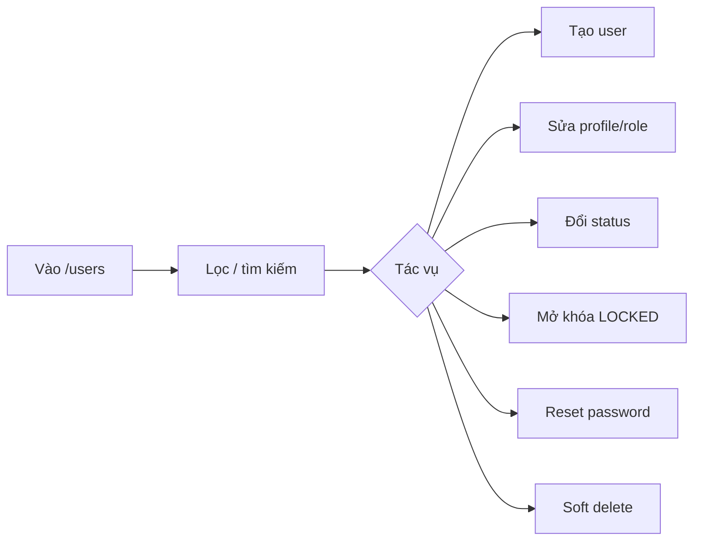

# User — Phân tích nghiệp vụ

## Overview

Phân tích nghiệp vụ quản lý người dùng nội bộ: vòng đời tài khoản từ tạo đến vô hiệu hóa, gán role, xử lý lock và reset mật khẩu.

## Purpose

Định nghĩa actor, use case, business rules và acceptance criteria cho module User trước/sau triển khai.

## Scope

| Bao gồm | Loại trừ |
|---------|----------|
| CRUD user, status, unlock, reset password | CRUD role/permission |
| User stories USR-01 → USR-10 | Chi tiết API → [api.md](./api.md) |
| Bảo vệ Admin cuối cùng, self-action | Public registration |

## Workflow

### Luồng chính (Admin)

### Create user

1. Validate payload (email, password policy, roleId)
2. Kiểm tra email chưa tồn tại
3. Verify roleId tồn tại
4. bcrypt hash password → insert `users` status ACTIVE
5. Trả 201 (không có passwordHash)

### Deactivate / soft delete

1. Kiểm tra không phải self
2. Nếu Admin ACTIVE → kiểm tra còn Admin khác
3. Set status INACTIVE
4. `authRepository.revokeAllUserTokens(userId)`

## Business Rules

| ID | Rule | Chi tiết |
|----|------|----------|
| BR-U01 | Permission `user:*` | Mọi endpoint qua `authorize()` |
| BR-U02 | Email unique, lowercase | Transform lowercase khi create |
| BR-U03 | Password policy | Shared `passwordPolicy` — ≥8, hoa, thường, số |
| BR-U04 | Không trả passwordHash | `mapUser()` |
| BR-U05 | Cấm self deactivate/delete | So sánh `id === actorId` |
| BR-U06 | Bảo vệ last Admin ACTIVE | `countActiveAdmins` exclude self |
| BR-U07 | Soft delete = INACTIVE + revoke | Delegate `changeStatus(INACTIVE)` |
| BR-U08 | Unlock reset lock fields | status ACTIVE, attempts=0, lockedUntil=null |
| BR-U09 | Reset password revoke all | Sau update passwordHash |
| BR-U10 | Chỉ gán roleId có sẵn | `assertRoleExists` |
| BR-U11 | Không sửa email | MVP — không field email trong update |

## Technical Design

Service: `userService` — business rules. Repository: Prisma queries. Reuse Auth: `authRepository.revokeAllUserTokens`. Chi tiết: [backend.md](./backend.md).

## API / Database

Không áp dụng chi tiết — [api.md](./api.md), [database.md](./database.md).

## Validation

| Schema | Fields |
|--------|--------|
| listUsersSchema | page, limit (max 100), search, status, roleId, sortBy, sortOrder |
| createUserSchema | email, fullName (2–255), password, roleId, avatarUrl? |
| updateUserSchema | fullName?, roleId?, avatarUrl? |
| changeUserStatusSchema | status: ACTIVE \| INACTIVE |
| resetPasswordSchema | newPassword, confirmPassword (match) |
| userIdSchema | params.id UUID |

## Security

- Manager/Staff không có `user:*` → 403
- Reset password không yêu cầu biết MK cũ (Admin privilege)
- Revoke tokens ngay khi deactivate/reset

## Error Handling

| Case | HTTP |
|------|------|
| Email trùng | 409 |
| Last admin violation | 409 |
| Self deactivate/delete | 400 |
| User/role not found | 404 / 400 |
| Missing permission | 403 |

## Examples

### User Stories

| ID | Story | Priority |
|----|-------|----------|
| USR-01 | Xem danh sách (search/filter/page) | Must |
| USR-02 | Tạo tài khoản | Must |
| USR-03 | Xem chi tiết | Must |
| USR-04 | Cập nhật fullName/role/avatar | Must |
| USR-05 | Vô hiệu hóa / kích hoạt | Must |
| USR-06 | Mở khóa LOCKED | Must |
| USR-07 | Reset mật khẩu | Must |
| USR-08 | Không tự deactivate/delete mình | Must |
| USR-09 | Không đụng Admin cuối cùng | Must |
| USR-10 | Manager/Staff không truy cập | Must |

### Acceptance Criteria

- CRUD + filter hoạt động
- Create → user login được
- Deactivate → login 403
- Unlock/reset đúng side-effect
- Self/last-admin protected
- Không leak passwordHash

## Design Decisions

| Decision | Reason | Advantages | Trade-offs |
|----------|--------|------------|------------|
| Soft delete only | FK integrity | Giữ audit/transactions | "Delete" gây hiểu nhầm |
| Unlock separate endpoint | Rõ nghiệp vụ | Admin action explicit | Thêm API |
| List includes LOCKED filter | Ops visibility | Tìm user bị lock | UI cần badge LOCKED |

## Notes

Audit log cho user actions có thể bổ sung Sprint sau. Role options: `GET /users/meta/roles` — không duplicate Role CRUD.

## Checklist

- [x] User stories USR-01 → USR-10
- [x] Business rules BR-U01 → BR-U11
- [x] Flow diagrams
- [x] Validation table
- [x] Cross-ref API/DB/FE/BE
