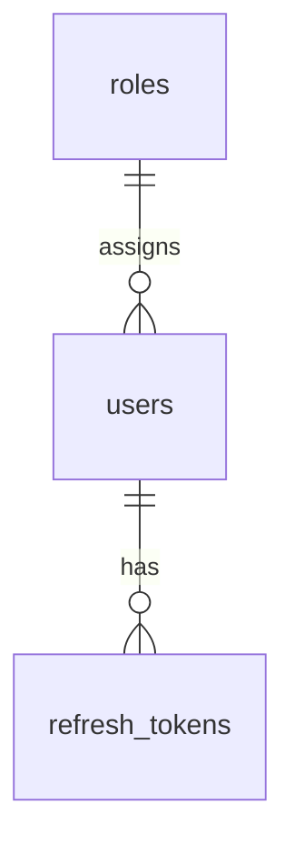

# User — Database Documentation

## Overview

Module User **không tạo bảng mới** — tái sử dụng schema Auth: `users`, `roles`, `refresh_tokens`.

## Purpose

Mô tả cột nào User module đọc/ghi, side-effect lên bảng liên quan và ràng buộc nghiệp vụ ở tầng DB.

## Scope

Thao tác CRUD trên `users`; đọc `roles`; revoke qua `refresh_tokens`. Schema đầy đủ Auth: [Auth database](../auth/database.md).

## Workflow

User create/update → `users`. Deactivate/reset → `users` + update `refresh_tokens.revoked_at`.

## Business Rules

| Thao tác | Cột ảnh hưởng | Ghi chú |
|----------|---------------|---------|
| Create | email, password_hash, full_name, role_id, status=ACTIVE | email UNIQUE |
| Update | full_name, role_id, avatar_url | email immutable MVP |
| Status INACTIVE | status | + revoke tokens |
| Unlock | status, failed_login_attempts, locked_until | → ACTIVE, 0, null |
| Reset password | password_hash | + revoke tokens |
| Soft delete | status → INACTIVE | same as deactivate |

## Technical Design

Prisma model `User` trong `backend/prisma/schema.prisma`. Repository: `user.repository.js`.

## API / Database

Không áp dụng — [api.md](./api.md).

### Bảng `users` (thao tác User module)

| Column | Type | Description |
|--------|------|-------------|
| id | UUID | **PK** |
| email | VARCHAR | **UNIQUE** — set khi create only |
| password_hash | VARCHAR | Set create + reset |
| full_name | VARCHAR | Create + update |
| avatar_url | VARCHAR? | Optional |
| status | UserStatus | ACTIVE / INACTIVE / LOCKED |
| role_id | UUID | **FK → roles.id** |
| failed_login_attempts | INT | Read detail; reset unlock |
| locked_until | TIMESTAMPTZ? | Read detail; reset unlock |
| last_login_at | TIMESTAMPTZ? | Read only (Auth sets) |
| created_at / updated_at | TIMESTAMPTZ | Audit |

**Index:** UNIQUE(email); INDEX(status); INDEX(role_id)

**Relationships:** N users → 1 role; 1 user → N refresh_tokens (+ business FKs khác)

### Bảng `roles` (read-only User module)

| Column | Type | Description |
|--------|------|-------------|
| id | UUID | **PK** — assign roleId |
| name | VARCHAR | **UNIQUE** — hiển thị + last-admin check |

User module: `findRoleById`, `listRoleOptions`, `isAdminUser` (name === 'Admin').

### Bảng `refresh_tokens` (side-effect)

Revoke via `authRepository.revokeAllUserTokens(userId)` — set `revoked_at` cho tokens active.

## Validation

DB constraints complement API: NOT NULL email, password_hash, full_name, role_id; FK role_id must exist.

## Security

Never SELECT password_hash for API response. bcrypt hash on write only.

## Error Handling

P2002 unique email → 409. FK violation role → 400/404 handled in service.

## Examples

Không cần migration mới nếu Auth đã `db push`. Seed roles qua `npm run db:seed`.

## Design Decisions

| Decision | Reason | Advantages | Trade-offs |
|----------|--------|------------|------------|
| No separate users module tables | DRY with Auth | Single source of truth | Coupled migrations |
| Soft delete via status | No hard DELETE | Preserve FKs | Status enum includes LOCKED |
| Admin check by role name | Simple MVP | No is_system on user | Rename role breaks rule |

## Notes

Optional future index: `full_name` hoặc pg_trgm cho search. Chi tiết role schema: [Role database](../role/database.md).

## Checklist

- [x] Tables used listed
- [x] Column operations matrix
- [x] FK/index/constraints
- [x] Side-effect on refresh_tokens
- [x] Cross-ref Auth schema
