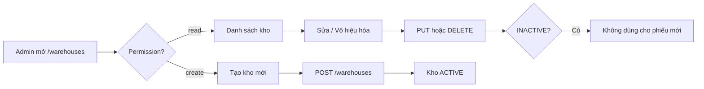

# Module Warehouse – Hub tài liệu

## Overview

Module **Warehouse** quản lý danh mục kho vật lý trong WMS. Mỗi kho có mã duy nhất, thông tin liên hệ và trạng thái `ACTIVE` / `INACTIVE`. Kho được tham chiếu bởi tồn kho, phiếu nhập/xuất, kiểm kê và điều chỉnh tồn.

| Thuộc tính | Giá trị |
|------------|---------|
| Sprint | 1 – Module 4 |
| Trạng thái | Đã triển khai |
| Base path API | `/api/v1/warehouses` |
| Route FE | `/warehouses` |
| Permissions | `warehouse:read` · `warehouse:create` · `warehouse:update` · `warehouse:delete` |

## Purpose

Cung cấm nguồn dữ liệu kho thống nhất cho toàn hệ thống, đảm bảo mọi giao dịch kho chỉ tham chiếu kho hợp lệ và có thể tra cứu.

## Scope

| Trong phạm vi | Ngoài phạm vi |
|--------------|---------------|
| CRUD danh mục kho (soft delete) | Quản lý vị trí/kệ trong kho |
| Tìm kiếm, lọc trạng thái, phân trang | Tồn kho theo kho (xem [inventory](../inventory/README.md)) |
| Đổi trạng thái ACTIVE/INACTIVE | Gán user vào kho cụ thể |

## Workflow

Luồng chi tiết: [analysis.md](./analysis.md) · API: [api.md](./api.md)

## Business Rules

| ID | Quy tắc |
|----|---------|
| WH-BR-01 | Mã kho (`code`) unique, normalize UPPERCASE |
| WH-BR-02 | Tạo mới mặc định `status = ACTIVE` |
| WH-BR-03 | DELETE = soft delete → `INACTIVE` |
| WH-BR-04 | Kho INACTIVE không được chọn khi tạo phiếu nhập/xuất/kiểm kê/điều chỉnh |
| WH-BR-05 | Không có hard delete; bản ghi giữ lại cho lịch sử |

## Technical Design

Kiến trúc 3 lớp chuẩn WMS: Route → Controller → Service → Repository (Prisma). Frontend dùng `MasterDataListPage` dùng chung. Chi tiết BE: [backend.md](./backend.md) · FE: [frontend.md](./frontend.md)

## API / Database

- API đầy đủ: [api.md](./api.md)
- Schema bảng `warehouses`: [database.md](./database.md)

## Validation

Backend Zod (`warehouse.validation.js`) + Frontend Zod (`masterDataSchema.js`). Tóm tắt: [api.md](./api.md#validation) · [frontend.md](./frontend.md#validation)

## Security

JWT Bearer bắt buộc; mỗi endpoint kiểm tra permission `warehouse:*`. Chi tiết: [api.md](./api.md#security)

## Error Handling

Chuẩn `{ success, message, errors? }`. Mã phổ biến: 400, 401, 403, 404, 409. Chi tiết: [api.md](./api.md#error-handling)

## Examples

Tạo kho, tìm kiếm, vô hiệu hóa: [user-guide.md](./user-guide.md) · curl: [api.md](./api.md#examples)

## Design Decisions

| Quyết định | Lý do |
|------------|-------|
| Soft delete qua status | Giữ FK lịch sử phiếu |
| Mã UPPERCASE server-side | Tránh trùng do khác hoa thường |
| MasterDataListPage dùng chung | 4 module master data cùng pattern |

## Notes

- Xóa trên UI chỉ hiện với bản ghi `ACTIVE`
- Chưa có API restore kho INACTIVE → ACTIVE qua PATCH status (có sẵn endpoint)

## Checklist

- [x] README hub với link tài liệu con
- [x] Phản ánh code BE/FE hiện tại
- [x] Cross-reference module liên quan (inventory, goods-receipt, goods-issue)
- [ ] Review định kỳ khi thêm field mới

## Tài liệu con

| File | Vai trò |
|------|---------|
| [analysis.md](./analysis.md) | Phân tích nghiệp vụ |
| [api.md](./api.md) | Đặc tả API |
| [database.md](./database.md) | Schema DB |
| [frontend.md](./frontend.md) | UI / feature |
| [backend.md](./backend.md) | Layer backend |
| [user-guide.md](./user-guide.md) | Hướng dẫn người dùng |
| [developer-guide.md](./developer-guide.md) | Hướng dẫn developer |
