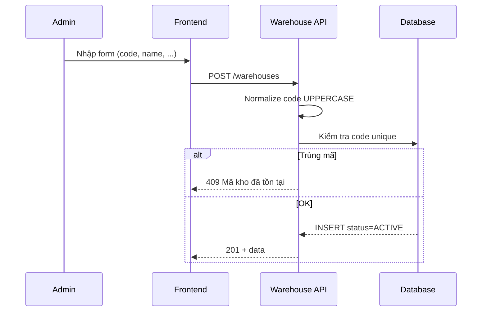

# Warehouse – Phân tích nghiệp vụ

## Overview

Phân tích module quản lý **danh mục kho** — thực thể master data định danh nơi lưu trữ hàng hóa. Kho là điều kiện tiên quyết cho mọi nghiệp vụ kho.

## Purpose

Xác định ai làm gì, dữ liệu đầu vào/đầu ra và ràng buộc nghiệp vụ trước khi triển khai hoặc mở rộng module.

## Scope

| Actor | Hành động |
|-------|-----------|
| Admin / User có quyền | Xem, tạo, sửa, vô hiệu hóa kho |
| Hệ thống (module khác) | Validate kho ACTIVE khi tạo phiếu |

Ngoài phạm vi: quản lý tồn, vị trí kệ, phân quyền theo kho.

## Workflow

### UC-WH-01: Tạo kho mới

### UC-WH-02: Vô hiệu hóa kho

Admin bấm Xóa → `DELETE /warehouses/:id` → service gọi `changeStatus(id, 'INACTIVE')`. Bản ghi vẫn tồn tại; phiếu mới không chọn được kho này.

### UC-WH-03: Tra cứu danh sách

Tìm theo mã/tên/địa chỉ; lọc ACTIVE/INACTIVE; phân trang 10 bản ghi/trang (FE).

## Business Rules

| ID | Quy tắc | Input | Output / Ràng buộc |
|----|---------|-------|---------------------|
| WH-BR-01 | Mã kho bắt buộc, unique | `code` | UPPERCASE, max 50 |
| WH-BR-02 | Tên tối thiểu 2 ký tự | `name` | trim, max 255 |
| WH-BR-03 | Email hợp lệ nếu có | `email` | nullable |
| WH-BR-04 | Tạo mới = ACTIVE | — | Không set status từ client |
| WH-BR-05 | Soft delete only | DELETE | status → INACTIVE |
| WH-BR-06 | Kho INACTIVE | goods-receipt/issue, stock-take/adjustment | Từ chối tạo phiếu mới |
| WH-BR-07 | Phiếu cũ giữ FK | Kho đã INACTIVE | Lịch sử không bị xóa |

## Technical Design

Module master data CRUD theo pattern chuẩn WMS. Không có state machine phức tạp — chỉ 2 trạng thái entity. Chi tiết kỹ thuật: [backend.md](./backend.md), [frontend.md](./frontend.md).

## API / Database

Không áp dụng chi tiết tại đây — xem [api.md](./api.md) và [database.md](./database.md).

## Validation

| Layer | Công cụ | Ghi chú |
|-------|---------|---------|
| API request | Zod | `warehouse.validation.js` |
| Form FE | Zod | `warehouseSchema` trong masterDataSchema |
| Nghiệp vụ | Service | assertCodeUnique |

## Security

Phân quyền RBAC: `warehouse:read|create|update|delete`. Mọi request qua `authenticate` middleware.

## Error Handling

| Tình huống | HTTP | Message |
|------------|------|---------|
| Không tìm thấy | 404 | Không tìm thấy kho |
| Trùng mã | 409 | Mã kho đã tồn tại |
| Thiếu quyền | 403 | Forbidden |
| Validation | 400 | Chi tiết field |

## Examples

| User Story | Kịch bản |
|------------|----------|
| WH-US-01 | Admin tạo `WH-001` / Kho chính → hiện trong dropdown phiếu nhập |
| WH-US-02 | Vô hiệu hóa kho đang có tồn → tồn vẫn hiển thị, không tạo phiếu mới |
| WH-US-03 | Tìm "Hà Nội" → lọc theo address chứa từ khóa |

## Design Decisions

| Quyết định | Lý do | Ưu điểm | Trade-off |
|------------|-------|---------|-----------|
| Soft delete | FK tới phiếu, inventory | An toàn dữ liệu | Danh sách có thể dài nếu không lọc |
| Search OR trên code/name/address | UX tra cứu linh hoạt | Dễ tìm | Query phức tạp hơn index đơn |
| Không hard delete | Audit, báo cáo | Nhất quán lịch sử | Không tái sử dụng mã cũ nếu vẫn còn bản ghi |

## Notes

- Giả định: một tenant, không phân kho theo chi nhánh công ty (chưa có field branch).
- Kích hoạt lại kho INACTIVE: dùng `PATCH /:id/status` với `{ "status": "ACTIVE" }` (chưa có UI riêng).

## Checklist

- [x] Actor và use case rõ ràng
- [x] Business rules có ID
- [x] Workflow mermaid
- [x] Cross-ref API/DB/FE
- [ ] Cập nhật khi thêm multi-warehouse policy
