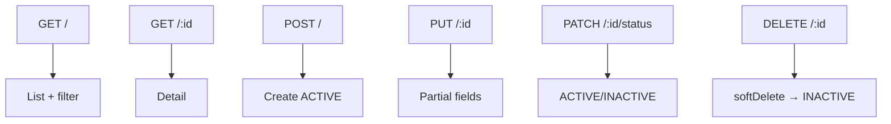

# Warehouse – API Reference

## Overview

REST API quản lý danh mục kho tại `/api/v1/warehouses`. Pattern CRUD + đổi status + soft delete. Response envelope chuẩn WMS.

## Purpose

Đặc tả đầy đủ contract API cho tích hợp frontend, test và module nghiệp vụ khác.

## Scope

6 endpoint: list, getById, create, update, changeStatus, softDelete. Không có bulk import/export.

## Workflow



## Business Rules

| ID | Áp dụng endpoint | Quy tắc |
|----|------------------|---------|
| WH-BR-01 | POST, PUT | `code` unique, UPPERCASE |
| WH-BR-02 | POST | status mặc định ACTIVE |
| WH-BR-05 | DELETE | Gọi changeStatus INACTIVE |

## Technical Design

| Layer | File |
|-------|------|
| Route | `backend/src/modules/warehouse/warehouse.route.js` |
| Controller | `warehouse.controller.js` |
| Service | `warehouse.service.js` |
| Validation | `warehouse.validation.js` |

Schema DB: [database.md](./database.md)

## API / Database

### Headers chung

| Header | Bắt buộc | Mô tả |
|--------|----------|-------|
| `Authorization` | Có | `Bearer <access_token>` |
| `Content-Type` | POST/PUT/PATCH | `application/json` |

### Response envelope

**Thành công (single):**
```json
{ "success": true, "message": "...", "data": { ... } }
```

**Thành công (list):**
```json
{ "success": true, "message": "Success", "data": [ ... ], "pagination": { "page": 1, "limit": 10, "total": 25, "totalPages": 3 } }
```

**Lỗi:**
```json
{ "success": false, "message": "...", "errors": [ ... ] }
```

---

### GET `/api/v1/warehouses`

| | |
|--|--|
| **Method** | GET |
| **Auth** | Bearer + `warehouse:read` |
| **Description** | Danh sách kho có phân trang, tìm kiếm, lọc |

**Query parameters**

| Param | Type | Mô tả |
|-------|------|-------|
| `page` | int ≥1 | Mặc định 1 |
| `limit` | int 1–100 | Mặc định 10 |
| `search` | string | OR: code, name, address (case-insensitive) |
| `status` | `ACTIVE` \| `INACTIVE` | Lọc trạng thái |
| `sortBy` | `code` \| `name` \| `createdAt` | Mặc định createdAt |
| `sortOrder` | `asc` \| `desc` | Mặc định desc |

**Response 200:** Mảng warehouse trong `data` + `pagination`.

**Status codes:** 200, 400, 401, 403, 500

---

### GET `/api/v1/warehouses/:id`

| | |
|--|--|
| **Method** | GET |
| **Auth** | Bearer + `warehouse:read` |

**Parameters:** `id` (UUID)

**Response 200:** Object warehouse đầy đủ.

**Error response:** 404 `Không tìm thấy kho`

---

### POST `/api/v1/warehouses`

| | |
|--|--|
| **Method** | POST |
| **Auth** | Bearer + `warehouse:create` |
| **Description** | Tạo kho mới, status ACTIVE |

**Body**

| Field | Type | Bắt buộc | Validation |
|-------|------|----------|------------|
| `code` | string | Có | 1–50, trim |
| `name` | string | Có | 2–255 |
| `address` | string \| null | Không | max 500 |
| `phone` | string \| null | Không | max 20 |
| `email` | string \| null | Không | email |
| `description` | string \| null | Không | max 1000 |

**Response 201:** `{ message: "Tạo kho thành công", data: {...} }`

**Status codes:** 201, 400, 401, 403, 409, 500

**Business rules:** code normalize UPPERCASE; conflict nếu trùng mã.

**Example**
```bash
curl -X POST /api/v1/warehouses \
  -H "Authorization: Bearer $TOKEN" \
  -H "Content-Type: application/json" \
  -d '{"code":"wh-001","name":"Kho chính","address":"123 ABC"}'
```

---

### PUT `/api/v1/warehouses/:id`

| | |
|--|--|
| **Method** | PUT |
| **Auth** | Bearer + `warehouse:update` |

**Body:** Tất cả field optional (cùng schema create, không gửi `status`).

**Response 200:** `Cập nhật kho thành công`

**Status codes:** 200, 400, 401, 403, 404, 409, 500

---

### PATCH `/api/v1/warehouses/:id/status`

| | |
|--|--|
| **Method** | PATCH |
| **Auth** | Bearer + `warehouse:update` |

**Body:** `{ "status": "ACTIVE" | "INACTIVE" }`

**Response 200:** `Cập nhật trạng thái thành công`

---

### DELETE `/api/v1/warehouses/:id`

| | |
|--|--|
| **Method** | DELETE |
| **Auth** | Bearer + `warehouse:delete` |
| **Description** | Soft delete — set INACTIVE |

**Response 200:** `Xóa kho thành công` (data là bản ghi sau cập nhật)

## Validation

Zod schemas: `listWarehousesSchema`, `warehouseIdSchema`, `createWarehouseSchema`, `updateWarehouseSchema`, `changeWarehouseStatusSchema`.

| Field | Create | Update |
|-------|--------|--------|
| code | required, 1–50 | optional |
| name | required, min 2 | optional, min 2 |
| email | email format | email format |

## Security

- `router.use(authenticate)` — mọi route
- `authorize('warehouse:*')` per endpoint
- Không endpoint public

## Error Handling

| Status | Nguyên nhân |
|--------|-------------|
| 400 | Validation Zod |
| 401 | Token thiếu/hết hạn |
| 403 | Thiếu permission |
| 404 | ID không tồn tại |
| 409 | Mã kho trùng |
| 500 | Lỗi server |

## Examples

**List với filter**
```
GET /api/v1/warehouses?page=1&limit=10&search=main&status=ACTIVE
```

**Vô hiệu hóa**
```
DELETE /api/v1/warehouses/{uuid}
```

## Design Decisions

| Quyết định | Lý do | Trade-off |
|------------|-------|-----------|
| DELETE = soft delete | Giữ FK | Tên endpoint gây hiểu nhầm |
| PATCH status riêng | Tách quyền update data vs lifecycle | Thêm endpoint |
| Paginated list default limit 10 | Khớp FE | Client phải truyền limit nếu cần lớn hơn |

## Notes

- Base path `/api/v1` mount tại `backend/src/routes/index.js`
- Module goods-receipt/issue validate warehouse ACTIVE khi tạo phiếu

## Checklist

- [x] Đủ 6 endpoint với auth/permission
- [x] Body/query/response documented
- [x] Status codes và error messages
- [x] Example curl
- [ ] OpenAPI spec (chưa có)
