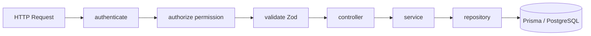

# Warehouse – Backend

## Overview

Backend module warehouse triển khai CRUD danh mục kho theo kiến trúc layered Express + Prisma, đồng bộ với pattern product/supplier/customer.

## Purpose

Mô tả luồng xử lý request, trách nhiệm từng lớp và điểm mở rộng cho developer backend.

## Scope

`backend/src/modules/warehouse/*` — không bao gồm logic tồn kho hay phiếu.

## Workflow



**Luồng create:** validate body → normalize code UPPERCASE → assertCodeUnique → repository.create (status ACTIVE) → 201

**Luồng softDelete:** controller.softDelete → service.changeStatus(id, INACTIVE)

## Business Rules

Logic nghiệp vụ tập trung ở `warehouse.service.js`:

| Hàm | Rule |
|-----|------|
| `normalizeCode` | trim + toUpperCase |
| `assertCodeUnique` | throw 409 nếu trùng |
| `buildWhere` | search OR code/name/address |
| `softDelete` | delegate changeStatus INACTIVE |

## Technical Design

| File | Trách nhiệm |
|------|-------------|
| `warehouse.route.js` | Mount routes, middleware chain |
| `warehouse.controller.js` | Map HTTP ↔ service, response format |
| `warehouse.service.js` | Business rules, pagination, errors |
| `warehouse.repository.js` | Prisma CRUD |
| `warehouse.validation.js` | Zod schemas |

**Đăng ký route:** `backend/src/routes/index.js` → `router.use('/warehouses', warehouseRoutes)`

**Pagination:** `parsePagination(query, 'createdAt')` — default page 1, limit 10, sort desc.

**Response helpers:** `paginatedResponse`, `successResponse` từ `utils/apiResponse.js`

## API / Database

Chi tiết HTTP: [api.md](./api.md) · Schema: [database.md](./database.md)

## Validation

Middleware `validate(schema)` parse params/query/body theo Zod. Lỗi → 400 với message tiếng Việt từ schema.

Service-level: kiểm tra tồn tại (404), unique code (409).

## Security

```javascript
router.use(authenticate);
router.get('/', authorize('warehouse:read'), ...);
```

Mọi route yêu cầu JWT hợp lệ + permission cụ thể.

## Error Handling

| Layer | Cơ chế |
|-------|--------|
| Controller | `asyncHandler` bọc exception |
| Service | `throw new ApiError(status, message)` |
| Global | Error middleware format JSON |

Messages tiếng Việt: `Không tìm thấy kho`, `Mã kho đã tồn tại`.

## Examples

**Thêm field mới (pattern):**
1. Cập nhật Prisma schema + migration
2. Thêm vào create/update validation
3. Map trong service create/update
4. Repository tự nhận qua Prisma data object

**Test service logic:** mock `warehouseRepository` (chưa có test file riêng warehouse).

## Design Decisions

| Quyết định | Lý do | Trade-off |
|------------|-------|-----------|
| Repository mỏng | Dễ test service | Không cache |
| Không audit log riêng | Master data đơn giản | Không track ai sửa |
| Partial update PUT | Chỉ gửi field thay đổi | PUT không replace full resource |

## Notes

- Module khác import warehouse qua repository riêng hoặc Prisma include (goods-receipt)
- `changeStatus` endpoint dùng permission `warehouse:update`, không `warehouse:delete`

## Checklist

- [x] Layer responsibilities documented
- [x] File paths khớp codebase
- [x] Business logic location rõ
- [ ] Unit tests warehouse.service (TODO)
