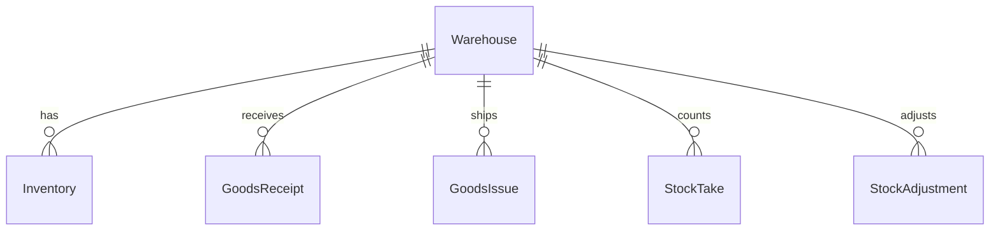

# Warehouse – Database Schema

## Overview

Bảng `warehouses` lưu master data kho vật lý. Prisma model `Warehouse`, map PostgreSQL qua `@map("warehouses")`.

## Purpose

Mô tả cấu trúc dữ liệu, ràng buộc và quan hệ để thiết kế query, migration và báo cáo.

## Scope

Chỉ schema bảng `warehouses` và quan hệ trực tiếp. Tồn kho: bảng `inventories` — xem [inventory/database.md](../inventory/database.md).

## Workflow



## Business Rules

| ID | Ràng buộc DB / nghiệp vụ |
|----|--------------------------|
| WH-BR-01 | `code` UNIQUE |
| WH-BR-02 | `status` enum EntityStatus, default ACTIVE |
| WH-BR-05 | Không xóa vật lý — chỉ đổi status |

## Technical Design

- ORM: Prisma (`backend/prisma/schema.prisma`)
- Repository: `warehouse.repository.js` — CRUD cơ bản, không join phức tạp
- Timestamps: `created_at`, `updated_at` auto

## API / Database

Không áp dụng — xem [api.md](./api.md) cho contract HTTP.

### Bảng `warehouses`

| Column | Type | Description |
|--------|------|-------------|
| `id` | UUID | PK, auto generate |
| `code` | VARCHAR (unique) | Mã kho, business key |
| `name` | VARCHAR | Tên hiển thị |
| `address` | TEXT nullable | Địa chỉ kho |
| `phone` | VARCHAR nullable | SĐT liên hệ |
| `email` | VARCHAR nullable | Email liên hệ |
| `description` | TEXT nullable | Mô tả bổ sung |
| `status` | EntityStatus | ACTIVE / INACTIVE |
| `created_at` | TIMESTAMPTZ | Thời điểm tạo |
| `updated_at` | TIMESTAMPTZ | Cập nhật cuối |

### Primary Key

- `id` (UUID)

### Unique Constraints

- `code` — đảm bảo mã kho duy nhất toàn hệ thống

### Indexes

| Index | Column | Mục đích |
|-------|--------|----------|
| PK | id | Tra cứu theo ID |
| UNIQUE | code | Lookup theo mã |
| idx | status | Lọc ACTIVE/INACTIVE |

### Foreign Keys (incoming)

| Bảng con | FK column | On delete |
|----------|-----------|-----------|
| `inventories` | warehouse_id | Restrict (mặc định Prisma) |
| `goods_receipts` | warehouse_id | Restrict |
| `goods_issues` | warehouse_id | Restrict |
| `stock_takes` | warehouse_id | Restrict |
| `stock_adjustments` | warehouse_id | Restrict |

### Relationships

| Relation | Cardinality | Business note |
|----------|-------------|---------------|
| Inventory | 1-N | Một kho – nhiều dòng tồn (product) |
| GoodsReceipt | 1-N | Phiếu nhập gắn một kho |
| GoodsIssue | 1-N | Phiếu xuất gắn một kho |

### Business Notes

- Soft delete không xóa row → FK luôn hợp lệ cho báo cáo lịch sử
- Không có cascade delete từ warehouse sang phiếu
- Giả định: chưa có soft-delete filter ở DB level (filter ở application)

## Validation

Validation ở application layer (Zod), không trigger DB ngoài NOT NULL/UNIQUE trên `code`, `name`.

## Security

Truy cập DB qua Prisma từ service layer; không expose trực tiếp. Row-level security: không có (phân quyền ở API).

## Error Handling

| DB error | API mapping |
|----------|-------------|
| Unique violation (code) | 409 Mã kho đã tồn tại |
| FK violation (nếu hard delete) | Không xảy ra (soft delete only) |

## Examples

**Tra cứu kho ACTIVE**
```sql
SELECT id, code, name FROM warehouses WHERE status = 'ACTIVE' ORDER BY code;
```

**Đếm kho theo trạng thái**
```sql
SELECT status, COUNT(*) FROM warehouses GROUP BY status;
```

## Design Decisions

| Quyết định | Lý do | Trade-off |
|------------|-------|-----------|
| UUID PK | An toàn khi expose API | Index lớn hơn int |
| code UNIQUE business key | Tra cứu nhanh, hiển thị | Không tái dùng mã INACTIVE |
| Index status | Filter list thường xuyên | Thêm storage nhỏ |

## Notes

- Enum `EntityStatus`: ACTIVE, INACTIVE (dùng chung nhiều entity)
- File schema gốc: `backend/prisma/schema.prisma` model `Warehouse`

## Checklist

- [x] Cột, type, mô tả
- [x] PK/FK/Index/Constraints
- [x] Relationships và business notes
- [ ] Migration history doc (nếu cần audit)
